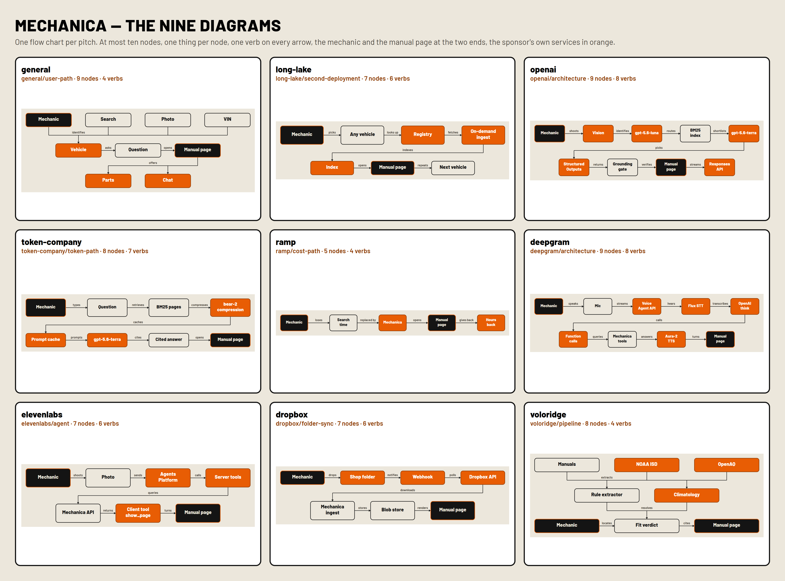

# The nine diagrams

One flow chart per pitch, nine in all. At most ten nodes each and one thing per node — a service, a
model, a tool, an artefact, the person — with **the mechanic and the manual page as the two ends**.
No sentences and no numbers inside a box; every drawn arrow carries one lowercase verb, on an opaque
pill above its line. Three colours, the same in all nine: **ink** for the two ends, **paper** for our
own code, **orange** for the sponsor's services (or, in the pitches with no sponsor tech, for the
thing that room is there to look at).

Each chart lives in three places, all from the same rows: the `.mmd` beside its pitch, the
`mermaid` block inside the pitch `.md`, and the `diagram` slide in `deck/slides/<pitch>.json`.
The `.mmd` is the editable source; `deck/lane.mjs` draws the shipped art from it with explicit
coordinates — every arrow leaves and lands on the midpoint of a node edge, rows share a baseline,
gaps are equal, and a row-to-row connector is an orthogonal elbow, never a diagonal. Re-render with
`node docs/pitches/deck/mermaid.mjs` (which also writes `DIAGRAMS.png` and this file and audits
every chart numerically), then rebuild the decks with `node docs/pitches/deck/build.mjs`.

| # | pitch | source | the nodes, in order | the verb on every arrow |
|---|---|---|---|---|
| 1 | [`general.md`](general.md) | [`general/user-path.mmd`](general/user-path.mmd) · [`.svg`](general/user-path.svg) · [`.png`](general/user-path.png) | **9** — Mechanic · Search · Photo · VIN · Vehicle · Question · Manual page · Parts · Chat | **4** — identifies · asks · opens · offers |
| 2 | [`long-lake.md`](long-lake.md) | [`long-lake/second-deployment.mmd`](long-lake/second-deployment.mmd) · [`.svg`](long-lake/second-deployment.svg) · [`.png`](long-lake/second-deployment.png) | **7** — Mechanic · Any vehicle · Registry · On-demand ingest · Index · Manual page · Next vehicle | **6** — picks · looks up · fetches · indexes · opens · repeats |
| 3 | [`openai.md`](openai.md) | [`openai/architecture.mmd`](openai/architecture.mmd) · [`.svg`](openai/architecture.svg) · [`.png`](openai/architecture.png) | **9** — Mechanic · Vision · gpt-5.6-luna · BM25 index · gpt-5.6-terra · Structured Outputs · Grounding gate · Manual page · Responses API | **8** — shoots · identifies · routes · shortlists · picks · returns · verifies · streams |
| 4 | [`token-company.md`](token-company.md) | [`token-company/token-path.mmd`](token-company/token-path.mmd) · [`.svg`](token-company/token-path.svg) · [`.png`](token-company/token-path.png) | **8** — Mechanic · Question · BM25 pages · bear-2 compression · Prompt cache · gpt-5.6-terra · Cited answer · Manual page | **7** — types · retrieves · compresses · caches · prompts · cites · opens |
| 5 | [`ramp.md`](ramp.md) | [`ramp/cost-path.mmd`](ramp/cost-path.mmd) · [`.svg`](ramp/cost-path.svg) · [`.png`](ramp/cost-path.png) | **5** — Mechanic · Search time · Mechanica · Manual page · Hours back | **4** — loses · replaced by · opens · gives back |
| 6 | [`deepgram.md`](deepgram.md) | [`deepgram/architecture.mmd`](deepgram/architecture.mmd) · [`.svg`](deepgram/architecture.svg) · [`.png`](deepgram/architecture.png) | **9** — Mechanic · Mic · Voice Agent API · Flux STT · OpenAI think · Function calls · Mechanica tools · Aura-2 TTS · Manual page | **8** — speaks · streams · hears · transcribes · calls · queries · answers · turns |
| 7 | [`elevenlabs.md`](elevenlabs.md) | [`elevenlabs/agent.mmd`](elevenlabs/agent.mmd) · [`.svg`](elevenlabs/agent.svg) · [`.png`](elevenlabs/agent.png) | **7** — Mechanic · Photo · Agents Platform · Server tools · Mechanica API · Client tool show_page · Manual page | **6** — shoots · sends · calls · queries · returns · turns |
| 8 | [`dropbox.md`](dropbox.md) | [`dropbox/folder-sync.mmd`](dropbox/folder-sync.mmd) · [`.svg`](dropbox/folder-sync.svg) · [`.png`](dropbox/folder-sync.png) | **7** — Mechanic · Shop folder · Webhook · Dropbox API · Mechanica ingest · Blob store · Manual page | **6** — drops · notifies · polls · downloads · stores · renders |
| 9 | [`voloridge.md`](voloridge.md) | [`voloridge/pipeline.mmd`](voloridge/pipeline.mmd) · [`.svg`](voloridge/pipeline.svg) · [`.png`](voloridge/pipeline.png) | **8** — Manuals · NOAA ISD · OpenAQ · Rule extractor · Climatology · Mechanic · Fit verdict · Manual page | **4** — extracts · resolves · locates · cites |

## What changed

The old charts were architecture drawings: legends, sentences inside the boxes, measured figures,
and up to twenty-six nodes. They were accurate and unreadable at slide size. These carry the same
claims — every node names something that exists in the repo — with the detail moved to the caption,
the presenter notes and the pitch text, where it can be said out loud instead of squinted at.

The OpenAI pitch had two charts; it now has one. `openai/not-a-wrapper` is gone as a drawing and
lives as the argument spoken over `openai/architecture` — *Structured Outputs* for shape,
*Grounding gate* for truth — plus the table in `openai.md`.
