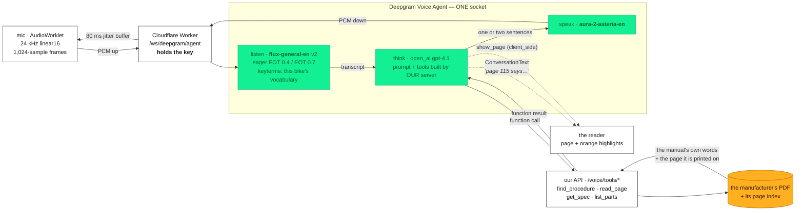

# Deepgram — the voice that is not allowed to know anything

**Mechanica.** A mechanic with the bike on the lift and gloves on asks out loud. The answer comes back out
loud **and** the manufacturer's own manual page opens with the answering lines marked in orange.

Live: **https://mechanica.emilvinu.ch** · API at `/api` · repo `C:\Users\me\trustthemanual`
Code for this sponsor: `api/app/voice.py` · `web/counter/js/voice-deepgram.js` · `web/counter/js/deepgram.js`
· `worker/index.js` · docs `web/docs/VOICE.md`.
Diagram: [`deepgram/architecture.png`](deepgram/architecture.png) · [`.svg`](deepgram/architecture.svg) ·
[`.mmd`](deepgram/architecture.mmd) (rendered with `@mermaid-js/mermaid-cli@11`).
Backlog with impact/build scores: [`deepgram/improvements.md`](deepgram/improvements.md).

**The one line for this sponsor:** *the agent has no permission to speak a sentence the manual does not
print — four grounded functions are its entire vocabulary — and the page it names is on screen before it
finishes saying the number.*

Every figure below is **measured** on the live deployment on 2026-09-20 unless it says otherwise, with the
message trace saved. Where we could not measure something, it says so.

---

## 0:30 — The workshop moment

A friend of the founder opened his own motorcycle workshop in Germany a few years ago. He spends **about
20% of his working time looking for things in manuals** instead of working on the bike. At a EUR 90–120/h
shop rate, that is **EUR 36k–48k of billable time a year, per mechanic**, spent scrolling PDFs.

He will not use AI for it. Two reasons, both of them right:

1. *"95% correct is not good enough when I am the one liable for the 5%."* A wrong torque figure does not
   produce a wrong paragraph, it produces a wheel that comes off.
2. He tried it once. One question cost **~$4 in API usage**, because the model had to read a 500-page
   manual to answer it.

Now put him back on the lift. Both hands on the bike, oil on the gloves, a phone on the bench he will not
touch. **This is the case voice was invented for, and it is the case where a voice assistant that
improvises is at its most dangerous** — because there is no page on screen to catch it.

> **Feel at 0:30:** this is a real person with a real number attached to the problem, and a real reason he
> has refused every product in this category so far.

## 1:00 — Why a voice agent has to be grounded, and what that means here

A voice answer has no citation. There is no hyperlink in a sound wave. So the grounding cannot be a
footnote you add afterwards — it has to be the only thing the agent is able to do.

**The architecture decision.** The whole `Settings` message is built on our server, per manual, by
`GET /api/voice/agent-settings?manualId=&bikeId=`. The browser never holds the prompt, the model name or
the tool wiring — it opens a socket and forwards what it was handed. Inside that message:

- **Four functions, all `endpoint`-carrying**: `find_procedure`, `read_page`, `get_spec`, `list_parts`.
  Because they carry an `endpoint`, **Deepgram calls our API directly from its own servers.** The manual's
  text never passes through the tab, and the browser cannot forge a tool result.
- **The manual id rides in the endpoint's query string, not in the function parameters.** An agent that had
  to say which book it is reading could say the wrong one. It cannot. Every answer in a session comes out of
  exactly one book, by construction.
- **One client-side function**, `show_page`, which has no endpoint and arrives in the browser as
  `client_side: true`. It moves the reader.
- **A ≤1,500-character digest of the manual's own contents page**, so the agent can say *"that is not in
  this manual"* without a round trip.
- **The prompt's one rule**, verbatim from `api/app/voice.py`:

  > *"You do not know anything about this motorcycle. Everything you think you remember about a KTM, a BMW
  > or any other bike is wrong here and may not be spoken. Call a function FIRST, every single time, before
  > the first word of every answer about this machine, and say only what its result printed."*

  and, for numbers specifically: *"A torque, a capacity, a pressure, a clearance, a gap, an interval, a fuse
  rating or a part number may only leave your mouth if a function result you have already received printed
  it, word for word."*

**The twist, and it is the line to say out loud:** *don't trust the voice. Trust the page.* The voice is a
pointer, not an authority. Its whole job is to get a liable professional to the printed line in two seconds
instead of ten minutes — and then get out of the way. That is why the page opening matters more than the
sentence being pretty.

We found out the hard way that this cannot be left to the model. Measured on the live socket: **7 spoken
turns, 6 pages named out loud, 0 `show_page` calls** — including on *"show me the brake fluid procedure"*.
So the reader no longer waits for the model to decide. The page number in the agent's own transcript moves
it, and that transcript arrives **on the same millisecond as the first byte of audio**: the mechanic hears
"page 115" and page 115 is already in front of him.

> **Feel at 1:30:** the grounding is not a prompt request, it is the shape of the system. Four tools, one
> book, the server holding the wiring, and the page turning itself.

## 1:30 — The demo (exact utterances)

**Setup on stage:** the bike is the **KTM 390 Duke 2024** — 143 printed pages, one of the **535 manuals**
already warm (`GET /api/manuals`, 2026-09-20). (Any of 8,319 free official manuals works; a bike nobody has ever asked for opens in ~7 s and is
fully searchable in ~50 s for ~$0.10. If a judge names a bike, do that — but not on the clock.)
Tap **VOICE**. The greeting is *"I see you're looking at the KTM 390 Duke 2024."* — **724 ms after the
socket opens**.

| # | say, out loud | what the judge sees and hears | measured |
|---|---|---|---|
| 1 | **"What's the torque on the rear axle nut?"** | `get_spec` fires; *"Page 78 says tighten the rear axle nut to one hundred newton metres."* and page 78 opens | transcript **349 ms**, function **730 ms**, tool result **1,025 ms**, **first audio 1,793 ms**, done 3,951 ms |
| 2 | **"And the front one?"** | no repeat of the bike, no repeat of the part — multi-turn context resolves it; `get_spec("front axle nut torque")`; *"Page 130 says tighten the front axle nut to forty five newton metres."* | transcript **319 ms**, **first audio 1,733 ms** |
| 3 | **"What is the tyre pressure?"** | already in the session's context — no tool call at all | **first audio 780 ms** |
| 4 | **"Show me the brake fluid procedure."** | `find_procedure` → *Adding front brake fluid*, p. 85–86 → four `read_page` calls → the steps, read in the manual's order, page 85 on screen | **first audio 9,878 ms** — the slow one, and we say so (see below) |
| 5 | **Interrupt it mid-sentence** — start talking over the answer | the voice stops dead and listens | scheduled audio stops in **<3 ms**; the felt wait is Deepgram's `StartOfTurn` crossing the network |
| 6 | **"What's the valve clearance on a Ducati Panigale?"** | *"That is not in this manual."* — no figure, no guess, no carry-over from another bike | — |

**Numbers are spoken, not printed.** The prompt bans every screen-only token: no markdown, no bullets, no
"4.5 Nm". The agent says *"one hundred newton metres"*, *"two point zero bar"*, *"SAE fifteen W fifty"*.
Aura-2 reads a spelled-out figure correctly every time; it reads `4.5 Nm` as "four point five enn emm".

**Do not hide turn 4.** Say the honest line: *"That one took ten seconds, because the question walks our
search pipeline and then reads four printed pages. A spec question that lands on `get_spec` is a
two-second answer. We know exactly which hop costs what — it is on the next slide."* A judge who watches
you volunteer your own slowest path believes the rest of your numbers.

> **Feel at 3:00:** it is genuinely hands-free, the follow-up works the way a conversation works, and it
> refuses when it should.

## 1:00 — Architecture, and where every millisecond goes

**The manual's text never passes through the browser.** The dotted lines are the only thing the tab
learns: a sentence and a page number.

**The key never passes through the browser either.** A browser WebSocket cannot set headers, and this
account's key cannot mint a short-lived browser credential (`/v1/auth/grant` and `keys:write` are both
denied — `POST /api/voice/deepgram-token` honestly 502s). So `worker/index.js` proxies both sockets and adds
the real `Authorization: Token` header at the edge. It opens the upstream socket **before** answering the
browser's handshake, so the `Settings` message sent on `open` can never beat the upstream into existence,
and it sets `binaryType = "arraybuffer"` on both ends — a Workers `WebSocket` defaults to `"blob"`, and a
`Blob` handed back to `send()` goes out as the literal text `[object Blob]`, which silently turns every PCM
frame into `UNPARSABLE_CLIENT_MESSAGE` while the JSON keeps flowing perfectly.

### Measured, live, through that proxy

Deepgram's TTS speaks the question into the socket at real speed; every number is milliseconds from the
**last sample of the question**. KTM 390 Duke 2024, 2026-09-20, traces saved.

| turn | transcript | function call out | tool result back | **first audio byte** | audio done |
|---|---|---|---|---|---|
| "what's the torque on the rear axle nut?" | 349 | 730 | 1,025 | **1,793** | 3,951 |
| "and the front one?" | 319 | 857 | 1,116 | **1,733** | 3,887 |
| "what is the tyre pressure?" (in context) | 170 | — | — | **780** | 3,552 |
| 5 spec turns, 4 sessions | median 512 | median 857 | — | **median 2,083** · range 1,733–4,006 | — |
| "show me the brake fluid procedure" | 1,087 | 949 | 6,519 | **9,878** | 24,968 |

| hop | measured |
|---|---|
| socket open → `Welcome` | 4–10 ms |
| → `SettingsApplied` | 154–166 ms |
| → greeting audio | **724 ms** |
| `get_spec` round trip | 260–770 ms |
| `read_page` round trip | 110–330 ms |
| `find_procedure` round trip | **1,970 ms and 6,519 ms** — the tail; it runs the full router → BM25 → picker ask pipeline |
| barge-in, local stop | **<3 ms** (next render quantum), + a 500 ms window that drops the abandoned answer's in-flight chunks |
| cost | **$0.075 per connected minute** — the hosted tier bundles STT + LLM + TTS and bills socket time, and the socket exists only between the two taps on VOICE |

**What we would fix next, in priority order:** `find_procedure` is 85% of the worst case. Returning the
section's printed text with the hit would collapse a `find_procedure` + 4 × `read_page` chain into one call
and take turn 4 from ~10 s to ~3 s.

## 0:30 — What of Deepgram we use, and why that and not something else

| | why |
|---|---|
| **Voice Agent API**, not STT + LLM + TTS stitched | We had the stitched version. One socket carries mic up, voice down, and the JSON events interleaved — so the turn boundary, the barge-in signal and the function call are all decided at Deepgram, next to the audio, instead of being re-derived in a browser three hops away. It also means the LLM's tool calls are *server-side*: Deepgram calls our API, so the manual never round-trips through the tab. That single property is what makes the grounding airtight. |
| **flux-general-en (listen v2) endpointing** | End-of-turn is detected *inside the model*, not by a silence timer, and `eager_eot_threshold: 0.4` starts the LLM before the mechanic has finished the sentence, throwing the speculative turn away on `TurnResumed`. Previously measured on the same question: **1.35 s to first audio against nova-3's 1.97 s.** `eot_timeout_ms` is 2,000, not the 5,000 default — a mechanic's question ends when it ends. |
| **Barge-in** (`StartOfTurn` / `UserStartedSpeaking`) | A workshop answer is often wrong-question-shaped, and you want to cut it off without touching anything. Scheduled audio dies on the next render quantum, **<3 ms**. |
| **aura-2-asteria-en** | Deepgram describes asteria as *"clear, confident, knowledgeable"*; this voice reads torque figures to someone holding a spanner, so knowledgeable wins over thalia's *"energetic"*. Measured within noise of thalia and a second faster than luna. |
| **Keyterm prompting** (`agent.listen.provider.keyterms`) | Up to 100 phrases, built per manual on our server: the bike's own name, the parts this manual names, the specs it prints, the rider phrasings each section was indexed under, then the standard parts catalogue spread one group at a time. KTM 390 Duke: **100 terms, 1,413 chars**, accepted live with zero errors. **Read the honest note below before claiming anything for it.** |
| **`think.provider.type: open_ai`, `gpt-4.1`** | Deepgram drives think through `/v1/chat/completions` with `reasoning_effort` set, which OpenAI rejects the moment function tools are attached — so reasoning models close the socket with `FAILED_TO_THINK`. Of what remains, 4.1 picks one right function and answers in a sentence: 1.35 s to first audio against 2.37 s (mini) and 1.83 s (4o). |

### The honest note on keyterms

It is implemented, it is accepted by the live socket at the full 100 terms, and it is built from real
vocabulary rather than a hand-written list. **We could not measure a win.** A/B on
`wss://…/ws/deepgram/listen`, same audio both ways, Deepgram TTS speech mixed with synthetic workshop noise:

| | without keyterms | with keyterms |
|---|---|---|
| WER @ 3 dB SNR (n = 88 words) | **11.4%** | 13.6% |
| WER @ 0 dB SNR (n = 135 words) | 14.1% | **13.3%** |

That is noise, not a result. Individual terms flipped both ways (`"rear brake kit"` → `"rear brake disc"`
with keyterms; `"oil screen"` → `"oil stream"` with them). It ships because it is the documented lever, it
costs nothing, and it protects the proper nouns a general model has no reason to expect — but the claim we
are entitled to make is *"built and wired"*, not *"X% better"*. **A real number needs real mechanics in a
real shop, and that is the first thing we would spend a Deepgram credit on.** Say it that way; a judge who
hears you refuse an easy number will believe the ones you do give.

## 0:30 — Close

Three sentences:

> A mechanic loses 400 hours a year to a PDF search box, and he will not trade it for an AI that is right
> 95% of the time. So we built the voice that is not allowed to know anything: four functions, one book,
> and a rule that no number may leave its mouth unless a function result printed it word for word.
>
> Deepgram's Voice Agent is what makes that airtight rather than aspirational — the tool calls are
> server-side, so the manual's text never touches the browser, and the agent physically cannot answer from
> a book it was not handed.
>
> Two seconds, hands never leave the bike, and the page is already open. **Don't trust the voice. Trust the
> page.**

---

## Slides — 7 slides, one idea each

| # | slide | on screen | you say |
|---|---|---|---|
| 1 | **The lift** | Photo: bike on a lift, gloves, phone face-down on the bench | "20% of his week. EUR 36–48k a year. He refuses AI, and he is right to." |
| 2 | **Don't trust the voice** | The one rule, pulled verbatim out of `voice.py`, big type | "This is the system prompt. It is not a style guide, it is a permission set." |
| 3 | **Four functions, one book** | The mermaid flowchart above | "Deepgram calls our API. The manual never enters the browser. The manual id is in the URL, not in the model's arguments." |
| 4 | **LIVE** | The app, full screen, nothing else | The six utterances. Interrupt it. Ask it about a Ducati. |
| 5 | **Where the milliseconds go** | The two measured tables | "1.7 seconds to first audio on a spec question. 9.9 on a procedure. Here is which hop costs what." |
| 6 | **What of Deepgram, and why** | The feature table, plus the keyterm A/B with the honest verdict | "One socket instead of three. Endpointing inside the model. And a feature we shipped and could not prove — here is the data." |
| 7 | **Don't trust the voice. Trust the page.** | The reader, page 78, orange highlight on "100 Nm" | The close. |

**If the demo network dies:** `web/docs-shots/voice-*.png` are real screenshots of a real session, and the
saved message trace (`Welcome → SettingsApplied → ConversationText → FunctionCallRequest →
FunctionCallResponse → 210 binary frames / 201,600 bytes of audio`) is in the repo. Show the trace, not a
video.

---

## Q&A — the hard ones

**"A workshop is loud. Does this work with an impact wrench running?"**
Honestly: we have measured it only against synthetic noise, and the result is above. At 0 dB SNR — noise as
loud as the voice — flux transcribed at ~13–14% WER, which is usable-but-not-good; our own grounding then
catches most of what a mishear would break, because a mistranscribed *part* name returns no spec rather
than the wrong spec. What we have not tested is a real shop. That is measurement we would do before
claiming anything, not a slide we would fake.

**"Your mechanic is German. What about accents, and German?"**
Today: English only, and that is a real limitation, stated in `web/docs/VOICE.md`. The path is one field:
Deepgram ships `flux-general-multi` for listen, aura-2 has multilingual voices, and `agent.language` is
already a parameter in the `Settings` message we build. The part that does **not** generalise for free is
the manual — a German rider's manual has to be indexed in German for the tools to return German text, and
our ingest is language-agnostic but untested outside English. So: a week of work, not an afternoon, and we
would not ship it until the tool results and the spoken answer are in the same language.

**"What if it mishears a number?"**
It cannot introduce one. The agent never hears a number from the mechanic that matters — it hears a
*question*. Every figure in the answer comes out of a function result, and those come out of our index,
which comes out of the PDF's own text layer with per-block coordinates. The failure mode is not "wrong
torque", it is "wrong part looked up", and that surfaces as *"the manual does not print that"* rather than
as a confident wrong number. The page on screen is the second check: he can see the printed line next to
what he just heard, in the manufacturer's own typesetting. That is the whole design.

**"Does it ever say something the manual does not print?"**
One deliberate exception, and it is narrowly scoped: owner manuals name a hundred jobs and print the
procedure for twenty. When a function result shows the manual naming the job but printing no steps, the
agent says *"the manual doesn't print the steps"* in four words, then gives the ordinary workshop
procedure, marked as general — *"the usual way is…"*. **That licence covers steps and order only. It never
covers a number.** General steps carry no figures; only the printed pages do.

**"What does a minute cost?"**
**$0.075 per connected minute** on Deepgram's hosted-LLM tier — STT, LLM and TTS bundled, billed on socket
time rather than per turn, and the socket exists only between the two taps on VOICE. A typical spec
question is a ~10-second session: **about 1.2 cents**. For comparison, the same question typed into our chat
costs $0.0049, and the naive "paste the whole manual into a flagship model" baseline is **$6.10**. The
Cloudflare Worker in the middle bills CPU time, not socket duration, so proxying is effectively free.

**"Why not OpenAI Realtime?"**
Three reasons, in order of how much they mattered. **(1)** Realtime's tool calls come back to *us* to
execute — which in a browser app means the manual's text round-trips through the tab, and the tab becomes
something that can forge a tool result. Deepgram's `endpoint`-carrying functions are called server-to-server
from Deepgram to our API; the browser is not in that loop at all. **(2)** Endpointing: flux decides the end
of a turn inside the ASR model and can start the LLM early on an eager threshold, which measured 1.35 s to
first audio against 1.97 s for a silence-timer setup on the same question. **(3)** We still get the OpenAI
model — `think.provider.type: "open_ai"` — so this is not "Deepgram instead of OpenAI", it is Deepgram's
transport and turn-taking wrapped around OpenAI's reasoning. We use the best part of each.

**"Does it work offline? A shop basement has no signal."**
No, and we will not pretend otherwise: the Voice Agent is a cloud socket. What *is* offline-shaped is the
half that matters most — the manual PDF and its page index are static files, and the app is a PWA, so the
book and the search stay usable on a dead connection; only the talking stops. A genuinely offline voice
path would be on-device ASR plus our local index, and it would lose the grounding guarantees the
server-side tools give us. We would rather be honest about the boundary than ship a degraded voice that
answers from memory in a basement.

**"What happens if Deepgram is down, or the key is missing?"**
`GET /api/voice/config` reports `deepgram: false` and the VOICE button does not render — no dead button, no
mystery failure. The dictation path (`web/counter/js/deepgram.js`, flux over `/ws/deepgram/listen`) falls
back to the browser's own Web Speech (`speech.js`, identical interface), and typing has always worked.

**"Did you just wrap an API?"**
The wrapping is four `Settings` fields. The product is everything the tools return: 39,119 registry rows
across 33 makes, 8,319 free official PDFs we can fetch, a per-page text layer with block coordinates, a
router that rewrites rider slang into the manual's vocabulary, and the rule that a quote is sliced out of
the original page by the *server* so citations are verbatim by construction rather than by trusting a
model. The voice is a two-second door onto that. Take the index away and the same `Settings` message
produces a confident liar.

**"Show me you actually measured this."**
Every number here comes from a saved message trace taken against `wss://mechanica.emilvinu.ch/ws/deepgram/agent`
— the live Worker proxy, not a local mock — with Deepgram's own TTS speaking the question into the socket
at real speed. Four sessions, eight spoken turns. We can open the trace on stage: `Welcome` at 4 ms,
`SettingsApplied` at 154 ms, `FunctionCallRequest get_spec({"name":"rear axle nut torque"})` at 730 ms,
`FunctionCallResponse` carrying `"Nut, rear wheel spindle" · "100 Nm" · page 78 · quote "100 Nm"` at
1,025 ms, first audio at 1,793 ms.
