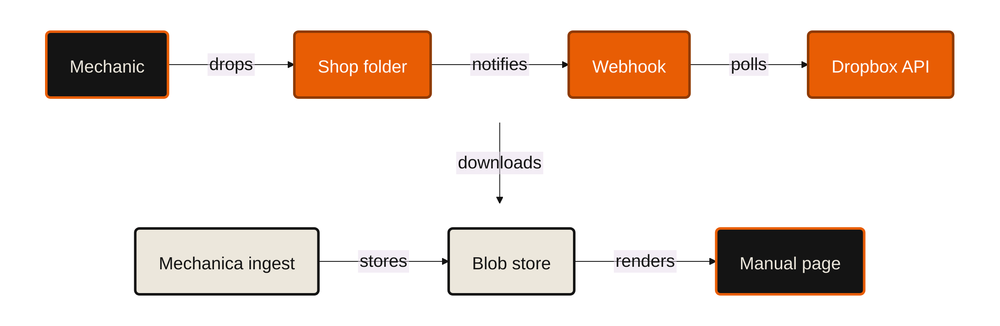

# Dropbox — the shop's own folder

5 minutes. **Live:** https://mechanica.emilvinu.ch/counter/ · API `/api`
**Evidence:** [dropbox/registry-report.md](dropbox/registry-report.md) (regenerate: `cd api && python -m tools.dropbox_report`)
**Code:** `api/app/dropbox_sync.py` · tests `api/tests/test_dropbox_sync.py` (32, green)
All counts measured 2026-09-20 from `api/data/registry.json` and the live API.

---

## Fit verdict — read this before you pitch it

**The challenge text is not in this repo.** `docs/PITCH.md` carries a Dropbox row, `docs/SUBMISSION.md`
carries none, and hackmit.org served nothing usable. The earlier "digital chaos → order" summary could
**not** be verified. So the pitch below is written to survive either reading: it opens on chaos→order
with counted evidence, and the middle is a real Dropbox API integration, which is what a sponsor judge
asks for regardless of theme. **Check the actual track text at the venue and cut accordingly** — the
script marks which 45 seconds to drop.

Three angles were considered. Scores are 1–5.

| angle | fit to "chaos → order" | fit to *Dropbox* | judge appeal | build | verdict |
|---|---|---|---|---|---|
| **(a) the registry as chaos→order** — 99,338 rows, 90 portals, 6,244 **owner-typed** rows a portal filed as a handbook that are not | **5** | **1** | 3 | 1 (done already) | **opening only** |
| **(b) the shop's own folder** — a workshop drops its PDFs in Dropbox, we index them page-exact next to the OEM manual | 4 | **5** | **5** | 3 | **primary** |
| **(c) Dropbox as the archive / shared links to customers** | 2 | 3 | 2 | 3 | **no** |

**(a) alone loses.** It is the strongest evidence we own and it has nothing to do with Dropbox. A
sponsor judge hears a beautiful data-cleaning story and asks "where is our product in this?" — and the
honest answer would be *nowhere*. It is a perfect 45-second opening and a terrible 5-minute pitch.

**(c) is a downgrade dressed as an integration.** Azure Blob is already the system of record
(`api/app/store_blob.py`, 489 lines, public-read `pdf` container so the browser range-fetches pages
without an API hop). Replacing it with Dropbox would make the product slower for no user benefit, and
the customer-shared-link idea — "here is the page for your bike" — means creating a public link to a
manufacturer's PDF, which is the one thing `docs/MANUALS.md` § *Copyright stance* says we never do. I
also could not retrieve the parameters of `sharing/create_shared_link_with_settings` from the published
spec, so nothing in this pitch depends on it.

**(b) wins because it is the half of our own problem we cannot solve any other way.** The registry
indexes 99,338 rows and **186** of them are service manuals; **14 are not free** — BMW meters its at
**EUR 9/hour**, Triumph at **GBP 5.99/month per bike**, and Ducati, Piaggio, Moto Guzzi, Aprilia and
Royal Enfield hand theirs to dealers only. We fetch none of them, ever. The shop already bought its
copy. It is sitting in a Dropbox folder next to the scanned bulletins and the PDFs the importer
emailed over. Dropbox is not decoration here; it is where the missing documents actually live.

---

## What was verified about the Dropbox API (not guessed)

Fetched 2026-09-20 from `github.com/dropbox/dropbox-api-spec/files.stone` and
`docs.dropboxapi.com/dropbox-api/docs/webhooks`:

| call | host | auth | scope |
|---|---|---|---|
| `files/list_folder` (+ `/continue`) | `api.dropboxapi.com` | user token | `files.metadata.read` |
| `files/list_folder/longpoll` | `notify.dropboxapi.com` | **`auth = "noauth"`** | `files.metadata.read` |
| `files/download` | `content.dropboxapi.com` | user token, arg in `Dropbox-API-Arg` | `files.content.read` |

- `longpoll` takes a `timeout` of **30–480 s** and its only error is `reset` ("the cursor has been
  invalidated. Call `list_folder`"). It is unauthenticated **by design** — the cursor is the
  credential — so our watcher never puts the token on an eight-minute socket. That is a good line.
- `FileMetadata` carries `id`, `rev`, `size`, `server_modified` and **`content_hash`**, which is how we
  spot the same manual saved twice under two names.
- **Webhooks**: Dropbox verifies the URI with a `GET ?challenge=…` that you echo as `text/plain` with
  `X-Content-Type-Options: nosniff`; notifications are `POST`s signed with an **HMAC-SHA256 of the raw
  body under `X-Dropbox-Signature`**, and the body "does not include the actual file changes. It only
  informs your app of which users have changes" — so the only correct response is to go ask
  `list_folder/continue`. Both halves are implemented and tested.

---

## 0:45 — the chaos (show it)

Screen: [`dropbox/chaos-to-order.svg`](dropbox/chaos-to-order.svg), then
[`dropbox/rows-per-portal.svg`](dropbox/rows-per-portal.svg).

> "A friend of mine runs his own motorcycle workshop in Germany. He spends about a fifth of his week not fixing bikes —
> looking for a page.
>
> So we went and indexed every manual a manufacturer publishes. **Fifty-three thousand five hundred
> and fifty-seven rows, across eighty-four different portals.** Every one of them a different shape.
> Twenty-five thousand of those rows point at a file another row already named. Four thousand and
> eighty-one arrive labelled *owner's manual* and are a brochure, a warranty insert, or the
> infotainment guide — Triumph's portal alone ships three and a half thousand of those. Seventeen manufacturers we
> walked to the end and wrote off: CFMOTO TLS-resets from outside its region, Beta needs a VIN.
>
> That is the chaos. We turned it into **fourteen thousand seven hundred and seventy** fetchable PDFs
> and **thirteen thousand five hundred and thirty-seven** vehicles that open on the right page.
>
> And it is still the wrong document."

*(If the track turns out not to be about chaos→order, cut this to ten seconds: "we indexed 99,338
manuals from 90 portals — and none of them is the one a professional needs.")*

## 1:30 — what order looks like in the product

> "Of those fifty-three thousand rows, **a hundred and eighty-two** are service manuals. **Fifteen of
> them are not free.** BMW charges **nine euros an hour** to read theirs. Triumph, six pounds a month,
> per bike. Ducati, Piaggio, Moto Guzzi, Aprilia: dealer only. We fetch **zero** of those. Not because
> we can't — because we won't; the registry stores locations, never documents.
>
> But my friend already **owns** that manual. He bought it. It is a PDF in his Dropbox, in a folder
> with four hundred scanned bulletins, the importer's emails and three photos of a wiring loom.
>
> So: he connects the folder once. Every PDF he drops in it from then on gets the exact same treatment
> as a factory manual. It is read page by page, its own headings become the search index, and every
> quote is searched back into the PDF's text layer — **if we can't find the ink, we don't draw the
> marker.** His own scanned service manual now answers in the same two taps, on the same printed page,
> with the same `[p. 214]` chip under every sentence the chat writes.
>
> Nothing is rewritten. Nothing is uploaded anywhere else. It is his document, in his index, and the
> answer is still a page he can hold a judge to."

## 1:00 — live demo

Exact inputs. Everything below was run against the repo on 2026-09-20; the Dropbox half needs the token
(see *What Emil must do*).

| do | on screen | say |
|---|---|---|
| Before you go on: the folder is empty and `GET /api/dropbox/status` shows `counts: {}` | — | — |
| From the phone, drop **`MV Agusta Brutale 1000 RR 2024 service manual.pdf`** into the shop folder | Dropbox's own upload toast | "That's the whole setup. It's a folder." |
| Switch to the app, type `brutale` → tap **MV AGUSTA BRUTALE 1000 RR** → **2024** | the bike | "He never told us which bike. The folder is the filing cabinet, so the file name is the metadata." |
| Show `/api/dropbox/status` on the second screen | `state: done`, `manualId: mv-agusta-brutale-1000-rr-2024-shop`, `replaced: …` | "Longpoll came back in about a second, we pulled it, and it went through the same ingest as a KTM manual. Forty seconds, ten cents." |
| Type `valve clearance` | the service manual's own heading, then the printed page, marker on the lines | "That figure is not in any owner's manual on earth. It's in his." |
| Tap **CHAT**, ask `what is the valve clearance` | every sentence ends in a `[p. N]` chip; tap it | "Same rule on his document as on the factory's: it may only emit page numbers." |

**If there is no token on the day**, do the same demo through the button that is already live: on a bike
with no free manual, **PDF** → pick the file → progress bar → the same page-exact answers
(`POST /api/ingest/upload`, `web/counter/js/screens/confirm.js`). Then say, honestly: "the folder version
is in the repo, `api/app/dropbox_sync.py`, thirty-two tests green — it needs a token and I didn't want
to fake one on stage."

## 1:00 — how it is done



Three sentences for the room: **one poller, one webhook, one ingest.** The Dropbox side is four
documented calls and a stored cursor. The moment the bytes are on disk it is *literally the same
function* that ingests a factory PDF — which is why a shop's scanned manual gets the grounding
guarantees and not a watered-down version of them.

## 0:45 — close

> "Thirteen and a half thousand of our twenty-seven thousand vehicles have a free owner's manual.
> That's the rider's document. The mechanic's document is metered by the hour, and it always
> will be — that is the manufacturers' business model and I am not going to pretend otherwise.
>
> So we don't fight it. The shop bought the manual. We just make the copy it already owns as findable
> as the factory's — page-exact, marker on the ink, same two taps.
>
> Fifty-three thousand rows of order, and the last mile is a folder.
> Don't trust the AI. Trust the manual — including the one you already paid for."

---

## Slides

| # | title | the one line | art |
|---|---|---|---|
| 1 | **Mechanica** | Don't trust the AI. Trust the manual. | — |
| 2 | **99,338 rows. 90 portals.** | Every one a different shape. | `dropbox/rows-per-portal.svg` |
| 3 | **What a portal calls a handbook** | 6,244 rows typed *owner* that are a brochure, a warranty insert, an infotainment guide — counted over **every** row, in every language and access level. | table from `dropbox/registry-report.md` |
| 4 | **Order** | 14,865 fetchable PDFs · 18,564 vehicles · one page. | `dropbox/chaos-to-order.svg` |
| 5 | **And it is the wrong document** | 186 service manuals. 14 not free. BMW: **EUR 9 / hour**. | the four rows of the access table |
| 6 | **He already owns it** | It is a PDF in a folder, next to 400 scans. | photo of a shop folder / Dropbox screenshot |
| 7 | **Connect the folder** | Demo. | live |
| 8 | **The same ingest** | Four documented calls, then the identical function that reads a factory PDF. | the mermaid flowchart |
| 9 | **What the model is allowed to do** | Emit page numbers. That's all. The server cuts the quote out of the page. | `08-chat.png` (from `docs/pitches/general/`) |
| 10 | **The last mile is a folder** | 99,338 rows of order — and the one that matters is yours. | — |

Speaker notes: **slide 3 is the laugh** — say "the Gold Wing brochure is filed next to the owner's
manual" and let it land; it is the single most human illustration of the mess. **Slide 5 is the
turn** — go quiet on "nine euros an hour." **Slide 8**: do not read the diagram. Say the three
sentences and move.

---

## Q&A — the hard ones

**1. "Why Dropbox? This is just a folder. Why not a watched directory, or S3, or Drive?"**
Because the folder already exists and it is already Dropbox. Go into an independent workshop and the
service manuals, the scanned bulletins and the photos the importer sent are in one of two places: an
unsorted Desktop, or a Dropbox the boss set up years ago so the second bay could see the same files.
We are not asking him to adopt a system; we are reading the one he has. Technically, three things a
watched directory cannot do: **`list_folder/longpoll`** gives us sub-second change notice without a
token on the socket and without polling a laptop that is asleep; **`content_hash`** tells us the same
manual saved twice is the same manual before we spend ten cents ingesting it; and the folder works from
his phone in the workshop and his desktop in the office without us building sync. The abstraction is one
`Store`-shaped seam — if the next shop is on Drive, that is a second adapter, not a second product.

**2. "You are copying manuals into your servers. Whose copyright is that?"**
Three answers, and they are in `docs/MANUALS.md` § *Copyright stance*, written before this pitch. One:
the registry stores **locations, not documents** — `RegistryEntry` has no field that could hold manual
content, and we fetch nothing that is paid, subscription or dealer-only. **Zero of the 15 metered
service manuals are in our index.** Two: this path only ever ingests a document **the user already
holds**, into **the user's own index**, the same as the PDF-upload button that has been live all along —
we are the reader, not the distributor. Three: nothing is rewritten, so nothing new is authored.
Sections are headings the manual prints, quotes are character-for-character, and `ingest/ground.py`
**drops any quote it cannot find in the PDF's text layer**. Every screen shows the manual's cover title
and its own printed page number, so there is no way to read an answer here without knowing who wrote it.
What we have not built yet, and I will say it plainly: a per-shop tenancy boundary. Today a shop's
document re-points that bike in one shared catalog. That is a scoping change, not a redesign — the
manual id already ends `-shop` precisely so the free `-om` row survives underneath it.

**3. "Those are a mechanic's private documents. Invoices, customer records. What do you do with them?"**
We read the folder he points us at, and only PDFs. A file whose path does not parse to a make, a model
and a year is **not downloaded further, not ingested and not guessed at** — it comes back as
`unmatched` in `/dropbox/status` so he can see exactly what we ignored. There is a test for that, and
it is the one behaviour I would not trade: a manual filed under the wrong bike is precisely the failure
this product exists to prevent. The token is scoped — `files.metadata.read` and `files.content.read`,
nothing else, and an **App folder** app can only ever see its own folder, never his Dropbox. Longpoll
is unauthenticated, so the token never rides a long-lived socket. And the honest gap: today the PDF he
ingests is cached in our blob storage so the browser can render the page. For a shop deployment that
container is his, and a per-tenant key is the next thing I would build.

**4. "How does this scale? Ten thousand shops, ten thousand folders."**
The per-shop cost is the interesting number and it is small: **$0.0972 median to ingest a manual**
(648 real ingests in `api/data/mass_report.jsonl` — the file has 773 lines, the rest are error, duplicate
or suspicious), **once**, and **$0.00038** per question after that. A shop
with a hundred documents is a **ten-dollar** one-time cost. The scaling risk is not money, it is
**cursors and duplicates**: one cursor per folder, and the `content_hash` check means the same Haynes
PDF sitting in five hundred shops' folders is ingested — well, today, five hundred times, and that is
the real answer: cross-tenant dedupe on content hash is worth more than anything else on the roadmap,
and the hash is already stored. Dropbox's own limits push you toward exactly the design we picked:
longpoll instead of polling, one cursor per folder, `429` carries its own `retry_after` and our watcher
honours it with a backoff ladder.

**5. "Is it live right now?"**
The upload path is live and always has been — `POST /api/ingest/upload`, and the button on a bike with
no free manual. The folder sync is **built, deploying**: the router is in `api/app/main.py`, but the deployed replica
predates it, so `/api/dropbox/*` is not in the live OpenAPI yet. 32 tests against a mocked
Dropbox covering list, continue, pagination, cursor reset, download, the `%PDF` check, duplicates by
content hash, the unmatched path, `429` with `retry_after`, the noauth longpoll, the webhook challenge
and its HMAC. It needs one token in `agent-secrets/dropbox.txt` and it starts on the next boot. I would
rather tell you that than demo a stub. Same rule as the Elastic and voice tracks in this repo: no key,
no button, and the code says so.

**6. "What if the file name is wrong, or in German, or just `scan0001.pdf`?"**
Then it is `unmatched` and it stays in the folder, visible in the status endpoint. We read the **whole
path**, not just the file name, because a shop's filing *is* metadata —
`/Manuals/Yamaha/MT-07/2019.pdf` resolves fine. The make list comes from the 82 makes in our own
catalog plus a small alias table (`harley`, `gasgas`, `mv`). The next step is obvious and cheap: when a
path does not parse, read page one of the PDF — the cover says the make, the model and the year, and we
are already reading the text layer. I did not build it because guessing is worse than asking.

**7. "This is a hackathon. What did you actually build today?"**
`api/app/dropbox_sync.py` — the poller, the webhook with signature verification, the path→vehicle
resolver, the ingest hand-off, `/dropbox/config|status|sync|webhook` — plus its tests, plus
`api/tools/dropbox_report.py`, which generates the chaos evidence in this pitch from the live data so
the numbers cannot drift from the repo. Two lines in existing files: one router include, one settings
line. Nothing else was touched.

---

## Numbers, and where each one comes from

| claim | number | source |
|---|---|---|
| registry rows | **99,338** | `api/data/registry.json`, `tools/dropbox_report` |
| portals | **84** | same |
| makes | **80** | same |
| rows naming a file another row already names | **48,962** | 99,338 − 50,376 distinct URLs |
| rows typed `owner` that are not a handbook | **6,244** | `registry/doctype.py` over **every** row, every language, every access level. The free-English subset — the rows we would actually fetch — is **1,507**. Say which one you mean |
| …from Triumph's portal alone | **3,435** | same, by site |
| distinct free English PDFs we can fetch | **14,865** | `_ingestable()` over the registry |
| vehicles with a free official manual | **18,564** of 30,409 | `api/data/bikes.json`, live `GET /api/catalog` |
| service-manual rows | **186** — 172 free, 7 paid, 5 dealer, 2 subscription | registry, `docs/MANUALS.md` |
| BMW service manual | **EUR 9 / hour** (`aos.bmwgroup.com`) | `docs/MANUALS.md` |
| Triumph service manual | **GBP 5.99 / month per bike** | same |
| OEM portals written off as unreachable | **17** | `docs/MANUALS.md` |
| rows explicitly retracted by a drop list | **1,449** | `api/data/registry-fragments/*.drop.json` |
| cost to ingest one manual | **$0.096** median, 169 pages | `api/data/mass_report.jsonl`, 773 manuals |
| cost per question afterwards | **$0.00038** mean | `api/eval/report.md` |
| Dropbox tests | **32 passed**; full API suite **528 passed, 20 skipped** | `cd api && python -m pytest` |

**Do not say** "99,338 manuals" — they are rows, and 48,962 of them are the same file under another
year. Say **rows**, then say **14,865 distinct PDFs**. The honesty is the pitch.

---

## What Emil has to do (10 minutes, once)

1. **Create the app.** https://www.dropbox.com/developers/apps → *Create app* → **Scoped access** →
   **App folder** (not Full Dropbox — an app-folder app can never see the rest of the Dropbox, and
   that is the answer to Q&A #3) → name it `mechanica`.
2. **Permissions tab** → tick **`files.metadata.read`** and **`files.content.read`**. Nothing else.
   *Submit*. (Scopes must be ticked **before** the token is generated, or the token will not carry them.)
3. **Settings tab** → *OAuth 2* → **Generate access token**. Copy it.
4. **Save it:**
   ```
   C:\Users\me\agent-secrets\dropbox.txt
   line 1: <the access token>
   line 2: <the App secret from the Settings tab>   # optional, only for the webhook
   ```
   Nothing else in the file. `config.py` reads it; git never sees it.
5. **The folder.** The app folder appears as `Apps/mechanica` in your Dropbox. Default watched path is
   its root; set `DROPBOX_FOLDER=/Manuals` if you want a subfolder. Drop PDFs named
   `<make> <model> <year> …pdf` — e.g. **`MV Agusta Brutale 1000 RR 2024 service manual.pdf`**, which
   resolves to a bike already in the catalog. (A free, legitimate service manual for the demo:
   `https://mva-files.s3.amazonaws.com/manuals/MM_D3739_2_Brutale_1000_24.pdf` — MV Agusta publishes
   its workshop manuals free; 113 of them are in our registry.)
6. **Run it.** `cd api && .venv/Scripts/python -m uvicorn app.main:app --port 8000`. The watcher starts
   itself at import because the token now exists. Check `GET /api/dropbox/config` → `enabled: true,
   watching: true`, then `GET /api/dropbox/status`. Force a pass any time with
   `POST /api/dropbox/sync?wait=true`.
7. **Live API (optional).** `az containerapp secret set -n ttm-api -g ttm --secrets dropbox-token=<tok>`
   then `az containerapp update -n ttm-api -g ttm --set-env-vars DROPBOX_TOKEN=secretref:dropbox-token
   DROPBOX_FOLDER=/Manuals`. Note `deploy/azure.sh` does not carry this variable yet — that file belongs
   to the store/deploy agent.
8. **Webhook (optional, only if the demo Wi-Fi kills long sockets).** App Console → *Webhooks* →
   `https://mechanica.emilvinu.ch/api/dropbox/webhook`. The `GET ?challenge=` handshake already answers
   correctly; the `POST` needs line 2 of the secrets file (or `DROPBOX_APP_SECRET`).
9. **The Chooser button (a different thing, not mine).** `web/counter/js/screens/confirm.js` already
   loads Dropbox's Chooser drop-in and hides the button unless `globalThis.TTM_DROPBOX_APP_KEY` is set —
   nothing in the repo sets it. To light it up, the frontend owner adds
   `<script>window.TTM_DROPBOX_APP_KEY="<app key>"</script>` to `web/counter/index.html`. It is the
   one-off "pick a file" path; the folder sync is the continuous one. Demo the folder.

---

## If it breaks on stage

| what breaks | what you do |
|---|---|
| **no token, or the token was revoked** | `GET /api/dropbox/config` returns `enabled: false` and the demo falls back to the **PDF** button, which is live. Say so — this repo hides every unkeyed feature and that is the rule, not an excuse. |
| **the file does not appear** | `POST /api/dropbox/sync?wait=true` runs a pass in the foreground and returns what it did, including why a file was skipped. Longpoll can sit for up to 480 s; this does not wait. |
| **it says `unmatched`** | The name is the metadata. Rename to `<make> <model> <year>.pdf` and re-drop. Say it out loud — refusing to guess is the feature. |
| **conference Wi-Fi kills the long socket** | The watcher catches the `httpx` error, backs off 5/15/60/300 s and carries on; the webhook path needs no socket at all. |
| **the ingest is slow** | It is the same 40–50 s as any cold manual, and it streams a progress bar. Start the drop *before* the chaos slide and let it run underneath — same trick as the general pitch. |
| **"is that a real service manual?"** | Yes: MV Agusta publishes its workshop manuals free and 113 are in our registry. We are not showing a BMW one, because BMW charges nine euros an hour for it and we do not fetch metered documents. That answer is better than the demo. |
