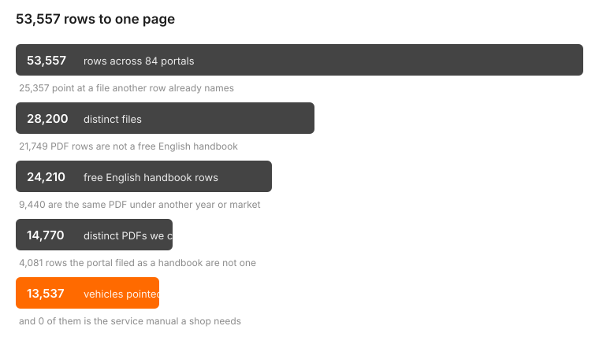
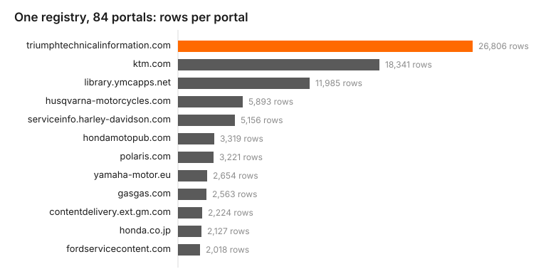

# The chaos, measured

Generated by `python -m tools.dropbox_report` from `api/data/registry.json` and
`api/data/bikes.json`. Every figure below is a count, not an estimate.

## Order, in one funnel

| step | count |
|---|---|
| registry rows | **53,557** |
| makes | 80 |
| portals (`site`) | **84** |
| distinct hosts serving the files | 84 |
| distinct URLs behind those rows | 28,200 |
| rows that name a file another row already names | **25,357** |
| free English owner's-manual PDF rows | 24,210 |
| …distinct PDFs behind them | **14,770** |
| vehicles in the catalog | 27,751 |
| …with a free official manual attached | **13,537** |

## What the portals call a handbook and is not

`api/app/registry/doctype.py` classifies every row from its URL and title alone - no download.
**4,081 rows arrive typed `owner` and are something else:**

| docKind | rows |
|---|---|
| infotainment | 2,793 |
| supplement | 578 |
| quickstart | 479 |
| spec | 159 |
| warranty | 64 |
| brochure | 6 |
| service | 2 |

Worst offenders, by portal:

| portal | mislabelled rows |
|---|---|
| `triumphtechnicalinformation.com` | 3,030 |
| `owners.hyundaiusa.com` | 278 |
| `service.citroen.com` | 153 |
| `powersports.honda.com` | 122 |
| `owners.genesis.com` | 112 |
| `serviceinfo.harley-davidson.com` | 75 |
| `library.ymcapps.net` | 60 |
| `assets.sipb.toyota.com` | 44 |

## Rows per portal

| portal | rows |
|---|---|
| `triumphtechnicalinformation.com` | 18,109 |
| `library.ymcapps.net` | 11,985 |
| `serviceinfo.harley-davidson.com` | 5,156 |
| `contentdelivery.ext.gm.com` | 2,185 |
| `fordservicecontent.com` | 2,018 |
| `ktm.com` | 1,669 |
| `kawasaki.com` | 1,309 |
| `assets.sipb.toyota.com` | 1,291 |
| `powersports.honda.com` | 1,119 |
| `manuals.bmw-motorrad.com` | 946 |
| `hondamotopub.com` | 636 |
| `owners.hyundaiusa.com` | 583 |

## The half no crawler reaches

| service-manual rows | 182 |
|---|---|
| …free | 167 |
| …paid | 7 |
| …dealer | 5 |
| …subscription | 3 |

Portals walked to the end and written off (17, from `docs/MANUALS.md`): CFMOTO, LiveWire, Beta, Moto Morini, Brixton, Ural, Janus, Norton, Mash, CCM, SWM, Fantic, Energica, Segway, Sur-Ron, Talaria, Stark.

Rows explicitly retracted by a `*.drop.json` list in `api/data/registry-fragments/`: **1,444**
(`python -m tools.registry merge-fragments` is the only writer of `registry.json`; a fragment
cannot un-say a row on its own, so an owner retracts it by id or by `--replace`ing its scope).

That is the order we can build from a crawler. The document a professional needs is in none of
it - which is where the shop's own Dropbox folder comes in.

