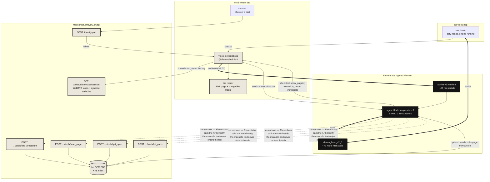

# ElevenLabs — the voice that is not allowed to make anything up

**Mechanica.** A mechanic with dirty hands says one sentence. The official manual opens on the exact page,
the answering lines go orange, and a voice reads him the figure that is printed there — with the page
number. Never a paragraph an AI wrote.

Live: **https://mechanica.emilvinu.ch** · API at `/api` · repo `C:\Users\me\trustthemanual`.

**The one line for this sponsor:** *the ElevenLabs agent has no vocabulary of its own — four server tools
are the only things it is allowed to say, and a fifth tool turns the page on the mechanic's screen while it
is still speaking.*

Judged on **agentic depth · low latency · multimodal**. This pitch is built around exactly those three.

**Honesty up front, say it on camera:** the voice mode that is live today runs on Deepgram's Voice Agent.
The ElevenLabs path is a real second engine, implemented against the Agents Platform, sharing the same
grounding policy *by import, not by copy* — it needs one API key to go live and nothing else. Everything in
section 2 is code in the repo with tests; nothing in it has been run against a live ElevenLabs account,
because there is no key on this machine. Say that in one sentence and move on. A judge who finds it
themselves has stopped listening to the rest.

---

## 1. Five ways to use ElevenLabs here, and which one we chose

Scored 1–5. Build time is *remaining* build time from where the repo already was.

| # | Integration | Agentic depth | Latency | Multimodal | Build | Verdict |
|---|---|---|---|---|---|---|
| **A** | **Agents Platform agent whose server tools ARE our four grounded manual tools, plus a client tool that drives the UI** | **5** — the model's only path to a fact is `find_procedure → read_page / get_spec / list_parts`, and `show_page` makes it act on the page, not just talk about it | **5** — flash v2.5 TTS, one hop, WebRTC | **4** — voice + the page turning + text into the same session | **3** | **CHOSEN** |
| B | Client tool `mark_lines(from,to)` on top of A: the agent highlights the answering lines as it reads them | 4 | 5 | 4 | 4 | Deferred. The reader already marks lines from a `[p. N]` jump; a second highlight channel is polish, not depth |
| C | Photo mid-conversation: the mechanic holds a part to the camera, `/identify/part` classifies it, the labels go in as a **contextual update** and the agent looks it up | 4 | 4 | **5** | 4 | **Shipped as part of A** — `photo()` in `voice-elevenlabs.js`, ~20 lines, because `/identify/part` already exists |
| D | "Read me this section" — plain TTS (`eleven_flash_v2_5`) over the page already on screen, no agent at all | 2 — zero agency, it is a speaker | 5 | 3 | 5 | Rejected as the headline. Worth one sentence on camera as the fallback for a 40-page procedure |
| E | German mechanic: the agent follows the language the mechanic speaks, while printed figures stay in the manual's language | 3 | 5 | 3 | 5 | **Folded into A** as a prompt clause — see below, it is a grounding decision, not a feature |
| F | Scribe v2 dictation replacing the chat drawer's speech-to-text | 2 | 4 | 2 | 4 | Rejected. Deepgram Flux already does this with keyterms from the manual; swapping it proves nothing about agents |

**Why A wins.** The sponsor is judging *agentic depth*, and the deepest thing a voice agent can do in this
product is the thing it is forbidden from doing everywhere else: it may not answer. Every sentence it says
has to be the return value of a tool call against one specific PDF. That constraint is the demo.

**On E, and say this out loud — it is the most interesting design decision in the whole integration.**
A German mechanic asks *"Wieviel Öl?"*. The agent answers in German. But the manual is printed in English,
and translating a printed figure is paraphrasing a figure — the exact thing this product exists to stop. So
the prompt splits the two: **your own words translate, the manual's do not.** Numbers, units, part
designations and page numbers come out in the manual's own language, word for word. Everything around them
is German. That is a sentence no generic voice wrapper has ever had to write.

---

## 2. What is implemented

Four new files, one import plus one `include_router` line in `api/app/main.py`, and **no edit to the
Deepgram path at all**. `api/app/config.py` already read `elevenlabs.txt`, so it needed nothing.

| File | What it is |
|---|---|
| [`api/app/voice_elevenlabs.py`](../../api/app/voice_elevenlabs.py) | `GET /voice/elevenlabs/session` (mints the credential + the dynamic variables), the four tool endpoints seen from ElevenLabs' side, `GET /voice/elevenlabs/timings` |
| [`api/tools/elevenlabs_setup.py`](../../api/tools/elevenlabs_setup.py) | Creates/updates the agent and its five tools. `--dry-run` prints every request body and calls nothing |
| [`web/counter/js/voice-elevenlabs.js`](../../web/counter/js/voice-elevenlabs.js) | Drop-in for `voice-deepgram.js`: same exports, same events. `@elevenlabs/client` from jsDelivr, loaded on first press |
| [`api/tests/test_voice_elevenlabs.py`](../../api/tests/test_voice_elevenlabs.py) | 29 tests, ElevenLabs HTTP mocked |
| [`elevenlabs/chat-ui.patch`](elevenlabs/chat-ui.patch) | The two-line hook into `chat-ui.js`. **Not applied** |
| [`elevenlabs/agent-dry-run.txt`](elevenlabs/agent-dry-run.txt) | The exact JSON the setup tool would POST, against the live `PUBLIC_BASE` |

**Test status: 29/29 in the new file, 617 passed / 20 skipped across `api/tests`, `node --check` clean.**

### The three things that make it not a re-skin

**One policy, two engines — enforced by a test.** `prompt_template()` calls `voice._prompt()` — the Deepgram
agent's own prompt function — with the per-manual facts replaced by `{{bike_name}}`, `{{manual_title}}`,
`{{manual_pages}}`, `{{manual_digest}}`. The test substitutes a live session's dynamic variables back in and
asserts the result **equals the Deepgram prompt character for character**. Edit the policy in `voice.py` and
both engines move together; fork it and CI fails.

**The book cannot be talked out of the model's hands.** Deepgram puts the manual id in a query string its
own server owns. ElevenLabs substitutes dynamic variables, but *which* substitutions a given account
performs is not verifiable from this repo without a key — so the id is offered three ways and resolved
hardest-to-forge first:

| order | source | who writes it |
|---|---|---|
| 1 | `X-Manual-Id` header | ElevenLabs, from `{{manual_id}}` — the model never sees it |
| 2 | `?manualId=` | ElevenLabs, likewise |
| 3 | request body | **the model** — last resort, only if 1 and 2 are absent |

A value that still contains `{{` is treated as absent, so a platform that does not substitute degrades to
the next source instead of looking up a manual literally called `{{manual_id}}`. Five tests cover this,
including *"the model asks for the BMW, the header says KTM, the header wins."*

**`show_page` is `execution_mode: "immediate"`.** The page appears *during* the sentence that names it, not
after the turn ends. One field, and it is the difference between a voice assistant and a pair of hands.

### The flowchart



Read it once on camera as: **everything black is ElevenLabs, everything cream is ours, and every arrow into
the model comes out of a PDF.**

---

## 3. The five-minute video — shot list

300 seconds. Times are elapsed. **Bold** = spoken word for word. Screen column is what is visible at that
second. Shoot the demo in one take; cut only between sections.

| t | screen | spoken |
|---|---|---|
| **0:00–0:18** | A real workshop. A bike on a lift. A phone on the tank, screen off. | **"My friend runs a motorcycle workshop in Germany. About a fifth of his working day is spent looking for a page in a manual. He does not use AI, for one reason: if the answer is ninety-five percent right, he is the one who is liable for the five."** |
| 0:18–0:32 | Mechanica landing → tap the KTM 390 Duke 2024 card. | **"So we built the thing that gives him the page instead of a paragraph. Today I want to show you what happens when you can talk to it."** |
| **0:32–0:45** | The manual open on the reader. Tap **VOICE**. Status strip: connecting → listening. | **"That's the official KTM owner's manual. Voice is on. Nothing is loaded until I press that button."** |
| **0:45–1:05** | Agent greeting plays. | Agent, unprompted: *"I see you're looking at the KTM 390 Duke 2024."* — **"It knows which bike, because the session is bound to one book before the model is ever reached."** |
| **1:05–1:35** | Mechanic speaks. Watch the page: it turns *while* the voice is still talking. | Mechanic: **"How much engine oil does it take?"** · Agent: *"Page 114 says one point five litres."* · You: **"Two things just happened. It called `get_spec`, which went to our API and came back with the sentence that's printed on the page — and it called `show_page`, which turned the page in front of me while it was still speaking."** |
| **1:35–2:05** | Second question, longer answer. Reader jumps, lines go orange. | Mechanic: **"Walk me through changing the oil filter."** · Agent reads printed steps, page number first. You: **"`find_procedure`, then `read_page`. It's reading the book out loud. It cannot summarise, because it never had the summary — only the page."** |
| **2:05–2:30** | Ask something the KTM manual does not print. | Mechanic: **"What's the valve clearance?"** · Agent: *"This manual doesn't print a valve clearance."* · You: **"That is the whole product in one sentence. Every other assistant would have given me a number."** |
| **2:30–3:05** | Hold a chain up to the phone camera. Tap the camera chip. Labels appear; the agent picks it up mid-conversation. | **"Multimodal, and I never left the conversation. The photo goes to our part classifier, the labels go in as a contextual update — context, not an answer — and the agent still has to look the part up before it can tell me anything about it."** Agent: *"Page 96 lists the chain, and says to adjust the slack to ..."* |
| **3:05–3:30** | Same session, no restart. | Mechanic, in German: **"Und wie viel Öl?"** · Agent answers in German, with the figure in the manual's own words. You: **"It followed me into German. But look at the number — the manual is printed in English, and a translated figure is a paraphrased figure. So its own words translate and the manual's do not."** |
| **3:30–4:05** | Split screen: `GET /api/voice/elevenlabs/timings` in a terminal; the flowchart on the other half. | **"Latency, measured rather than claimed. Our tool leg — the part we own — is this endpoint: every call the agent made, timed on the server. ElevenLabs' own published numbers are a hundred and fifty milliseconds to a partial transcript and about seventy-five to the first byte of audio. The budget is the sum, and we can show you which half is ours."** |
| **4:05–4:35** | The flowchart. | **"Four server tools. ElevenLabs calls our API directly, so the manual's text never passes through the browser and cannot be edited on the way. One client tool, and it doesn't speak — it turns the page."** |
| **4:35–4:50** | `api/app/voice_elevenlabs.py` on screen, the `prompt_template` function. | **"The grounding policy isn't rewritten for this. It's imported from the other engine, and a test asserts the two prompts are identical character for character."** |
| **4:50–5:00** | Back to the bike. Phone on the tank, page open, lines orange. | **"He gets the page. He stays liable, and he stays right. That's the whole thing."** |

**Fallback if the key does not exist on the day:** run the same demo on the Deepgram engine, and put the
`--dry-run` output and the 29 passing tests on screen for section 2. Say *"same policy, same tools, one key
away"* — do not mime an ElevenLabs session that did not happen.

**What the judge should feel, by minute:** 1 — *this is a real trade, not a demo app.* 2 — *it just did four
things I did not ask it to explain.* 3 — *it refused to answer, and that was the best moment.* 4 — *these
numbers are measured and they told me which half was theirs.* 5 — *this ships on Monday.*

---

## 4. The written submission (≤400 words)

> **Mechanica — the voice that is not allowed to make anything up**
>
> A mechanic with a bike on the lift and dirty hands asks one sentence out loud. The manufacturer's own
> manual opens on the exact page, the answering lines turn orange, and a voice reads him the figure printed
> there — with the page number. Never a paragraph an AI wrote.
>
> The problem is real: a friend's motorcycle workshop in Germany loses roughly 20% of its working time
> searching manuals — about 400 hours a year, EUR 36–48k of billable time per mechanic. He won't use AI,
> because 95% right is not good enough when he carries the liability for the 5%.
>
> **Agentic depth.** Our ElevenLabs agent has no vocabulary of its own. Four webhook tools —
> `find_procedure`, `read_page`, `get_spec`, `list_parts` — are the only route to a fact, and each returns
> the manual's own printed words with the page they are printed on. Temperature 0. The agent must call one
> before the first word of any answer; when the manual prints nothing it says so instead of supplying a
> figure. A fifth tool, `show_page`, is a client tool with `execution_mode: immediate`: the agent drives the
> reader on the mechanic's screen *while it is still speaking*. The manual id is bound by a substituted
> header, not by a model argument, so the agent cannot be talked into reading a different book. The whole
> grounding policy is imported from our Deepgram engine; a test asserts both prompts are identical
> character for character — one policy, two engines.
>
> **Latency.** WebRTC, `eleven_flash_v2_5` (~75 ms to first audio), Scribe v2 realtime (~150 ms partials),
> and a tool leg we measure ourselves at `GET /api/voice/elevenlabs/timings` — per-call, p50, p95.
> ElevenLabs' servers call our tools directly, so no browser round trip sits in the loop. Our comparable
> live engine answers in a median of 2.08 s from end of speech.
>
> **Multimodal.** Voice, the page, and the camera in one session: the mechanic holds a part up, our
> classifier labels it, and the labels enter as a *contextual update* — context, never an answer — so the
> agent must still look the part up in the book. Typed turns go into the same conversation. And it follows
> the mechanic into German, with one rule: its own words translate, the manual's do not.
>
> Live: mechanica.emilvinu.ch — 14,770 free official manuals, $0.00038 an ask and $0.0041 a written answer.

*(398 words.)*

---

## 5. Q&A — the hard ones

**"Have you actually run this against ElevenLabs?"**
No. There is no ElevenLabs key on this machine, and I am not going to pretend otherwise. What exists is the
agent definition, the session endpoint, the tool endpoints, the browser client and 29 tests with the HTTP
mocked; `--dry-run` prints the exact bodies. The live voice mode you saw runs on Deepgram, which is why I
can quote a measured median of 2.08 s (5 spec turns, 1.73–4.01 s; a procedure question is 9.9 s). One key
turns this on.

**"So this is a Deepgram app with an ElevenLabs sticker."**
The opposite. The two platforms ground an agent in opposite directions: Deepgram is stateless — we push the
whole prompt, models and tool endpoints down the socket every session. An ElevenLabs agent is a persistent
workspace object with one static prompt and tool ids, and the per-session facts arrive as dynamic variables.
That difference is why there is a separate setup tool, a separate session endpoint, a separate credential
flow, and a separate manual-id binding strategy. What is *shared* is the one thing that should be: the
grounding policy, imported rather than copied, with a test that fails if they drift.

**"Why not just use the knowledge base / RAG that ElevenLabs gives you?"**
Because a RAG answer is a paraphrase with a citation stapled on, and this mechanic is liable for the
number. Our tools return the page's verbatim text and the page number, and the prompt forbids any figure
that a tool result did not print. Also: 14,770 distinct free English PDFs, 27,751 vehicles. Uploading them into a knowledge
base is a copy we have no right to make — we index what the manufacturer publishes and link to their file.

**"What stops the model from just answering from memory? Every prompt says 'don't hallucinate'."**
Three things that are not the prompt. The tools are the only source of page text, so an unsourced figure
has no page number to attach and the answer visibly breaks its own format. The manual id never comes from
the model, so it cannot silently switch books. And the same four tools already serve the typed chat path,
which is evaluated: **100% valid citations, 0 invented numbers, 0 dealer referrals** over the chat eval set.
The voice agent is the same tools with a different mouth.

**"What is your actual latency number for ElevenLabs?"**
I don't have one, and I'd rather say that than read you their marketing page as if I'd measured it. What I
can give you is the decomposition and the half we own: `GET /api/voice/elevenlabs/timings` returns every
tool call this process has served with p50 and p95, and each is one index lookup or one page read against a
warm manual. Their published figures are ~150 ms to a partial transcript and ~75 ms to first audio. The
comparable full round trip on our live engine is a median 2.08 s from end of speech to first audio, over
5 spec turns — and 9.9 s on a procedure question, which is the number I would not leave out.

**"Why WebRTC instead of the WebSocket?"**
A workshop's wifi is the worst network in the building. A WebSocket is TCP: one lost packet head-of-line
blocks everything behind it, including the audio. WebRTC has its own congestion control and can drop a
frame instead of stalling a sentence. The session endpoint mints a WebRTC conversation token first and only
falls back to a signed WebSocket URL if the account cannot issue one.

**"Where does the API key live?"**
Never in the browser. `GET /voice/elevenlabs/session` mints a short-lived conversation credential server-side
with the account key and hands the tab only that. Same posture as the Deepgram path, where a Cloudflare
Worker holds the key and proxies the socket. The webhook tools are additionally guarded by a shared
`X-Voice-Secret` header when `VOICE_TOOL_SECRET` is set.

**"Cost?"**
Not measurable for ElevenLabs yet — that is a key away too. For scale: the whole product costs
$0.0003–0.005 per question against $4–6 for the naive approach of feeding a 500-page manual to a flagship
model, and the comparable voice engine bills $0.075 per connected minute of socket time, which exists only
between two taps of one button.

**"It refused to answer the valve-clearance question. Isn't that a failure?"**
It is the feature. An owner's manual names a hundred jobs and prints the procedure for twenty. When the
manual names the job but prints no steps, the agent says *"the manual doesn't print the steps"* in four
words, gives the ordinary workshop procedure marked as general, and still quotes every figure the manual
*does* print with its page. General steps are allowed. A general number never is.

---

## 6. What Emil has to do

Five steps. Nothing else in the repo changes.

1. **Create the key.** elevenlabs.io → Profile → API Keys → create. A plan with Agents Platform access is
   required (the free tier's agent minutes are enough for a demo).
2. **Save it.** `C:\Users\me\agent-secrets\elevenlabs.txt`, the key and nothing else.
   `api/app/config.py` already reads it: `elevenlabs_api_key = _secret("ELEVENLABS_API_KEY", "elevenlabs.txt")`.
3. **Create the agent.**
   ```sh
   cd C:\Users\me\trustthemanual\api
   PUBLIC_BASE=https://mechanica.emilvinu.ch/api ./.venv/Scripts/python tools/elevenlabs_setup.py --dry-run   # read it first
   PUBLIC_BASE=https://mechanica.emilvinu.ch/api ./.venv/Scripts/python tools/elevenlabs_setup.py             # prints agent_...
   ```
   Put the printed id in `ELEVENLABS_AGENT_ID` wherever the API runs (Azure Container App env var), so
   `/api/voice/config` starts serving it. Re-running the tool is idempotent — it PATCHes what it already owns.
4. **Switch the button** (only when you want ElevenLabs to be the live engine):
   `git apply docs/pitches/elevenlabs/chat-ui.patch`. Two lines. Revert with `git apply -R`.
5. **Deploy** the API and the web bundle the usual way, then check
   `GET https://mechanica.emilvinu.ch/api/voice/elevenlabs/session?manualId=ktm-390-duke-2024-om-en`
   returns a `conversationToken`. If it returns `"auth":"public"` the key is not reaching the API process;
   if it 501s, `ELEVENLABS_AGENT_ID` is not set.

**If the setup tool 4xxs**, the two fields most likely to have moved are `prompt.llm` (the enum of allowed
models changes; `api/app/voice_elevenlabs.py` → `LLM`) and `platform_settings.auth.enable_auth`. Both are
one constant each, and `--dry-run` shows exactly what is being sent.

**Optional, and worth it before filming:** once a session has run, `GET /api/voice/elevenlabs/timings` has
real numbers in it. Those are the only latency figures in this pitch we are allowed to call *measured*.
