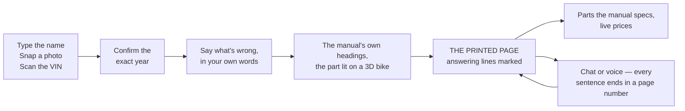

# Mechanica — the general pitch

5 minutes, one live phone, no tech words. **Live:** https://mechanica.emilvinu.ch/counter/
**Demo bike:** KTM 390 Duke **2024** — every input below was run against the live app on 2026-09-20.
Screens: `docs/pitches/general/`.

---

## The opening — three drafts, and the one to use

**A. The friend's workshop.** "A friend of mine opened a motorcycle workshop in Germany a few years
ago. He's a good mechanic. And he spends about a fifth of his working week not fixing bikes — he
spends it looking for a page."

**B. $4 and 95%.** "Two numbers killed AI in my friend's workshop. It was right 95% of the time. And
one question cost him four dollars."

**C. The manual is the answer.** "Every answer a mechanic needs is already printed. Somebody wrote it,
a lawyer checked it, the manufacturer signed it. The problem was never the answer. It's finding it."

### Use **A**.

B opens with numbers nobody is attached to yet — the room has to be told why to care before the
numbers mean anything. C is a thesis, not a problem; an audience that hasn't felt the pain hears it as
a slogan. **A** puts a real person in the room in eleven seconds, and it carries B and C inside it:
the 95% and the $4 arrive thirty seconds later as *his* reasons, which is much harder to argue with
than ours. Then the product isn't an idea — it's what we built for him.

---

## The user path

---

## The script — 5:00

Start the slow thing first (0:20) and talk over it. Every input is literal: type exactly that.

| clock | you do | on screen | you say | they should feel |
|---|---|---|---|---|
| **0:00–0:20** | nothing. Phone down. | — | "A friend of mine opened a motorcycle workshop in Germany a few years ago. He's a good mechanic. And he spends about a fifth of his working week not fixing bikes — he spends it looking for a page." | *Oh. That's a real person.* |
| **0:20–0:35** | pick up the phone, type `mt-07`, tap the **YAMAHA MT07** card, tap **2018** (a year with no manual yet), tap the **✓** on *Is this your bike?*. A progress bar starts. **Leave it running.** | a bar filling | "Hold that thought — I've just asked it for a manual it has never seen. We'll come back to it." | *Something is loading. Fine.* |
| **0:35–1:00** | put the phone down again | — | "Twenty percent of his time. Call it four hundred hours a year. At a German shop rate that's thirty-five to forty-five thousand euros of work he could have billed — gone, into PDFs." | *That's a salary.* |
| **1:00–1:20** | — | — | "So I asked him: why not use AI? He said two things. One — it's right ninety-five percent of the time, and I'm the one who signs for the five. Two — he tried it, and one question cost him four dollars, because the model had to read a five-hundred-page manual to answer it. He hit his limit by lunchtime." | *Both objections are fair. I'd refuse too.* |
| **1:20–1:35** | — | — | "So we built the opposite of a chatbot. Mechanica never answers. It finds the page in the manufacturer's own manual and puts your finger on the line." | *Okay — what does that look like?* |
| **1:35–1:50** | pick up the phone, type `390 duke` | photo cards of every Duke | "You start with the bike. Twenty-seven thousand vehicles — motorcycles and cars." | *Fast.* |
| **1:50–2:00** | tap the **KTM 390 DUKE** card, tap **2024** | year chips, then the bike on the stage | "The exact year. A 2024 and a 2021 are different machines, and a torque figure from the wrong year is how you strip a thread." | *They care about the boring part.* |
| **2:00–2:20** | type `chain is loose` | the bike explodes, the chain lights, two headings appear: *12.12 Checking the chain tension* P. 77–78, *12.13 Adjusting the chain tension* P. 78 | "Plain words — what he'd actually say. And look at what comes back. Those aren't our words. That's KTM's own table of contents, and the part it's talking about." | *It didn't write anything.* |
| **2:20–2:45** | tap **Checking the chain tension**, then **MANUAL →** | KTM page 77, orange markers on the measuring instruction and on *Chain tension 7 … 10 mm (0.28 … 0.39 in)* | "There it is. Page 77 of KTM's manual. The marker sits on the two lines that answer him — and it's only there because we found that exact text in KTM's PDF. If we can't find the ink, we don't draw the marker." | *That's the actual document, not a summary.* |
| **2:45–2:55** | tap **ALL** | 143 sheets | "The whole book is here when he wants it. By default he only gets the pages that answer." | *Nothing is hidden.* |
| **2:55–3:15** | tap **PARTS**, then the **Chain** tile | Chain · 5/8 x 1/4" (520) X-ring · P. 126 · RevZilla $61.15, free shipping, in stock | "A hundred and thirty-five parts for this bike. Every one of them is on that list because the manual prints a spec for it — that chain size is KTM's, not a guess. Then the live price, because the next thing after 'it's worn' is 'what does it cost'." | *It closes the loop.* |
| **3:15–3:40** | back, tap **CHAT**, type `chain is loose, what do I do` | four numbered steps, every sentence ending in a `[p. 77]` or `[p. 78]` chip. Tap **[p. 78]** — the page appears. | "This is the one place it's allowed to write a sentence. And it is only allowed to write page numbers. Every claim is one tap from the ink." | *Even the chatty part is leashed.* |
| **3:40–3:50** | tap the **mic**, say `how much engine oil does it take` | it answers out loud and turns the page itself | "Hands covered in oil, bike on the lift. He talks; it reads him the manual's own number and shows him the page." | *That's a workshop, not a website.* |
| **3:50–4:05** | go back — the **MT-07** from 0:20 is ready. Tap it, type `oil` | the page | "That manual did not exist on our servers four minutes ago. Seventeen thousand free official manuals — any of them, fetched and searchable in under a minute, for ten cents." | *So the catalogue isn't the limit.* |
| **4:05–4:35** | phone down | — | "Why now: the manufacturers put these PDFs online for free, and they're unusable — two hundred pages, no search worth the name. Reading one to a model end to end costs dollars a question. Reading only the page that answers costs four hundredths of a cent. That gap is the whole product, and it only opened in the last year." | *The timing is real, not a pitch.* |
| **4:35–5:00** | — | the marked page | "Today: twenty-seven thousand vehicles, five hundred manuals already indexed, and the whole thing has cost six dollars to run. Every number I gave you is on the live site right now. And there is not one AI-written sentence on this screen. Don't trust the AI. Trust the manual — we just get you to the page." | *I want to show this to someone who turns wrenches.* |

**Running short?** Cut 2:45–2:55 (ALL) and 3:40–3:50 (voice), in that order. Never cut the page at
2:20 or the chat at 3:15 — one is the proof, the other is the objection-killer.

**Spare inputs, all verified live today.** KTM 390 Duke 2024: `what torque for the rear axle` →
*Adjusting the chain tension* p.78 + *Chassis tightening torques* p.128–130 · VIN
`VBKJSA40XXXXXXXXX` → KTM 390 Duke 2024 in 1.3 s.

---

## 10 slides

| # | title | the one line | screenshot |
|---|---|---|---|
| 1 | **Mechanica** | Don't trust the AI. Trust the manual. | `01-landing.png` |
| 2 | **My friend's workshop** | He fixes bikes for a living and spends a fifth of his week looking for a page. | — (his shop, or blank) |
| 3 | **Why he won't use AI** | 95% right, and he signs for the 5%. $4 a question when he tried. | — (the two numbers, huge) |
| 4 | **Start with the bike** | 27,751 vehicles — type it, photograph it, or scan the VIN. | `02-cards.png` |
| 5 | **The exact one** | Year and market, because a torque figure from the wrong year strips a thread. | `03-chooser.png` |
| 6 | **Say what's wrong** | Plain words in; the manual's own headings out, and the part lit on the bike. | `04-pick-3d.png` |
| 7 | **The answer is a page** | KTM's page 77, marked on the two lines that answer — and only where we found that ink. | `05-book.png` |
| 8 | **What it needs, what it costs** | 135 parts, each one there because the manual prints a spec for it. Live prices. | `06-parts.png` → `07-part-detail.png` |
| 9 | **When you do want a sentence** | It may only write page numbers. Every claim is one tap from the ink. | `08-chat.png` |
| 10 | **Today** | 17,556 free manuals reachable · any of them searchable in under a minute for 10¢ · four hundredths of a cent a question. | — (numbers) |

---

## Speaker notes

**Slide 1 — don't rush it.** Say the title, then stop talking for two seconds. The whole pitch is a
reversal ("AI that refuses to answer"), and reversals need a beat.

**Slide 2 — name him, don't dramatise him.** "A friend of mine." Not "a customer", not "shops
everywhere". One person is more convincing than a market, and the room knows the difference.

**Slide 3 — let the two numbers sit alone.** No bullets. 95% and $4. Say them as *his* reasons, not
your argument. You're not attacking AI, you're agreeing with a skeptic — which buys you everything you
do next.

**Slide 4–5 — narrate the taps, not the screen.** "Type it. Tap it. Tap the year." They should feel
how few taps there are. Don't explain the photo or the VIN path unless asked — say the words "or
photograph it, or scan the VIN" and move on.

**Slide 6 — the line that lands is "those aren't our words."** Point at the headings. *12.12* and
*12.13* are KTM's own section numbers; that they look like a filing system is the point.

**Slide 7 — this is the slide.** Stop. Let them read the marked line. Then: "and the marker is only
there because we found that text in KTM's PDF. If we can't find it, we don't draw it." That one
sentence is the trust story; everything else is convenience.

**Slide 8 — don't oversell the shop.** Say "live prices", not "checkout". There is no checkout.

**Slide 9 — say the constraint out loud.** "It is *only allowed* to write page numbers." People hear
that as a style choice; make clear it's a hard rule, and that the quotes are cut out of the page by
our server, not written by the model.

**Slide 10 — end on him, not on us.** The last sentence is about the mechanic, not the technology.

**Throughout:** no model names, no vendor names, no architecture. If someone wants that they'll ask,
and the answer lives in Q&A. "No one's gonna care" holds right up to the moment they ask — then be
exact.

---

## Q&A — eight hard ones

**1. "It's still AI. What happens when it's wrong?"**
Then it points at the wrong page — and you see that in half a second, because you're looking at the
manual, not at a paragraph. That's the design. When a chatbot is wrong it's wrong in a sentence that
reads exactly like the right one. When we're wrong the heading says *Checking the front brake fluid
level* and you asked about the chain. On our 150-question test it put the right section first 100% of
the time, and when a question isn't about the bike at all it returns nothing rather than guessing — 20
out of 20. And we never give advice, so there's nothing to be liable for that the manufacturer isn't
already liable for.

**2. "Are you allowed to use these manuals?"**
We only use manuals the manufacturers publish free on their own sites — KTM, BMW, Yamaha, Honda,
Ford, Toyota, Tesla and seventy-odd others. We don't host them: the PDF you're looking at is the
manufacturer's own file, and the page is the one they typed. We index where things are; we don't
republish and we don't paraphrase. Paid service manuals — seventy of them in our index, none of them
free — we deliberately don't touch. For those, a shop points us at the copy it already bought.

**3. "Bikes are a niche. What about cars?"**
Cars are already in — 4,611 of them, 4,113 with a free official manual, and you can ask one right now.
We lead with bikes because the person who feels this pain hardest is the one-man motorcycle shop, and
he's reachable. Cars are the bigger market and the identical product: a Corvette owner's manual is
four hundred pages of exactly the same problem. Honestly: our bike answers are better today, because
that's where the tuning went.

**4. "How does this make money?"**
Three ways, in order of how sure we are. Per seat, per month, to independent workshops — a mechanic
billing ninety euros an hour who gets back even one hour a week has paid for it forty times over.
Then parts: we already show what the bike needs and what it costs, and sending a confirmed, correct
part to a retailer is worth something to that retailer. Third and further out, the manufacturers
themselves — they publish these PDFs because they have to, and right now nobody can find anything in
them. What we won't do is charge per question. Our cost per question is four hundredths of a cent;
metering that would cost more to bill than to serve.

**5. "Why not just use ChatGPT?"**
Ask it a torque figure for a 2024 390 Duke and you'll get a number. It'll be confident, it'll usually
be right, and you'll have no way to check it without opening the manual — at which point you've done
the work anyway. Three concrete differences. It doesn't know which of the fourteen model years you're
standing next to. It can't show you the page, so nothing is verifiable. And to genuinely read the
manual it has to be handed the manual: our own worst-case measurement for that is $12.40 a question,
and my friend measured about $4. We do the same job for four hundredths of a cent, because we only
ever read the six pages that matter.

**6. "Does it work with no signal? Workshops are basements."**
Partly — and I'd rather say exactly which part. Once you've opened a bike on that phone, the app, the
vehicle list, the chapters and every page you've already looked at stay on the device and work with
the network off. That covers the case that actually happens: the bike you're already working on. What
needs signal is fetching a manual you've never opened, plus chat and voice. We'd rather say that
plainly than promise offline and have it fail on a lift.

**7. "What if the manual doesn't cover the job?"**
Then it says so, and that's a feature. Owner's manuals stop at consumer-level work — they'll give you
chain tension, not how to split a crankcase. When the answer isn't printed, chat gives the general
steps and is explicit that the manual doesn't print them; it does not manufacture a torque figure to
fill the gap. In our test set five questions had no printed procedure and all five came back that way,
with zero invented numbers and zero "see your dealer" brush-offs. The real fix is the service manual,
which is the paid document — which is why a shop can point us at its own copy.

**8. "What's next?"**
Three things. Service manuals: the paid documents a shop has already bought. The whole flow works on
them today — it's a rights conversation, not a build. Second, put it in real shops: ten workshops for
a month, and the number we care about is how much of that twenty percent comes back. Third, parts
properly — we know the part and we know the spec, so ordering it should be one tap, not three tabs.
And underneath all of it, more vehicles: 13,537 of our 27,751 have a free manual attached today, and
the rest is patient work.

---

## The numbers, and where they come from

Say **measured** or **his number** out loud. Never round up.

| claim | number | source |
|---|---|---|
| vehicles you can pick | **27,751** — 23,140 motorcycles, 4,611 cars, 77 makes | live `GET /api/catalog` |
| …with a free official manual attached | **13,537** | same |
| manuals we can reach | **53,557** registry rows across 80 makes; **17,556** distinct free English PDFs | live `GET /api/registry` |
| manuals already indexed | **535** | live `GET /api/manuals` |
| brand-new manual → readable | **1.3 s** | live run, KTM 390 Duke 2014, 182 p, 2026-09-20 |
| brand-new manual → fully searchable | **40.4 s** | same run |
| what that cost | **$0.089** | cost-log delta over that run |
| …median over 773 manuals | **$0.096**, 169 pages | `api/data/mass_report.jsonl` |
| a question, first time | **2.2–3.4 s** | live, 2026-09-20 |
| a question, asked again | **0.20 s, $0** | live |
| accuracy | right section first on **100% of 150 questions**; **0 of 20** off-topic questions answered | `api/eval/report.md` |
| cost per question | **$0.00038** mean | same |
| chat honesty | **100%** of 48 claim sentences carry a page; **100%** of 43 quotes verbatim; **0** invented numbers; **0** dealer referrals | `api/eval/chat-report.md` |
| chat speed / cost | first word **2.64 s** median, **$0.0049** an answer | same |
| voice | you stop talking → it starts talking in **1.5–2.0 s**; whole answer 3.9–4.6 s | `web/docs/VOICE.md` |
| VIN → the exact bike | **1.3 s** | live `POST /api/identify/vin`, `VBKJSA40XXXXXXXXX` → KTM 390 Duke 2024 |
| parts for the KTM 390 Duke 2024 | **135**, each with the spec the manual prints | live `GET /api/parts/catalog` |
| reading the whole manual to a model instead | **$12.40** a question, worst case | live `GET /api/cost` → `naivePerAsk` |
| everything we have ever spent running this | **$6.13** over 1,546 model calls | live `GET /api/cost` |

**His numbers, not ours — say so:** about 20% of his working time; ~$4 a question when he tried AI;
"95% right isn't enough when I sign for the 5%."

**Estimate — label it:** 20% of a ~2,000-hour year ≈ **400 hours**; at €90–120/h ≈ **€36k–48k** of
billable time per mechanic per year. That's arithmetic on his number, not a study.

---

## If it breaks on stage

| what breaks | what you do |
|---|---|
| **no network** | Keep going. The app, the vehicle list, the chapters and every page you already opened are on the phone. Say: "and this is the part he actually cares about — it's on the phone." Chat, voice and the on-demand fetch won't work; say so. |
| **a question is slow** | Every input above was run this morning, so it comes back from cache in a fifth of a second. Never type a question that isn't in this file. |
| **the on-demand MT-07 stalls past ~60 s** | Back out and use MT-07 **2019**, **2020**, **2024** or **2025** — all already indexed. Say: "we've got five hundred cached; that one was cold." |
| **the 3D bike doesn't load** | It never blocks anything. Carry on — the headings and the page are the point, and the model swaps in when it lands. |
| **"is that actually a 390 Duke?"** | Honest: it's a stand-in motorcycle for most bikes, and it's a *part locator*, not a manufacturer parts catalogue. Pick the Honda CBR650R 2023 and it is that bike. |
| **someone asks what it's built on** | One sentence, then move on: "a small model reads each manual once, and after that the search is ordinary text search — that's why a question costs four hundredths of a cent." |
