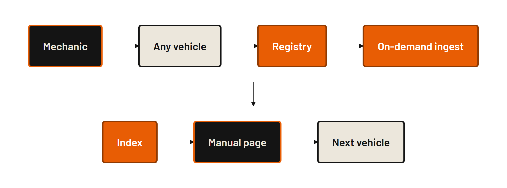
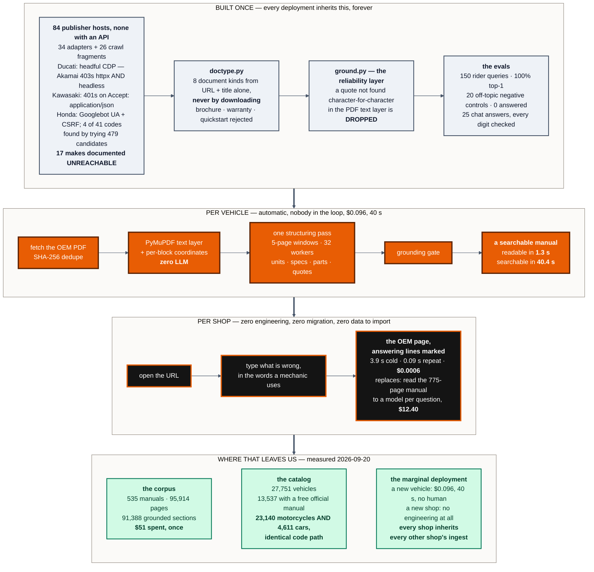

# Long Lake — "designed for the second deployment"

**Mechanica** · <https://mechanica.emilvinu.ch> · repo `C:\Users\me\trustthemanual`
Diagram source: [`long-lake/second-deployment.mmd`](long-lake/second-deployment.mmd).

**The one line for this sponsor:** *we took the highest-hours, lowest-leverage workflow in an
independent repair shop, cut it from five minutes to two seconds at six ten-thousandths of a dollar,
and the expensive part of the build is inherited by the next vehicle, the next brand and the next
shop for free.*

Every number below is measured and dated. Live figures were read from the deployed API on
**2026-09-20 ~09:30 UTC**; regenerate before the pitch, they move.

---

## 0. Read this first — what is verified and what is not

| | |
|---|---|
| **Verified** | Who Long Lake is, in their own words, from their own sites (URLs in §1). |
| **NOT verified** | **The text of Long Lake's HackMIT 2026 challenge and its prize criteria.** I could not retrieve it: `hackmit.org` serves no sponsor copy to a fetcher, there is no live HackMIT 2026 Devpost page, and this session's web-search budget was exhausted before I could search for it. |

So §2 maps our evidence against **Long Lake's own published success criteria for the engineers they
hire**, which is the best available proxy and is quoted verbatim. Before you pitch, spend 60 seconds
at the booth closing the gap:

> "What are you actually giving the prize for — is it the most useful thing in a real business, the
> most technically serious build, or the best company?"

Then apply §10, which tells you exactly which three slides to swap for each answer. Do not walk in
having guessed.

---

## 1. Who Long Lake is

| | |
|---|---|
| Legal/brand | **Long Lake** / Long Lake Tech. Site <https://llmh.com/>; `longlake.ai` 301s to it; careers at <https://jobs.ashbyhq.com/long-lake> |
| What they say they do | *"We are transforming the services economy with AI. Long Lake acquires service business and transforms how they operate through a shared AI platform, forward-deployed engineers, and a world-class M&A / operations team."* — job posting, <https://api.ashbyhq.com/posting-api/job-board/long-lake> |
| On the homepage | *"Long Lake applies frontier technology in partnership with leading management teams and founders across the American services sector."* — <https://llmh.com/> |
| Capital | *"backed by General Catalyst, Alpha Wave, Elad Gil, and others, with billions in permanent capital raised. We are not a private equity fund but a permanent capital vehicle with an extremely long-term view."* — same posting |
| Their posture toward hackathon-shaped work | *"Most AI companies build demos. We build and run operating systems for real businesses."* — same posting |

**So they are a buyer and operator of unglamorous service businesses, not a fund writing seed
cheques.** That single fact decides the whole framing: pitching them "we're a startup, here's the
TAM" is pitching a firm that explicitly says it is not a PE fund and whose stated job is running
operations. Pitch them an **operating system for a service business**, and let the company question
come to you in Q&A.

### What they reward, in their own words

Their four "what success looks like" bullets are the closest thing to published judging criteria:

1. *"You've shipped something into daily production use, not a pilot or a proof of concept, and the team would notice if it went down tomorrow"*
2. *"A workflow that used to take a person hours now runs as a background agent, and the hours have been redirected to higher-leverage work"*
3. *"Something you built once has been reused across multiple portfolio companies, because you designed for the second deployment, not just the first"*
4. *"You can point to a specific business metric (throughput, cycle time, error rate) that moved because of work you led"*

And the problems they name, which are the technical taste of the room:

- *"Turning a workflow where someone spends hours copying data between systems, QA-ing outputs, and producing documents into a background agent that runs in minutes and flags exceptions for review"*
- *"Writing the integration between a modern agent and a legacy industry ERP with no clean API, and making it reliable enough to run core business operations"*
- *"Building the deployment infrastructure that makes rolling AI into a new business repeatable rather than bespoke"*
- *"Building the evals, feedback loops, and training pipelines that teach AI to reliably complete specific jobs"*

---

## 2. Fit, honestly

### The mapping — their criterion, our evidence

| Long Lake's criterion | Our strongest evidence | Source |
|---|---|---|
| **Hours redirected** | A one-man motorcycle shop spends **~20% of his working time** finding a page. 20% of a ~2,000 h year ≈ **400 h**; at EUR 90–120/h ≈ **EUR 36–48k** of billable time a year. *Say "his number" and "arithmetic on his number" out loud.* | the founder's design partner; the EUR figure is labelled estimate |
| **Cycle time moved** | Five minutes of thumbing a 775-page PDF → **top-1 section in 3.9 s cold, 0.09 s on a repeat.** p95 **3.33 s** over a 150-query eval. Cold manual → readable **1.3 s**, fully searchable **40.4 s**. | live timed run 2026-09-20 (Honda Civic 2022); `api/eval/report.md`; live ingest run |
| **Error rate moved** | Right section first on **100% of 150** rider queries; **0 of 20** off-topic questions answered instead of refused; chat: **100% of 43 quotes verbatim**, **100% of 48 claim sentences carry a page**, **0 invented numbers**, **0 dealer referrals**. | `api/eval/report.md`, `api/eval/chat-report.md` |
| **Throughput / unit cost** | **$0.00038** per ask (eval mean); measured again live this morning on the largest manual we hold: **6 asks, $0.00357 total, $0.0006 each**. Against a **$12.40** naive per-ask baseline the live API reports for that same manual. | `GET /api/cost` before/after, 2026-09-20 |
| **Legacy source with no clean API** | **34 adapter modules + 26 crawl fragments over 84 publisher hosts.** Ducati's PDFs are Akamai-fingerprinted — 403 to httpx *and* headless Chrome, 200 to headful, so that adapter drives a real browser over CDP. Kawasaki **401s if you send `Accept: application/json`**. Honda needs a Googlebot UA and a CSRF token, and 4 of its 41 distributor codes were found only by trying **479 candidates**. **17 makes are documented as unreachable** so nobody re-walks them. | `docs/MANUALS.md`, `api/app/registry/**` |
| **Repeatable, not bespoke** | **535 manuals · 95,914 pages · 91,388 sections** ingested by one pipeline at **$0.096 a manual**, median 169 pages. **4,611 cars are already in the same catalog as 23,140 motorcycles** and answer through the identical code path — no per-vertical work. | live `GET /api/manuals`, `GET /api/catalog`, `api/data/mass_report.jsonl` |
| **Evals and exception-flagging** | The grounding gate drops any quote it cannot find character-for-character in the PDF text layer; the picker returns **ids only** and any id outside the candidate list is dropped; every digit in a chat answer is checked against the pages the model was shown. A question the manual does not cover comes back as *"the manual does not print this"*, not as an invented torque figure — 5 of 5 in the eval. | `api/app/ingest/ground.py`, `api/app/ask.py`, `api/eval/chat-report.md` |
| **Daily production use** | **We do not have this.** Zero paying shops, one design partner, no operator usage data. Say it before they ask. | — |

### Fit score: **8.5 / 10**

| axis | score | why |
|---|---|---|
| Thesis fit (AI into an unglamorous service business) | **10** | Independent vehicle repair *is* the American services sector. The workflow we removed is the one their bullet #2 describes almost word for word. |
| Measurable business metric | **9** | Cycle time, error rate and unit cost all measured against a named baseline. Missing: throughput measured on a real operator, because there is no real operator yet. |
| Second-deployment design | **9** | The corpus, the adapters and the grounding gate are built once; a new vehicle costs $0.096 and 40 s of machine time and zero engineering. Cars were the second deployment and they already work. |
| Production reliability | **8** | Deployed, health-checked, degrades honestly (offline pages, dropped quotes, empty lists). But it is a hackathon deployment, not something an operator would notice going down. |
| Legacy-integration credibility | **8** | We integrated 84 hostile publisher portals. We did **not** integrate a shop-management ERP (Mitchell 1, Tekmetric, Shop-Ware) — the analogue is genuine but not the same system. |
| Daily production adoption | **4** | One design partner, zero installs, no adoption data. This is their hardest criterion and our weakest column. |

**The deduction is real and you should name it in minute 4, not have it found in Q&A.** Long Lake's
first bullet is "not a pilot or a proof of concept" and we are a proof of concept. The counter is
not to argue — it is to be the team that already knows which ten shops it would install in and what
number it would measure.

### Evidence NOT to use in this pitch

Every one of these is strong somewhere else and actively costs you points here.

| Do not use | Why it hurts you here |
|---|---|
| **The Token Company / bear-2 compression slide** (31% tokens saved, aggressiveness 0.3 vs 0.5, page fences) | Vendor-specific prompt economics. Long Lake cares that the unit cost is $0.0006, not how the last 20% of it was won. One sentence in Q&A, never a slide. |
| **The Voloridge climate feature** (600 GB NOAA, the −25 °C antifreeze finding) | Built for a different sponsor, partly unshipped (marked † in that doc), and it moves the story from "operations" to "data science". Cut entirely. |
| **Codex as the fifth teammate** (the FLOOR bug, run-1/run-2) | That is OpenAI's track. Here it reads as tooling trivia. |
| **Anything pending a key: ElevenLabs voice, the Dropbox chooser, Elastic, Runpod, Visa checkout** | Long Lake's literal first criterion is "not a pilot or a proof of concept". Demoing a button that hides itself without a key is the single worst thing you can do in this room. **Do not say the word Elastic.** Deepgram voice is *not* in this list — it is live and measured — but it is off-thesis here, so open the mic only if a judge asks. |
| **The 3D exploded model and the 97 generated part illustrations** | Let it appear on screen for four seconds because it is genuinely fast and pretty. Never argue from it. If asked: "it's a part locator, not a manufacturer parts catalogue" and move on. |
| **The multiples — "32,632× cheaper", "3,600× cheaper"** | An operator discounts a multiple against a strawman on instinct. Lead with the two absolute numbers — **$12.40 and $0.0006** — and let them do the division themselves. |
| **Model names and price tiers** (luna/terra, $0.20/M vs $2/M) | Only in Q&A, only if asked "how is it that cheap". |
| **Any market-size number** | We have no sourced TAM. Do not invent one. The arithmetic we can defend is per-mechanic and comes from our design partner; label it as his. |

---

## 3. Three angles, and the one to use

**A. The forward-deployed engineer's week one.**
Frame the whole pitch as what a Long Lake FDE does on day one inside a newly acquired repair group:
sit in the shop, find the workflow that eats the most hours and produces the least value, automate
it, and publish the metric that moved. The demo is the artifact from that week. Structure follows
their four success bullets in order.
*Strength:* it speaks their internal language and it is flattering in the right way. *Weakness:* it
tops out at one workflow in one shop, which is exactly the "bespoke, not repeatable" failure mode
their third bullet is written to catch.

**B. The acquisition memo.**
Pitch independent vehicle repair as a vertical Long Lake could roll up, and Mechanica as the
operating system that comes with it: fragmented owner-operators, document-bound work, a shared
platform that gets cheaper per shop as the corpus grows.
*Strength:* it is the most ambitious version and it answers "why does this matter to *you*".
*Weakness:* it misreads the relationship. They state plainly they are "not a private equity fund",
they buy and operate rather than fund, and we have no sourced market data to make the memo credible.
It also puts our weakest column — zero deployments — at the centre of the slide.

**C. "Designed for the second deployment."**
Open with their own sentence. Show that the expensive, ugly, one-time work — 84 hostile publisher
portals, the PDF-to-structured-units pass, the grounding gate — is inherited, and that everything
per-deployment is automatic: a new vehicle costs **$0.096 and 40 seconds of machine time with no
human in the loop**, a new shop costs zero engineering, and a whole new vertical (cars) already runs
on the identical code path. The workflow story from A lives inside it as minute 2; the company
question from B is answered in Q&A instead of on a slide.

### Use **C**.

Two reasons. First, C is the only one of the three whose central claim we can *demonstrate live*:
cold-start a manual nobody has ever asked for, and then answer a question about a **car** through the
same pipeline that answered a motorcycle question ninety seconds earlier. A and B both end in
assertions; C ends in a demo. Second, C is the framing that survives our weakest column. An operator
who buys businesses is not really asking "is this a good app" — he is asking "would this survive
contact with the seventh company we bought, or does an engineer have to rebuild it each time". C
answers that question with evidence we already have, and it lets us concede "not yet in daily
production use" from a position of strength instead of having it extracted.

---

## 4. The diagram

Rendered: [`long-lake/second-deployment.png`](long-lake/second-deployment.png) ·
[`.svg`](long-lake/second-deployment.svg) · source
[`.mmd`](long-lake/second-deployment.mmd) (`npx @mermaid-js/mermaid-cli@11`). One slide, full bleed.
The only thing you need them to read is the four zone labels.

**The one line to say over it:** *"Grey is what took us the whole hackathon and is never paid for
again. Orange is what a new vehicle costs — nine cents and forty seconds, and no person is in it.
Black is what a new shop costs, which is nothing. The second deployment is the only one that
matters, and it is already cheaper than the first."*

---

## 5. The script — 5:00

Start the cold ingest at 0:50 and talk over it. Clock in the left column.

| clock | you do | on screen | you say | what the judge should feel |
|---|---|---|---|---|
| **0:00–0:35** | phone down | one slide: **400 hours** | "A friend of mine opened a motorcycle workshop in Germany. He's a good mechanic. And he spends about **a fifth of his working time** not fixing bikes — he spends it looking for a page. Call it **four hundred hours a year**. At a German shop rate that's **thirty-five to forty-five thousand euros** of work he could have billed. That's his number, and that's arithmetic on his number." | *That is a real person in a real business, and that is a real P&L line.* |
| **0:35–0:50** | — | same slide, two numbers appear | "He does not use AI. Two reasons, both fair. It's right ninety-five percent of the time and **he signs for the five**. And when he tried it, **one question cost about four dollars**, because the model had to read a five-hundred-page manual. He hit his limit before lunch." | *Both objections are correct. I'd refuse too.* |
| **0:50–1:05** | pick up the phone, type `mt-07`, tap the card, tap **2018** (a year with no manual yet), Confirm → **Yes**. A progress bar starts. **Put the phone down and leave it running.** | a bar filling | "I've just asked it for a manual that has never been on our servers. **Nobody is doing anything.** Come back to that in three minutes." | *Something is deploying itself in the background.* |
| **1:05–1:25** | — | the diagram, §4 | "Here's the shape. **Grey took us the whole hackathon and is never paid for again** — eighty-four manufacturer portals, none of which has an API, and the layer that decides whether a model's answer is allowed out. **Orange is what one new vehicle costs: nine cents and forty seconds, with no person in it.** Black is what a new shop costs, which is nothing." | *They built deployment infrastructure, not a demo.* |
| **1:25–1:55** | phone: type `390 duke`, tap the **KTM 390 DUKE** card, tap **2024**, Confirm. On Pick, type `chain` | the bike explodes, the chain lights, KTM's own headings rank under it: *Checking the chain tension* **p.77–78**, *Adjusting the chain tension* **p.78** | "Plain words in — what he'd actually say with the bike on the lift. And what comes back **is not our words**. That's KTM's own table of contents." | *It didn't write anything.* |
| **1:55–2:20** | tap *Checking the chain tension* → **Open** | KTM p.77, orange markers on the two answering lines | "There it is. **Page 77 of KTM's manual**, and the marker sits on the two lines that answer him. It is only there because we found that exact text in KTM's PDF. **If we can't find the ink, we don't draw the marker.** Five minutes of thumbing a PDF became two seconds — that's the cycle time, and it's the whole product." | *That is the actual document, not a summary.* |
| **2:20–2:45** | tap **Chat**, type `chain is loose, what do I do`. When it lands, tap a **[p. 77]** chip. | numbered steps, every sentence ending in a `[p. 77]` / `[p. 78]` chip; the chip jumps to the page | "This is the one place it is allowed to write a sentence, and **it is only allowed to write page numbers**. The model names a page; **our server slices the quote out of the original page**. So the citation is verbatim by construction, not because we trusted it. Measured: forty-three of forty-three quotes verbatim, **zero invented numbers**." | *Even the chatty part is leashed — and checkably so.* |
| **2:45–3:25** | **The second deployment.** Back to the landing, type `civic`, tap **Honda Civic Sedan 2022**, Confirm, type `tire pressure` → Open. Then back, type `how do I change a flat tyre` → Open. | *Checking Tires* **p.681**; then *Replacing the Flat Tire* **p.709** | "That's not a motorcycle. **Same code, same pipeline, nobody wrote a car version.** And this is the biggest document we hold — **seven hundred and seventy-five pages**. Reading that book to a model once, to answer one question, is **twelve dollars forty** — that's our own cost endpoint's number for this exact manual. **That question cost six ten-thousandths of a dollar** and came back in under four seconds. I typed *tyre* with a Y, by the way." | *Oh — it generalises. And the arithmetic is brutal.* |
| **3:25–3:45** | back to the landing — the **MT-07** from 0:50 is ready. Tap it, type `oil` → Open | the page | "And that one is done. **Three minutes ago that manual did not exist on our servers.** Thirteen and a half thousand of our twenty-seven thousand vehicles already have a free official manual attached, and any one of them costs nine cents and forty seconds to bring online. **Nobody touched it.**" | *The catalogue is not the limit, and the marginal deployment is free.* |
| **3:45–4:20** | phone down | numbers slide | "So, the metrics. **Cycle time:** five minutes to two seconds, p95 three point three. **Error rate:** the right section first on a hundred out of a hundred and fifty real rider questions, and **zero of twenty** off-topic questions answered instead of refused. **Unit cost:** four hundredths of a cent against twelve dollars forty. Five hundred and thirty-five manuals, ninety-six thousand pages, ninety-one thousand sections — the whole thing has spent **eight dollars** on the live API." | *Every axis he'd ask about already has a number.* |
| **4:20–4:40** | — | same slide | "And the honest column. **This is not in daily production use.** One shop, one mechanic, no installs, no adoption data. What I'd do about it is not a slide, it's a plan: **ten independent shops for one month**, and the only number I care about is how much of that twenty percent comes back. Everything you'd need to measure it — cost per question, latency, which section won — is already logged per route, because we had to build that to know any of this." | *They know exactly where they are. That's rarer than the demo.* |
| **4:40–5:00** | back to the marked KTM page | the page | "The reason a liable mechanic will actually use this is on the screen right now: **there is not one AI-written sentence on it.** The model never gets to be the answer — it only gets to point. Don't trust the AI. Trust the manual. We just get you to the page." | *I could put this in a shop on Monday.* |

**Running short?** Cut 2:20–2:45 (chat) first, then 1:05–1:25 (the diagram, narrate it from the
KTM page instead). **Never cut 2:45–3:25** — the car is the entire angle.

---

## 6. The demo, exact inputs

Every input below was returned by the live API on **2026-09-20**. Do not improvise a question.

| # | bike/car | type exactly | lands on | verified |
|---|---|---|---|---|
| 1 | Yamaha **MT-07 2018** (any year chip with no manual) | — | cold ingest, progress bar | `docs/DEMO.md`, measured twice |
| 2 | **KTM 390 Duke 2024** | `chain` | *Checking the chain tension* **p.77–78**, *Adjusting the chain tension* **p.78** | `docs/DEMO.md` |
| 3 | KTM 390 Duke 2024, Chat | `chain is loose, what do I do` | numbered steps, every sentence `[p. 77]` / `[p. 78]` | `docs/DEMO.md` |
| 4 | **Honda Civic Sedan 2022** (775 p) | `tire pressure` | *Checking Tires* **p.681** (then *Changing a Flat Tire* p.705) | live `POST /api/ask`, 2026-09-20 |
| 5 | Honda Civic Sedan 2022 | `how do I change a flat tyre` | *Replacing the Flat Tire* **p.709** — **cold 3.95 s, repeat 0.088 s** | live, timed, 2026-09-20 |
| 6 | MT-07 (now warm) | `oil` | the oil-change pages | `docs/DEMO.md` |

**Spares, all verified live**

| vehicle | question | lands on |
|---|---|---|
| Honda Civic Sedan 2022 | `how do I check the engine oil` | *Oil Check* p.663–664, *Adding Engine Oil* p.665 |
| Honda Civic Sedan 2022 | `how much oil does it take` | *Changing the Engine Oil and Oil Filter* p.666–668 |
| KTM 390 Duke 2024 | `what torque for the rear axle` | p.128–130 *Chassis tightening torques*, p.78 *Adjusting the chain tension* |
| KTM 390 Duke 2024 | `what pressure should the tyres be` | p.95 *Checking tire pressure* |
| BMW R 12 G/S 2026 | `how do I check the engine oil level` | p.164, p.165 |
| Chevrolet **Corvette 2022** (338 p) | second car if the Civic misbehaves | warm, `chevrolet-corvette-2022-ca-om` |

**Before you walk up**

1. `curl https://mechanica.emilvinu.ch/api/health` → `{"ok":true}`.
2. Open the site on the demo phone once — caches shell, fonts, roster, pdf.js (service worker v7).
3. **Run every scripted question once, then run one different question you will NOT use.** Repeats
   come back in 0.09 s at $0, which is a great line but makes the cold-latency claim untestable.
4. Open the KTM and the Civic to page 1 so both PDFs are cached.
5. `#cost` ready in a second tab. Re-read `naivePerAsk` — it was **$12.40** at 09:30 UTC.
6. Warm the **MT-07 2018** ingest once beforehand? **No** — it must be cold on stage. Verify instead
   that MT-07 **2019** and **2020** are warm, as the fallback.

**Traps**

- **BMW R 12 G/S is shaft drive.** "chain is loose" returns *BATTERY GUARD* p.150 — correct, looks broken. Chain questions go to the KTM.
- **Honda motorcycle US years before 2023** open but structure to 0 sections (measured on `honda-cbr650r-2022`). Avoid.
- Only **two cars are warm**: Honda Civic Sedan 2022 and Chevrolet Corvette 2022. Do not pick a third car live.
- `/api/cost/ttc` counters are in-memory per replica and can go backwards on reload. **You are not showing that endpoint in this pitch anyway.**

---

## 7. Slides — 6, no more

| # | title | the one line on it | asset |
|---|---|---|---|
| 1 | **400 hours** | A mechanic. One number: *a fifth of his working year, looking for a page.* | `general/01-landing.png` or blank |
| 2 | **Why he won't use AI** | *95% right — and he signs for the 5%. $4 a question when he tried.* Two numbers, huge, nothing else. | — |
| 3 | **Built once. Deployed N times.** | The §4 diagram, full bleed. Three zone labels are the only text they read. | `long-lake/second-deployment.mmd` |
| 4 | **The answer is a page** | KTM p.77, markers on the two answering lines. *The marker is only there because we found that ink.* | `general/05-book.png` |
| 5 | **The metrics that moved** | cycle time **5 min → 2 s** (p95 3.33 s) · error rate **100% top-1 / 150**, **0 of 20** off-topic answered, **0** invented numbers · unit cost **$0.0006 vs $12.40** · **535 manuals, 95,914 pages, $8 spent** | — |
| 6 | **What we don't have yet** | *Not in daily production use. One shop. Ten shops for a month, and the number is how much of the 20% comes back.* Then the URL. | — |

Slide 6 being the last slide is deliberate. In this room, the team that puts its own weakest column
on the final slide is the team that gets believed about the other five.

---

## 8. Speaker notes

**Slide 1 — one person, not a market.** "A friend of mine." Not "shops everywhere", not "the $X
billion repair industry". Long Lake buys individual businesses; they think in units of one company,
and so should you. Say the 400 hours, then stop for two seconds.

**Slide 2 — these are *his* objections, not your argument.** You are agreeing with a skeptic, not
attacking AI. That buys you everything you do afterwards, in a room full of people whose job is
installing AI into businesses run by exactly this kind of skeptic. If you have thirty spare seconds
anywhere, spend them here: *"the hardest part of the FDE job you're hiring for is this guy, and he's
right."*

**Slide 3 — say the zone labels, do not read the boxes.** Ninety seconds on this slide and you touch
three things only: eighty-four portals with no API; nine cents and forty seconds per new vehicle with
no human in it; zero engineering per new shop. If they lean in, the Ducati/Kawasaki/Honda war stories
in §2 are the thing to give them — an operator who has integrated a legacy ERP recognises that
suffering instantly and it is the fastest credibility you will get all day.

**Slide 4 — this is the slide. Stop talking.** Let them read the marked line. Then one sentence:
*"it's only there because we found that exact text in KTM's PDF — if we can't find the ink, we don't
draw the marker."* That sentence is the entire trust story; everything else is convenience.

**The car moment (2:45) — do not oversell it, just do it.** No "and now, cars!". Type `civic`, tap
it, ask, open the page. Then the only line that matters: *"nobody wrote a car version."* The point
lands harder if you're bored by it.

**The $12.40 — say the two numbers and shut up.** Do not say "sixteen thousand times cheaper". Say
"twelve dollars forty" and "six ten-thousandths of a dollar" and let them divide. Operators trust
arithmetic they did themselves.

**Slide 6 — deliver the weakness flat, then immediately give the plan.** Do not apologise, do not
hedge with "but". "This is not in daily production use. Here's what I'd do about it: ten shops, one
month, and the number is how much of the twenty percent comes back." The plan is what turns the
concession into a credential.

**Throughout:** no model names, no vendor names, no architecture words unless asked. If someone asks
what it's built on, one sentence — *"a cheap model reads each manual once, and after that the search
is ordinary text search; that's why a question costs four hundredths of a cent"* — and move on.

---

## 9. Q&A — the hard ones

### Startup potential

**"Is this a company, or a feature?"**
It is the operating layer for any business whose work is bound to a document somebody else wrote and
is liable for. Today that's vehicle repair, because that's where our design partner is. The same
three pieces — a registry of who publishes what, a pipeline that turns a PDF into grounded printed
units, and a verifier that will not let a model's output ship unless it is found in the source — are
vertical-agnostic. We already proved the second deployment inside the same weekend by adding 4,611
cars to a motorcycle product without writing a car version. Whether it's a company depends on
whether shops pay, and I don't know that yet because nobody has been asked.

**"How does it make money?"**
Three ways, in the order I'm confident about them. **Per seat, per month, to independent shops** — a
mechanic billing EUR 90 an hour who gets back one hour a week has paid for it many times over, and
that's arithmetic on his rate, not a study. **Parts referral** — we already show what the vehicle
needs and what it costs, and a confirmed correct part is worth something to the retailer; no Visa
flow, no checkout, don't let me claim otherwise. **Eventually the manufacturers**, who publish these
PDFs because they have to and currently cannot make anyone find anything in them. What we will not do
is charge per question: our cost per question is $0.0006 and metering that costs more to bill than to
serve.

**"What's defensible? Anyone can call an LLM on a PDF."**
Three things, none of them the model. **The registry**: 53,557 rows across 84 publisher hosts, built
by writing 34 adapters against portals that actively resist — Ducati is Akamai-fingerprinted and
needs a headful browser over CDP, Kawasaki 401s if you send `Accept: application/json`, four of
Honda's 41 distributor codes were found by trying 479 candidates. That is months of unglamorous work
and it compounds. **The corpus**: 535 manuals, 95,914 pages, 91,388 grounded sections, and every
additional shop inherits every previous shop's ingest — the marginal cost of the tenth shop asking
about a KTM 390 Duke is zero. **The constraint itself**: the reason a liable mechanic uses it is that
it structurally cannot answer, and that's a product decision most people won't copy because it looks
like a worse demo. What is *not* defensible: the UI, and the fact that a competitor with more capital
could ingest the same free PDFs. The head start is the adapters and the grounding, not the idea.

**"Why this team?"**
Because the skeptic is in the room with us. This wasn't market research — the constraint "the model
may never be the answer" came from a specific mechanic who told us why he'd stopped, and every
guardrail in the build traces to something he said. And because the boring half is done: the thing
that stops most people isn't the model, it's eleven OEM portals that each lie differently about what
a file is, and that's written down in `docs/MANUALS.md` including the seventeen makes we could not
reach, so nobody has to re-walk them.

**"Independent shops are hard to sell to and they don't pay for software."**
Agreed, and that's the honest risk. The counter-argument I'd test, not assert: this is priced against
billable hours rather than against software, the buyer and the user are the same person, and there is
no migration — no data to import, no integration, he opens a URL and asks. If ten shops try it for a
month and fewer than half keep it, the per-seat thesis is wrong and the right shape is probably
selling into multi-site groups, which is the shape you'd care about anyway.

**"What would you do with Long Lake's money and portfolio that you can't do alone?"**
Deployments. The one thing we cannot manufacture is an operator using it daily, and that is exactly
your first success criterion. Everything else — corpus, latency, cost — we can push on alone. Access
to a handful of acquired service businesses, and permission to sit in them for a week, is worth more
to this product right now than capital is.

### Technical

**"What breaks?"**
Four things, in order of how often. (1) **Photo identification** on an odd angle or a vehicle outside
the catalog — it degrades to a ranked list rather than a wrong answer, but it degrades; that's why
the demo types the name. (2) **A PDF with no text layer** structures to zero sections — measured on
`honda-cbr650r-2022`. We detect it and fall back to readable-but-not-searchable instead of guessing.
(3) **Portals change.** An adapter that worked in March 403s in September; the registry is a pure
function of what the adapters currently see, so a retracted row stops being advertised rather than
becoming a dead link, but somebody has to fix the adapter. (4) **Live parts prices** occasionally
return category pages instead of products; anything without a price we can regex out of the model's
own text is dropped, so the failure mode is an empty list, never a wrong price.

**"What is actually deterministic, and what is the model doing?"**
The model decides exactly three things: which vehicle is in a photo, which page ids answer this
sentence, and how to phrase what those pages already print. Everything else has no model in it — the
PDF text layer and per-block coordinates, BM25 over the manual's own headings, the spec path, the
answer cache, the highlight geometry, the currency conversion, the URL liveness check. And every one
of the model's three jobs has code behind it that can throw the answer away: a photo answer is
fuzzy-matched back to a real catalog row with a floor and a kind lock, so a bike we hold no manual
for cannot win; a section id that was not in our own candidate list is dropped; a quote not found
character-for-character in the PDF text layer is dropped at ingest. **85% of asks never reach a
second model call at all** — BM25 was already decisive, or it was a spec question answered off parsed
rows with zero LLM calls.

**"How accurate is it, and how do you know?"**
Right section first on **100% of 150** rider queries, p95 **3.33 s** (`api/eval/report.md`). On
twenty deliberately off-topic questions it returned nothing **20 out of 20** rather than guessing.
In chat: **100% of 43 quotes verbatim on the page they name**, **100% of 48 claim sentences carry a
page number**, **zero invented numbers**, **zero dealer referrals** (`api/eval/chat-report.md`).
Five eval questions had no printed procedure and all five came back saying the manual does not print
it, instead of manufacturing a torque figure. And when it is wrong, **you see it in half a second**,
because the heading on screen says *Checking the front brake fluid level* and you asked about the
chain — a chatbot that is wrong is wrong in a sentence that reads exactly like the right one.

**"How is it that cheap? What's the catch?"**
The catch is that we do the expensive thing once. One cheap structuring pass turns a PDF into printed
units at **$0.096 a manual**, and after that every query against that manual is ordinary lexical
search over a book we already structured — the prompt carries about 2,300 tokens instead of the
620,000 that manual would be. That's why our cost per question is flat in document size while the
naive baseline scales with it: $1.03 for a 128-page manual, **$12.40 for the 775-page Civic**.

**"What happens at a thousand shops?"**
Ingest doesn't scale with shops, it scales with distinct documents, and there are only so many
vehicles: 535 manuals cost about $51 total, once, shared by everyone, and the whole free-and-
fetchable corpus is a three-figure spend. The marginal cost of a shop is the $0.0006 question, and
repeats are $0.

**"Could you point this at a shop-management system instead of a manual?"**
Not today, and I'd rather say so. What we integrated is 84 publisher portals with no APIs, which is
the same *shape* of problem as a legacy ERP with no clean API but is not the same system. What
transfers directly is the pattern: a deterministic verifier between the model and anything that ships
to an operator, and a per-source adapter layer with its failures written down. What would have to be
built is the connector and the write path, and a write path is a different risk class from a read
path — I'd want an exception queue and a human on it before an agent wrote anything into a system of
record.

---

## 10. If the booth says the criteria are different

| if they say the prize is for… | do this |
|---|---|
| **"most useful in a real business" / "best real-world impact"** | Ship the script exactly as written. This is what C was built for. |
| **"best startup potential" / "the best company"** | Move angle **B** to the front: keep slides 1–2, then go **market shape → business model → defensibility → the demo as proof**, and promote the first four Q&A answers in §9 into spoken slides. Keep slide 6 last. Do **not** invent a TAM; say plainly that the number we can defend is per-mechanic and comes from our design partner. |
| **"most technically impressive"** | Swap slide 3 for the `openai/architecture.png` diagram (the orange/green verifier lanes) and give 90 seconds to the guardrails: ids-only picker plus allowlist, grounding gate, server-sliced citations, digit checking. Keep the car moment; drop the 400-hours slide to 15 seconds. |
| **"best use of [a specific technology]"** | Whichever technology it is, the sponsor-specific doc already exists — `docs/pitches/openai.md`, `token-company.md`, `elevenlabs.md`, `voloridge.md`. Use that one and keep only the 400-hours opening from here. |
| **"best agent / automation"** | Lead with the cold ingest at 0:50 and let it run for the full pitch: an unattended pipeline that fetches a hostile OEM portal, structures 182 pages and self-verifies in 40 seconds for nine cents. Then the guardrails as the "flags exceptions for review" story. |

---

## 11. If it breaks on stage

| what breaks | what you do |
|---|---|
| **no network** | Keep going. The app, the vehicle roster, the chapters and every page you already opened are on the phone. Say: *"and this is the part he actually cares about — it's on the phone"*, then name what won't work: fetching a new manual, chat. Do not promise offline. |
| **the cold MT-07 stalls past ~60 s** | Back out, use MT-07 **2019** or **2020** (warm). Say: *"five hundred and thirty-five are already cached; that one was cold."* Do not stand and wait. |
| **a question is slow** | Every scripted question was run beforehand, so it returns from cache in ~0.09 s. If you improvised, you deserved it — say "that one's cold" and move on. |
| **the 3D bike doesn't load** | It never blocks anything. Carry on; the headings and the page are the point. |
| **"is that actually a 390 Duke?"** | Honest: it's a stand-in motorcycle for most vehicles and it's a *part locator*, not a manufacturer parts catalogue. Pick the Honda CBR650R 2023 and it is that bike. |
| **they ask about voice** | *"Voice is live — it runs on Deepgram's agent over the same four grounded tools, median two seconds from end of speech. It is just not the part of this that matters to you."* Then stop. The **ElevenLabs** engine is the one that needs a key we don't have, and its button hides itself. Do not demo either on the clock. |

---

## 12. Every number, and where it came from

Read the live ones again before you go on. They move.

| claim | value | source | when |
|---|---|---|---|
| vehicles you can pick | **27,751** (23,140 motorcycles, 4,611 cars), 77 makes | live `GET /api/catalog` | 2026-09-20 09:30 UTC |
| …with a free official manual attached | **13,537** | same | same |
| manuals indexed | **535** · **95,914 pages** · **91,388 sections** · 662 vehicles covered | live `GET /api/manuals` | same |
| all spend on the live API | **$8.93** over **1,633** calls — it moves every hour | live `GET /api/cost` | 2026-09-20 09:55 UTC |
| naive baseline, per ask | **$12.40** (the 775-page Civic read to a model once) | live `GET /api/cost` → `naivePerAsk` | same |
| six asks against that 775-page manual | **$0.00357 total — $0.0006 an ask**, one of the six a $0 cache repeat | `GET /api/cost` before/after, `ask.router` + `ask.picker` delta | same |
| that ask, cold / repeated | **3.95 s** / **0.088 s** | live timed `POST /api/ask`, Honda Civic Sedan 2022, `how do I change a flat tyre` → p.709 | same |
| ask, mean over 150-query eval | **$0.00038**, p95 **3.33 s**, top-1 **100%** | `api/eval/report.md` | — |
| off-topic questions answered | **0 of 20** | `api/eval/report.md` | — |
| chat honesty | **43/43 quotes verbatim · 48/48 claim sentences carry a page · 0 invented numbers · 0 dealer referrals** | `api/eval/chat-report.md` | — |
| ingest a manual | **$0.0972** median (170 p), **$0.0951** mean (177 p); **1.3 s to readable, 40.4 s to searchable** | `api/data/mass_report.jsonl` (**648** real ingests of 773 lines); live run, KTM 390 Duke 2014, 182 p | 2026-09-20 |
| registry | **53,557 rows**, 84 publisher hosts, 80 makes; **14,770 distinct free English PDFs**; **28,200 distinct URLs** | `api/data/registry.json`, `GET /api/registry` | 2026-09-20 |
| adapters | **34 modules + 26 crawl fragments**; **17 makes documented unreachable** | `api/app/registry/**`, `docs/MANUALS.md` | — |
| Ducati / Kawasaki / Honda portal behaviour | Akamai headful-only via CDP · 401 on `Accept: application/json` · Googlebot UA + CSRF, 4 of 41 codes from 479 candidates | `docs/MANUALS.md` | — |
| the manual page counts quoted | KTM 390 Duke 2024 **143 p**, Honda Civic Sedan 2022 **775 p** (largest in the deployed catalog), Corvette 2022 **338 p**, median **171 p** | live `GET /api/manuals` | 2026-09-20 09:30 UTC |

**His numbers — say "his number" out loud:** ~20% of his working time; ~$4 a question when he tried
AI; *"95% right isn't enough when I sign for the 5%."*

**Labelled estimate — say "arithmetic on his number":** 20% of a ~2,000 h year ≈ **400 h**; at
EUR 90–120/h ≈ **EUR 36–48k** of billable time per mechanic per year.

**Long Lake's own words:** <https://llmh.com/> · <https://jobs.ashbyhq.com/long-lake> ·
<https://api.ashbyhq.com/posting-api/job-board/long-lake> (the "Engineering and Research" posting,
read 2026-09-20).
