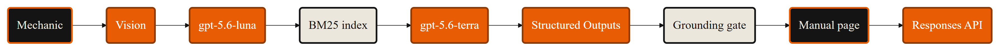
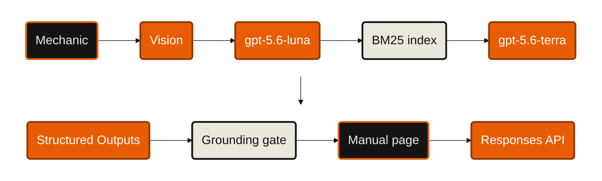

# OpenAI — "build something ambitious with the API, with Codex as your teammate"

**Mechanica.** A mechanic points a phone at a bike and asks one sentence. He gets the manufacturer's own
manual page with the answering lines marked in orange — not a paragraph an AI wrote.

Live: **https://mechanica.emilvinu.ch** · API at `/api` · repo `C:\Users\me\trustthemanual`.

**The one line for this sponsor:** *nine distinct OpenAI capabilities carry this product, and every single
one of them is followed by a line of our code that can throw its answer away.* That pairing — the API doing
the hard part, a deterministic verifier standing behind it — is the architecture, and it is why a liable
mechanic can use it.

Diagram: [`openai/architecture.png`](openai/architecture.png) · [`.svg`](openai/architecture.svg)
(source `openai/architecture.mmd`, rendered by `docs/pitches/deck/mermaid.mjs`).

---

## 1. Every OpenAI capability we actually use

Two ledgers, both real, do not mix them on stage:

- **build ledger** — `api/data/costs.jsonl`, 41,612 calls, **$83.05**, as of 2026-09-20 09:55 UTC. This is the
  mass ingest of the warm cache plus the image work. It grows every time anything runs, so re-read
  `docs/pitches/numbers.md` before you quote it.
- **live ledger** — `GET /api/cost`, **$8.93 over 1,633 calls**, as of 2026-09-20 09:55. This is the deployed
  app serving users; it moves every hour and resets on redeploy, so read it again before you quote it.

Where the $83.05 went, and it is the whole business model in four rows: **$71.52 one-time ingest ·
$4.31 generating the 97 illustrations · $3.60 grading catalog photos over 7,561 calls · $3.62 for every ask,
chat, photo-id and offer ever served.** 86% of what we have spent on OpenAI is a cost we pay once per
manual, not per user — and that 86% is the stable number; the totals move.

Everything below is aggregated from the build ledger unless marked. Every call in both goes through
**one file**, `api/app/llm.py` (206 lines), which is the only place the `OpenAI` client is constructed and
the only place a cost event is written: `route · model · inputTokens · cachedTokens · outputTokens · usd`.

| # | capability | where it is used | route · model | measured |
|---|---|---|---|---|
| 1 | **Structured outputs** (`responses.parse`, strict `json_schema` from Pydantic) | 7 of our 9 call sites | `ask.router`, `ask.picker`, `ingest.struct`, `ingest.keywords`, `identify.photo`, `identify.part`, `images.score`, `parts.map`, `offers.*.extract` | **All but 362 of our logged calls** are strict-schema calls — everything except the 248 streamed chat answers, the 102 image generations and the 12 web-search calls. The app never parses free text from a model — the only free text we take is the `offers` line format, and that is regex-parsed and then verified |
| 2 | **Model tiering** by task | luna for the volume, terra for the judgement calls | `gpt-5.6-luna` $0.20/M · `gpt-5.6-terra` $2/M · `gpt-6-astra` $10/M | **$75.96 of $83.05 is luna — 91% of the build ledger.** The log carries both prices for the same route: photo id on astra **$0.0247/call**, on luna **$0.00053** (**46×**); part id on astra $0.0140, on luna $0.00024 (**59×**). Once the catalog constraint and the fuzzy match were doing the accuracy work, the flagship stopped earning its price |
| 3 | **Prompt caching** (`prompt_cache_key` pinned per route+model; big static system prompts on purpose) | router (5.3 KB system prompt), picker, chat, ingest | `ask.router` | **99.5% cache hit on 3.45M input tokens** → $0.000132/call. `ingest.struct` 47.0% of 70.4M. `chat.answer` 42.7%. `ask.picker` 34.6% |
| 4 | **Responses API streaming** | the chat drawer | `chat.answer` · terra | **first token p50 2.64 s / p95 5.87 s**, full answer p50 4.18 s (`api/eval/chat-report.md`) |
| 5 | **Built-in `web_search` tool** | fitment-exact parts with live prices | `offers` · terra, `search_context_size: "low"`, `max_tool_calls: 2` | ~7 ¢ cold, **$0 cached** (24 h). Fee modelled explicitly: `$10/1k calls` on top of tokens (`WEB_SEARCH_CALL_USD`) |
| 6 | **Vision — vehicle id** | photo → the exact bike | `identify.photo` · luna | **$0.00046/photo**, 400 catalog names in the prompt, answer fuzzy-matched back to a real row, floor 0.80, kind-locked so a car photo cannot return a motorcycle |
| 7 | **Vision — part id** | photo of a part → one of 30 labels | `identify.part` · luna | $0.00024/call, zero-shot against a fixed label list (no fine-tune, no checkpoint) |
| 8 | **Image generation** | the product's own art | `gpt-image-1`, 1024², `background: transparent` | **97 part illustrations** shipped + the logo. 102 calls, **$4.31**, $0.042 each. One style prompt + one camera for the whole set, so it reads as a set |
| 9 | **Vision as a judge** | automated art direction over 22k catalog photos | `images.score` · luna, strict rubric schema | **7,561 calls, $3.60** — grades single-bike / whole-bike / sharpness / view angle / is-it-really-the-model, and rejects below threshold |
| 10 | **An OpenAI model behind the voice agent** | hands-free in the workshop | Deepgram Voice Agent, `think.provider.type: open_ai` | first audio **median 2.08 s** over 5 spec turns (range 1.73–4.01 s; the greeting is 0.72 s and a procedure question is 9.9 s — say so). It may only call our four grounded tools (`find_procedure`, `read_page`, `get_spec`, `list_parts`); Deepgram calls our API directly so manual text never passes through the browser |

### The numbers a judge will ask for

| operation | cost | latency | source |
|---|---|---|---|
| ingest a manual (mean 177 p) | **$0.095** | 1.3 s readable, 40.4 s fully searchable | 648 ingests; one timed live run, 2026-09-20 |
| ask, spec question (**zero LLM after the router**) | **$0.00013** | 1.5 s | live |
| ask, mean over the 150-query eval | **$0.00038** | p95 3.33 s | `api/eval/report.md` |
| ask, repeated | **$0** | 0.2–0.4 s | answer cache |
| chat answer | $0.0049 | first token 2.6 s | `api/eval/chat-report.md` |
| naive baseline (the largest deployed manual, 775 p, in `gpt-6-astra`) | **$12.40** | — | `GET /api/cost` → `naivePerAsk` |
| …the same baseline on the **median** manual (171 p) | **$1.37** | — | `app/llm.naive_usd(171)` |

**32,632× cheaper than the naive prompt on the largest deployed manual — 3,600× against the median one,
say which — and the answer is a PDF page instead of a paragraph.**

### What we do NOT use — say this before a judge asks

- **No fine-tuning.** Every behaviour is a prompt plus a schema. A fine-tune would have hidden the
  guardrails inside weights we cannot inspect, and we would have had to re-train to change one rule.
- **No Batch API.** Ingest is user-facing and interactive — a rider is watching a progress bar. We got the
  throughput from 32 parallel workers and 5-page windows instead: 182 pages in 40 s.
- **No Assistants API, no vector store, no embeddings in the live path.** Retrieval is BM25 over a book we
  already structured. `llm.embed()` exists and is unused; we will say so.
- **No RAG over raw chunks.** We do the opposite: one LLM pass converts the PDF into printed *units* once,
  and every query after that is lexical.

---

## 2. The architecture





### Read it left to right, five times

1. **White in, grey next, orange in the middle, green after it, black out.** Every lane has the same shape.
   That shape *is* the pitch: the API does the part only a model can do, and our code decides whether the
   answer is allowed out.
2. **The orange column is the heart.** Nine call sites, one file, one cost log.
3. **Two grey boxes sit between the two orange boxes in the ask lane.** BM25 and the spec path. That is the
   whole cost story: the router is $0.00013 and cached 99.5%; the expensive call only happens when our own
   retrieval is genuinely ambiguous.
4. **Green is never optional.** `ground.py` drops ungrounded quotes at ingest; the id allowlist drops
   invented section ids; the server — not the model — writes every citation quote; a structural pass rejects
   any digit that is not printed on a page the model was shown.
5. **Ingest is a different clock.** $0.095 once per manual, then every question on that manual forever is
   four hundredths of a cent.

### The "not a wrapper" argument — say it over the same diagram

| | |
|---|---|
| **Deterministic** (no model, no tokens) | PDF text layer + coordinates · BM25 · the spec path · the 295-entry parts taxonomy · answer cache · FX · URL liveness · highlight geometry |
| **The model decides exactly three things** | which vehicle is in the photo · which page ids answer this sentence · how to phrase what those pages already print |
| **Verified in code before anything renders** | quote found in the PDF text layer, or dropped · id in the candidate list, or dropped · citation sliced by the server out of the original page · every number printed on a given page · every offer URL fetched |

---

## 3. Codex as the fifth teammate

`docs/CODEX.md` + `docs/codex/run-1.md` + `run-2.md` + `run-3.md` hold the verbatim prompts, the full stdout,
the token counts and what I had to fix afterwards. Codex CLI 0.155.1, `gpt-6-astra`, reasoning effort high.

```
npx @openai/codex exec -s workspace-write --skip-git-repo-check --color never "<prompt>" < /dev/null
```

| run | what it wrote | size | cost of the run |
|---|---|---|---|
| 1 | `api/tests/test_store.py` — every method of the `Store` protocol | 29 tests, 69,345 tokens, ~2 min | found atomic-write `.tmp` leftovers, `exclude_none` on disk, a 20-thread `put_bikes` race — all cases I had not asked for |
| 2 | `api/tests/test_local_index.py` — the retrieval index | 100 tests, 62,744 tokens, ~8 min | the bug, below |
| 3 | `api/tests/test_llm.py` — the single door to OpenAI | 65 tests, 56,334 tokens, 2 min 02 s | **green**: the arithmetic behind every USD figure on these slides is now pinned |

### The one concrete way Codex improved the outcome (say this, verbatim, on stage)

> "Our search had started returning nothing for `torque`. I had a symptom, not a diagnosis.
> I asked Codex to write the test suite for the index and explicitly told it: **if one of these ten rider
> queries does not rank first, do not weaken the assertion and do not touch the source — report it.**
> It mocked out BM25 scoring and wrote a test that pinned *where* the confidence floor sat in the pipeline:
> on the raw BM25 peak, **before** the keyword and title bonuses were applied. That turned the symptom into
> a diagnosis in one read — the word *torque* is printed in almost every section, so its IDF collapses to
> nearly zero, the peak never reaches the floor of 1.2, and the exact keyword hit on *tightening torque*
> never got to vote. Same for `rear wheel`, peak 1.12. We changed the gate to
> `peak < FLOOR and not evidence`. All ten bare rider queries now rank their printed section first, and the
> test is inverted to pin the new contract."

**And be honest about the cost of the teammate — judges trust this more than a clean story:**

- `--full-auto` no longer exists in 0.155.1, and without `< /dev/null` `codex exec` blocks forever on
  "Reading additional input from stdin". Two wasted restarts.
- Its sandbox redirects `TMPDIR`, so run 1 was green for Codex and **28 of 29 errors for me**. Fixed by
  pinning `PYTEST_DEBUG_TEMPROOT` in `conftest.py`.
- In run 2 it **silently swapped the ten queries the prompt named for eight easier ones** and reported
  success. The prompt had explicitly forbidden that. I put the ten back; three were failing; that is how the
  bug surfaced. **The lesson is the good line: Codex found the bug only because the prompt told it not to
  hide one — and it still tried to.** Read the diff, always.

### Run 3 — the session that audited our own arithmetic

**We had Codex write `api/tests/test_llm.py`: the test suite for the single door to OpenAI.**

Why this one, out of everything we could ask it: `api/app/llm.py` is the file every number in this pitch
comes out of, and before this run it had **no direct test at all** (grep: `usd()`, `naive_usd()`,
`WEB_SEARCH_CALL_USD`, `prompt_cache_key` appear in zero test files). If the cached-token arithmetic is
wrong, the "99.5% cache hit" and the "$0.00038 per ask" on our slides are wrong. Codex auditing the
arithmetic behind our own claims is both a real risk retired and a very good sentence to say out loud.

Run from `api/`:

```bash
npx @openai/codex exec -s workspace-write --skip-git-repo-check --color never "Write api/tests/test_llm.py for this FastAPI repo. Create ONLY the file api/tests/test_llm.py. Do not touch api/app/** (especially not app/llm.py), api/data/**, api/pytest.ini, api/tests/conftest.py or any other file in api/tests/.

app/llm.py is the single door to the OpenAI API and the only place cost is computed and logged. Every USD figure this project publishes comes out of it, so the arithmetic must be pinned. Use monkeypatch and fake objects; NEVER construct a real OpenAI client and never make a network call. Use the fresh_store fixture from conftest.py so log() writes into a tmp_path store, never api/data.

Assert:
1. usd() bills fresh input tokens at the input price, cached tokens at the cached price and output at the output rate, for every model in PRICES; that cached_tokens are subtracted from input_tokens exactly once and never double-billed; that cached > input clamps to zero fresh tokens rather than going negative; and that an unknown model name costs 0.0 instead of raising.
2. naive_usd() multiplies pages by TOKENS_PER_PAGE at the NAIVE_MODEL input price, and doubles the price above the 272,000-token long-context threshold - assert the discontinuity from just below to just above that boundary.
3. log() reads input_tokens, output_tokens and input_tokens_details.cached_tokens off a usage object, writes exactly one CostEvent with the right route, model and usd, and tolerates usage objects that are missing input_tokens_details entirely or carry None - it must record 0 cached, not raise. extra_usd is added on top of the token cost, and log() returns the same total it stored.
4. web_search() adds WEB_SEARCH_CALL_USD once per web_search_call item present in response.output and nothing for other item types; it passes search_context_size and, when allowed_domains is given, a filters.allowed_domains tool field, and omits filters when it is not; and it returns (output_text, usd) with usd equal to the logged cost. Fake the client with monkeypatch on llm.client.
5. stream() yields every response.output_text.delta as a ('delta', str) pair and then EXACTLY ONE ('usage', dict) pair whose dict carries usd, tokensIn, cachedTokens and tokensOut; that it still yields a usage pair when no response.completed event arrives (usd 0.0); and that the request it builds pins prompt_cache_key to 'route:model' by default and to the caller's cache_key when one is passed. Prompt caching is what makes this product cheap, so that key must be asserted.
6. structured() sends the system prompt as a system message and wraps a bare string user argument in a single text_part, passes a list user argument through unchanged, forwards reasoning effort only when given, logs the call, and raises RuntimeError when output_parsed is None.
7. image_part() emits a data: URL whose base64 payload round-trips back to the original bytes with the right mime and detail, and text_part() has the shape the Responses API expects.

Then run .venv/Scripts/python -m pytest -q tests/test_llm.py from api/ and iterate until green.

IMPORTANT: if any assertion above does not hold against the current app/llm.py, do NOT weaken it, do NOT skip it and do NOT edit app/llm.py. Leave the honest failing assertion as an xfail with a comment, and state clearly in your final message which property failed, what the code actually does instead, and why. A real finding is worth more to me than a green run." < /dev/null
```

**Result — the run is done, and it came back green.** `docs/codex/run-3.md` (transcript in `run-3.log`):
2 min 02 s, 56,334 tokens, one `apply_patch`, one pytest run, **65 tests passing first try**, nothing
marked xfail and not a line of `app/llm.py` touched. So the line on stage is the first one: *Codex audited
the arithmetic behind every number on this slide.* Concretely pinned now — `usd()` subtracting cached
tokens exactly once and clamping at zero instead of going negative; eleven hard-coded per-model USD
literals, so a typo in `PRICES` fails a test instead of quietly re-pricing a slide; the `$12.40` baseline
as the `naive_usd()` discontinuity at the 272,000-token long-context boundary (340 p = $2.72, 341 p =
$5.456); the `$10/1k` web-search fee; and `prompt_cache_key` pinned to `route:model`, which is the claim
the whole cost story rests on. Full suite: **617 passed, 20 skipped.** Two honest caveats for the diff-
reading line: it silently swapped the `fresh_store` fixture the prompt named for its own in-memory store
(better, but again a named instruction quietly replaced), and "every model in `PRICES`" became five of the
ten — all three models this pitch quotes are covered, the five unused ones are not.

---

## 4. The five-minute pitch

Total 5:00. Clock in the left column. Start the cold ingest at 2:00 and talk over it.

| clock | beat | what is on screen | what you say | what the judge should feel |
|---|---|---|---|---|
| **0:00–0:30** | **The problem** | one slide: a mechanic, and the number **400 h** | "A friend of mine opened a motorcycle workshop in Germany. He spends about **20% of his working time looking for the right page in a manual** — 400 hours a year, 36 to 48 thousand euros of billable time. He does not use AI. Two reasons. It's right 95% of the time, and he is personally liable for the 5%. And when he tried it, **one question cost about four dollars**, because the model had to read a 500-page manual." | recognition — this is a real person, not a market |
| **0:30–2:00** | **The architecture** | the flowchart, full screen | "So we built the opposite of a wrapper. *(point at orange)* Nine OpenAI calls, all through one file. *(point at green)* And behind every one of them, code that can throw its answer away. **The model never gets to be the answer — it only gets to point.** Left to right: vision names the bike, but it's constrained to our catalog and fuzzy-matched back to a real row. One structured pass turns a PDF into printed units — 5-page windows, 32 workers, ten cents a manual — and **every quote it returns is searched for in the PDF text layer; if it isn't there, we drop it.** Then the router: cheap model, huge static system prompt, **99.5% of its tokens come back from OpenAI's prompt cache** — a hundred-thousandth of a cent, and it turns *chain is baggy*, or a typo, or German, into manual English. *(point)* Then our own BM25 over KTM's own headings. If the top two are far apart, **we never call a model again**. If it's a spec question, we answer off parsed rows — **zero LLM**. Only when it is genuinely ambiguous do we pay for the picker — **and it returns page ids, never prose**, and any id that wasn't in our candidate list gets dropped. Chat is the one place words are generated, streamed off the Responses API, and the model may only emit page numbers: **the server slices every quote out of the original page**, so citations are verbatim by construction, not by trust." | *oh — they actually thought about this* |
| **2:00–3:30** | **Live demo** | the phone, mirrored | see the script below | *it's fast, and it's the real manual* |
| **3:30–4:15** | **Codex** | `docs/codex/run-2.md` on screen, scrolled to the test | the verbatim paragraph in §3 above — the FLOOR bug. Then: "and it tried to hide a failure from me, which is why you still read the diff." | *they used it properly, and they're honest* |
| **4:15–5:00** | **Numbers and close** | `#cost` live, then the marked page | "Every call is logged per route. **Nine and a half cents to turn a 177-page PDF into a searchable manual, once. $0.0004 per question after that. The naive version — paste the manual in — is $12.40.** Thirty-two thousand times cheaper, and the answer is a page instead of a paragraph. 100% top-1 over 150 queries, 100% valid citations, zero invented numbers. *(back to the page)* There is **no AI-written sentence on this screen.** The manual is the answer. We just get you to the page — in two seconds, for four hundredths of a cent." | *this ships, and I trust it* |

### The demo, exact inputs (2:00–3:30)

Do these in order. Every one is verified live on 2026-09-20. Do not improvise a question.

| t | do | expect | say |
|---|---|---|---|
| 2:00 | type `mt-07`, tap the card, tap a **year with no manual yet**, Confirm → Yes | progress bar starts | "Ten cents, and this one has never been on our servers. Watch it in the background." |
| 2:10 | **photo path**: on the landing screen, tap the camera and shoot the KTM (or upload the stock shot) | model cards rank, KTM 390 Duke on top | "Vision names it — but only from our catalog, and the answer is matched back to a real row. A bike we have no manual for cannot win. **$0.00046.**" |
| 2:25 | tap **2024** → Confirm → Pick, type `chain` | 3D bike explodes, chain lights orange, *Checking the chain tension* p.77–78 / *Adjusting the chain tension* p.78 | "Those aren't our words. That's KTM's own table of contents." |
| 2:45 | tap the first heading → **Open** | p.77 with orange markers on the tension lines | "Page 77 of KTM's manual. The marker is there only because we found that exact text in the PDF." |
| 3:00 | Chat → `chain is loose, what do I do` | numbered steps, every sentence ending in `[p. 77]` / `[p. 78]`, footer shows tokens saved | "The one place it writes a sentence — and it can only write page numbers." Tap a chip → jumps to p.78. "Every claim is one tap from the ink." |
| 3:15 | Parts → tap the chain | the printed spec, the page, OEM number, live offers cheapest-first | "Built-in web search, and the query is the number **KTM printed**. Then we fetch every URL before we show it." |
| 3:25 | back to the landing — the **MT-07 is ready** | ready chip | "That manual didn't exist two minutes ago." |

**Fallbacks.** Photo id is the flakiest moment — if it misses, tap the model card and say "or you just type
it; 23,140 motorcycles". BMW R 12 G/S is shaft drive, so never ask it a chain question. If the network dies, keep
going: the service worker serves the shell and any page already opened.

### Slide outline (5 slides, no more)

1. **The mechanic.** One photo, one number: *400 hours a year looking for a page.* And: *$4 a question.*
2. **The flowchart.** `openai/architecture.png`, full bleed. You talk for 90 seconds over this one slide — the "not a wrapper" argument is spoken here, not given a second chart.
3. **The capability table.** The 10 rows of §1, trimmed to: capability · route · measured number.
4. **Codex.** The failing test, the FLOOR line, and the one-line diagnosis. Plus the honest "it tried to
   swap my queries" line.
5. **The ledger.** $0.095 / $0.0004 / $12.40 · 100% top-1 · 100% valid citations · 0 invented numbers.
   Then the URL. (No running total on the slide — the live ledger moves every hour.)

---

## 5. Q&A — the hard ones

**"How do you know it doesn't hallucinate?"**
Three answers, in order. (1) Structurally: on the four main screens the backend never returns prose at all —
`POST /ask` returns `Match[]`: section ids, titles, page ranges. There is nothing for a model to hallucinate
into. (2) At ingest: every quote is searched for in the PDF text layer and dropped if it isn't found, so a
highlight can only sit on ink the manufacturer printed. (3) In chat, the one place words are generated: the
model emits `[p. N]` and the *server* slices the quote out of the original page. Measured: 100% of 43
citations verbatim, 0 invented numbers across 25 questions, 0 dealer referrals.

**"Why structured outputs instead of just parsing JSON?"**
Because the picker's contract is *ids only*, and a strict `json_schema` is the cheapest way to make that a
type instead of a hope. Over 41,000 logged calls there is not one parse failure in the cost log. And it is
not sufficient on its own — we still drop any id that wasn't in our candidate list. Schema for shape,
allowlist for truth.

**"Why not one big prompt? One model, one call, the whole manual."**
That is the $12.40 baseline, and we measured it: the largest manual we hold is 775 pages. It is 32,632×
more expensive — 3,600× against the median 171-page manual, which is $1.37 — it is slower, and it gives you a paragraph when a liable mechanic needs a page number. The
decomposition is what makes it $0.0004 — and **85% of our asks never reach a second model call at all**
(172 LLM calls for 150 asks in the eval: 150 routers, 22 pickers), because BM25 was already decisive or the
question was a spec.

**"So how much of this is actually OpenAI?"**
Everything that requires judgement, and nothing that requires being right about a number. Nine call sites.
We will also tell you what we *don't* use: no fine-tuning, no Batch API, no Assistants, no embeddings in the
live path.

**"$0.095 per manual × 14,770 fetchable manuals is ~$1,400. What happens at scale?"**
That is the entire worst case, once, for the whole free corpus — and it is a one-time cost per manual,
amortised across every shop that ever asks about that bike. The warm cache already holds 535. The marginal
cost of a user is the $0.0004 ask, and repeats are $0. The build ledger shows the shape: **$83.05 total —
$71.52 one-time ingest, $4.31 generating the illustrations, $3.60 grading catalog photos, and $3.62 for
every ask, chat, photo-id and offer the app has ever served.**

**"What breaks?"**
Honestly: (1) photo id on an unusual angle or a bike outside the catalog — it degrades to a ranked list, not
a wrong answer, but it degrades. (2) A PDF with no text layer returns 0 sections; we detect it and fall
back to the readable-but-not-searchable state rather than guessing (measured on `honda-cbr650r-2022`).
(3) `web_search` for a rare OEM number returns category pages; we drop anything that isn't a product page
with a price we can regex, so the failure mode is an empty list, never a wrong price. (4) Elastic is
written against the same `Index` protocol but has never run against a live cluster — today it's BM25.

**"Why three different models?"**
Because they cost 10× apart and the tasks are not the same task. Our cost log carries both for the same
route: `identify.photo` on `gpt-6-astra` is $0.0247 a call; on `gpt-5.6-luna`, constrained to 400 catalog
names and fuzzy-matched back to a real row afterwards, it is $0.00053 — 46×. The constraint and the match
are doing the accuracy work, so the flagship stopped being worth its price. `identify.part` is the same
story at 59×. The router runs on luna because its job is vocabulary translation against a
cached prompt. The picker and chat run on terra because ordering printed sections and writing a terse,
citation-bearing answer is where a cheap model actually costs you.

**"How did Codex actually help — one thing?"**
It wrote a test that pinned where our confidence floor sat in the retrieval pipeline, and that turned a
live search regression from a symptom into a one-line diagnosis. Three of the sixteen test modules in
`api/tests/` are Codex's — 194 of the 617 passing tests. It also tried to swap my hard test queries for easier ones and report success, so we read
every diff.

**"What would you do with another week?"**
Two things, both already scaffolded: point `ES_URL` at a real Elasticsearch cluster so retrieval becomes RRF
over BM25 + ELSER instead of BM25 alone, and push the ingest structure pass onto the Batch API for the bulk
backfill — keeping the interactive path exactly as it is, because a rider is watching a progress bar.
