# Ramp — Mechanica

**5 minutes.** The one claim: *a one-man workshop is losing **EUR 24,640 a year** to looking for a page,
and the tool that gives it back costs **46 cents a month** to run.*

Every figure here is either **measured** (this repo, or a call against the live service on 2026-09-20),
**assumed** (stated, with a range), or **his** (the founder's friend's own numbers). They are never mixed.
The full working, the formulas and the sources: [`ramp/numbers.md`](ramp/numbers.md).
Regenerate every table from the inputs — a judge who disagrees can change one and re-run:

```
api/.venv/Scripts/python ../docs/pitches/ramp/numbers.py --md ../docs/pitches/ramp/numbers.md
api/.venv/Scripts/python ../docs/pitches/ramp/numbers.py --set search_share=0.10 --set lookups_per_day=40
```

Live: <https://mechanica.emilvinu.ch/counter/> · demo bike **KTM 390 Duke 2024**.

---

## The headline — put this slide up and stop talking

| | |
|---|---|
| a mechanic's year spent looking for a page | **400 hours** — 50 working days |
| what that costs him, Germany | **EUR 44,000** gross · **EUR 24,640** after honest deductions |
| what that costs him, US | **$56,000** gross · **$31,360** after the same deductions |
| photo of the bike → the marked page | **7.7 s** measured · typed or VIN, **2.0 s** |
| his bill when he tried AI | **$4.00** a question → **$4,800/month** at 40 questions a day |
| our bill for the same 40 a day | **$0.46/month** · **$5.04** if every one is a written answer |
| payback on a seat | **5.5 working days** — and **22 days** if his 20% is really 5% |
| hours lost to searching every year | Germany **89 M h** · EU-27 **522 M h** · US **216 M h** |

---

## 0:00–0:45 — The workshop, and the money slide first

> *"A friend of mine opened a motorcycle workshop in Germany a few years ago. He's a good mechanic.
> And about a fifth of his working time, he isn't fixing bikes. He's looking for a page."*

Then the money, before anything about the product:

**Slide: EUR 44,000.**

| | | |
|---|---|---|
| a full-time self-employed German craftsman works | **44.3 h/week** | Eurostat LFS 2024 — *measured* |
| × 45 working weeks | **~2,000 h/year** | the 45 weeks is *our assumption* |
| × his 20% | **400 hours a year** | **his number** |
| × the German independent-shop rate, EUR 110/h | **EUR 44,000** | motor.com.de 2026 — *assumed rate, cited* |

Then immediately take it down, out loud, before anyone else does:

> *"That number is too kind to me. Not all of it comes back — he still has to read the page. And an hour
> you get back is only money if there's a bike waiting. Take 30% off for that, and another 20% off for
> that, and you get **EUR 24,640**. That's the number I'd sign for."*

**What the judge should feel at 0:45:** *he cut his own number in half on stage; I can trust the rest.*

**The thing not to say:** "the market for workshop software". Not yet. One man, one number.

---

## 0:45–2:15 — The product path, in time units

Stopwatch on screen — a real one, counting up, next to the app. Every number here was measured against
`https://mechanica.emilvinu.ch/api` on 2026-09-20 and is in
[`ramp/numbers.md` §5](ramp/numbers.md).

**Slide: the stopwatch table.**

| step | measured |
|---|---|
| photo of the bike → the exact model **and year** | **5.80 s** (3 runs: 5.01 / 5.80 / 7.66) |
| VIN → the exact model and year | **0.11 s** |
| plain-words question → the section and the page | **1.59 s** median · mean 1.60 s, p95 3.33 s over 150 queries |
| the same question a second time | **0.13 s**, and $0 |
| the printed page renders | **0.24 s** |
| **photo → the marked page** | **7.7 s** |
| **typed or VIN → the marked page** | **2.0 s** |
| a manual we have never seen → fully searchable | **40.4 s**, once, for **$0.095** |

> *"Say a lookup costs him five minutes today — and five minutes is the kind end of it, because the
> thing he's paging through is a two-hundred-and-sixty-eight-page PDF on a phone. Five minutes becomes
> seven point seven seconds. That's thirty-nine times. Twenty-five lookups a day, two hundred and
> thirty days, and four hundred and sixty-seven hours come back."*

Be exact about what the seconds are:

> *"That's machine time — what the service spends. Put a stopwatch on a human doing it and it's two or
> three times that, because he still has to tap and read. I'm not going to pretend otherwise. What
> collapsed is the **finding**. The finding is one and a half seconds."*

**And say the trust line here, not later** — a time saving nobody trusts is not a saving:

| gate | measured | source |
|---|---|---|
| right section first, in-scope | **100%** of 130 | `api/eval/report.md` |
| off-topic question returned empty instead of guessed at | **100%** of 20 | same |
| chat quotes verbatim on the page they name | **100%** of 43 | `api/eval/chat-report.md` |

> *"If it were 95% right he'd check the manual anyway, and I'd have added a step instead of removing one.
> So the answer **is** the manual. A marker on KTM's line, on KTM's page. When we're wrong, he sees it in
> half a second, because he's looking at the document."*

**What the judge should feel at 2:15:** *the saving is a measurement, not a slogan — and it survives being checked.*

---

## 2:15–3:15 — Live demo

One phone. Every input below was run against the live app today. Do not improvise inputs.

| you do | on screen | you say |
|---|---|---|
| type `390 duke`, tap **KTM 390 DUKE**, tap **2024** | photo cards → year chips → the bike on the stage | "The exact year. A 2024 and a 2021 are different machines." |
| type `chain is loose` — **start the stopwatch** | the bike explodes, the chain lights; under KTM's chapter *12 SERVICE WORK ON THE CHASSIS*: **Checking the chain tension P. 77–78**, **Adjusting the chain tension P. 78** | "Those aren't our words. That's KTM's own table of contents." |
| tap **Checking the chain tension** → **MANUAL →** — **stop the stopwatch** | KTM page 77, orange markers on the measuring instruction and on *Chain tension 7 … 10 mm* | "Two seconds. Page 77 of KTM's manual, marked on the two lines that answer him — and the marker is only there because we found that exact text in KTM's PDF." |
| type `chain is loose` again | the same page, instantly | "Asked again: a tenth of a second, and it costs zero. He's the second mechanic today to ask that." |
| tap **#cost** | the live cost overlay | "That's not a demo number. That's the meter." |

**Spare inputs, all verified live today:** `what torque for the rear axle` → *Adjusting the chain tension*
p.78 + *Chassis tightening torques* p.128–130 · VIN `VBKJSA40XXXXXXXXX` → KTM 390 Duke 2024 in 0.2 s ·
`how much engine oil does it take` → 1.46 s.

**If it stalls:** every input above is cached from this morning and returns in a fifth of a second.
Never type a question that is not in this file.

**What the judge should feel at 3:15:** *that is the actual document, and the meter is public.*

---

## 3:15–4:15 — The business numbers

### The architecture slice that makes the bill small

```mermaid
%%{init: {"theme":"base","htmlLabels":false,"themeVariables":{"fontSize":"21px","fontFamily":"Barlow","lineColor":"#141414","primaryColor":"#ece7dc","primaryTextColor":"#141414","primaryBorderColor":"#141414","background":"#ffffff"},"flowchart":{"curve":"linear","htmlLabels":false,"nodeSpacing":40,"rankSpacing":70,"padding":28,"useMaxWidth":false}}}%%
flowchart LR
  MECH("Mechanic"):::ends -- "loses" --> TIME("Search time"):::ours -- "replaced by" --> MECA("Mechanica"):::them -- "opens" --> PAGE("Manual page"):::ends -- "gives back" --> HRS("Hours back"):::them

  classDef ends fill:#141414,stroke:#e85d04,stroke-width:3px,color:#ece7dc
  classDef ours fill:#ece7dc,stroke:#141414,stroke-width:3px,color:#141414
  classDef them fill:#e85d04,stroke:#8f3a02,stroke-width:3px,color:#ffffff
```



**85.3% of asks never pay for a picker at all** — the spec path and the decisive-BM25 path both skip it
(`api/eval/report.md`: 172 model calls for 150 asks). Retrieval itself is free: BM25 in process, no embeddings,
no vector database.

> *"The manual is never in the prompt. That's the whole trick. His four dollars was four hundred thousand
> tokens of PDF, every single question. We read the six pages that matter."*

### The monthly bill, before and after

**Slide: two columns, one number each.** 40 questions a day, 30 days.

| stack | $/question | **$/month** | $/year |
|---|---|---|---|
| **his**, when he tried it | $4.00 | **$4,800** | $57,600 |
| that design priced out today (500-page manual, flagship, 2× long-context) | $8.005 | $9,606 | $115,272 |
| worst case in our deployed catalog if we did it that way — live `GET /api/cost` | $12.40 | $14,880 | $178,560 |
| **ours**, every question a written answer with citations | $0.0042 | **$5.04** | $60.48 |
| **ours**, the default path | $0.00038 | **$0.46** | $5.47 |

> *"Four thousand eight hundred dollars a month, to forty-six cents. And the forty-six cents is the number
> that actually matters to whoever signs for software here, because it means the AI line item on a seat is
> **under one percent of the price of the seat**. Worst case, nine and a half percent. It is not a variable
> cost that eats you at scale — it's a fixed cost in disguise. The only thing that scales is the number of
> distinct motorcycles in the world, and that number is finite."*

| what we serve | model cost/seat/year | price/seat/year | gross margin on the AI line |
|---|---|---|---|
| default path | $5.47 | EUR 49/mo = $635 | **99.14%** — the AI line is **0.86%** of the seat |
| worst case, every question a chat answer | $60.48 | same | **90.48%** — the AI line is **9.5%** of the seat |

### Per-shop payback

| mechanics | recovered billable work/year | our price | payback | return |
|---|---|---|---|---|
| **1** | EUR 24,640 | EUR 588 | **5.5 working days** | 42× |
| **3** | EUR 73,920 | EUR 1,764 | **5.5 working days** | 42× |
| **10** | EUR 246,400 | EUR 5,880 | **5.5 working days** | 42× |

> *"And if you think his twenty percent is nonsense — say it's five. A quarter of what he claims. The
> seat still pays for itself in **twenty-two working days**."*

### The market

Built bottom-up from Eurostat's own hours, not from a market-report headline.

| | shops (car + motorcycle repair) | people | hours lost to searching/year | at sector value added/hour |
|---|---|---|---|---|
| **Germany** | 54,470 | 308,914 | **89 M h** | **EUR 4.4 bn** |
| **EU-27** | 540,394 | 1,527,411 | **522 M h** | **EUR 14.7 bn** |
| **US** | 315,404 | 600,406 | **216 M h** | $30.3 bn at the shop rate |

> *"Half a billion hours a year, in Europe alone, spent looking for a page that already exists. Priced at
> what Eurostat itself says an hour in these shops is worth, that's fourteen point seven billion euros.
> As a software business it's smaller and more honest: nine hundred million a year of seats in the EU,
> four hundred and twenty-five million in the US — and the average shop has **five** people in it, which
> is exactly the shop nobody sells software to."*

**What the judge should feel at 4:15:** *the small business case is good and the big one is real,
and he showed me the conservative version of both.*

---

## 4:15–5:00 — Close

> *"Three numbers and I'll stop.*
>
> *Four hundred hours a year, per mechanic, spent looking for a page. That's the problem, and it's his
> number, not mine.*
>
> *Seven point seven seconds from a photo of the bike to the marked line in the manufacturer's own manual.
> That's the product, and it's measured, today, on the live site.*
>
> *And forty-six cents a month to run it. The entire thing — every manual we've indexed, every question
> anyone has ever asked it — has cost **thirteen dollars and eighty cents**.*
>
> *He won't use AI because it's right ninety-five percent of the time and he signs for the five. So we
> built the thing that never answers. Don't trust the AI. Trust the manual. We just get you to the page."*

**Last slide:** the marked KTM page — `docs/pitches/general/05-book.png`. No logo, no bullets.

---

## Slides — 12, in order

| # | title | the one line on it | note |
|---|---|---|---|
| 1 | **Mechanica** | Don't trust the AI. Trust the manual. | say it, then two seconds of silence |
| 2 | **A workshop in Germany** | One mechanic. A fifth of his week is not spent on bikes. | his shop, or blank |
| 3 | **EUR 44,000** | 2,000 h × 20% × EUR 110/h. Per mechanic. Per year. | the whole slide is the number |
| 4 | **…and honestly, EUR 24,640** | Minus what we can't recover. Minus hours with no bike to fill them. | the credibility slide — do not skip |
| 5 | **The stopwatch** | photo → the marked page: **7.7 s**. Typed: **2.0 s**. Measured today. | the table from §5 of `ramp/numbers.md`, next to the phone's own stopwatch |
| 6 | **100 / 100 / 100** | Right section first. Off-topic refused. Quotes verbatim. | 150-query eval + chat eval |
| 7 | *(live demo — no slide)* | | screen mirrors the phone |
| 8 | **Why the bill is small** | The manual is never in the prompt. | the mermaid flowchart above |
| 9 | **$4,800 → $0.46** | Per month, 40 questions a day. His bill, our bill. | two columns, nothing else |
| 10 | **Under 1% of a seat** | The AI line item is a rounding error, not a variable cost. | margin table |
| 11 | **5.5 working days** | Payback for 1, 3 or 10 mechanics. 22 days if his 20% is really 5%. | payback table |
| 12 | **522 M hours a year** | EU-27, from Eurostat's own hours. EUR 14.7 bn at Eurostat's own value per hour. | market table |

---

## Speaker notes

**Slide 3 — do not editorialise the number.** Say the arithmetic out loud, slowly, in four steps:
hours, share, rate, product. If you explain why it's big, it gets smaller. Let it sit.

**Slide 4 is the most important slide in the deck.** Every pitch in the room will show slide 3.
Almost none will show slide 4. Cutting your own headline in half on stage buys you every number
after it. Say the words *"that number is too kind to me."*

**Slide 5 — the stopwatch must be real.** Use the phone's own stopwatch next to the app, not an
animation. Say "machine time" out loud and concede the human seconds before anyone asks. The concession
is free and the credibility is not.

**Slide 6 — one breath, then move.** It is an objection-killer, not a feature list. "A time saving
nobody trusts is not a saving" is the only sentence you need.

**The demo — narrate the taps, not the screen.** "Type it. Tap it. Tap the year." The line that lands
is *"those aren't our words"* over the KTM chapter headings. Then the second ask: run the same query
again and let them watch it come back instantly at zero. That is the unit-economics story told without
a slide.

**Slide 9 — say only two numbers.** $4,800 and $0.46. Do not read the other three rows unless asked;
they are on the slide so a judge can check you, not so you can recite them.

**Slide 10 is the Ramp slide.** Everyone shows cost savings. Almost nobody shows what the cost saving
does to their own P&L. "The AI line item is under one percent of the price of the seat" is the sentence
a finance audience remembers.

**Slide 12 — end on the small number, not the big one.** After the billions, come back to "five people
in the average shop." A market of one-man shops sounds unserious until you say there are 540,000 of them.

**Throughout:** no model names, no vendor names, no architecture beyond slide 8. Every time you quote a
figure, say *measured*, *assumed*, or *his*. Doing that four or five times is the entire tone of the pitch.

**Running short?** Cut the repeat-ask moment in the demo (3:00) and slide 6, in that order. Never cut
slide 4 or the marked page at 2:45.

---

## Q&A — the hard ones

**1. "Is the 20% real? It sounds like a number a founder made up."**
It is his estimate and I label it as his every time I say it. So test it instead of believing it.
400 hours over 230 working days is 104 minutes a day. At 25 manual lookups a day, that is
**4.2 minutes a lookup** — we derive that, we don't assert it. Four minutes to find a torque figure in a
268-page PDF on a phone is not a dramatic claim; it's a boring one. And the case doesn't need it:
[`ramp/numbers.md` §7](ramp/numbers.md) runs it at 5%, 10% and 15% too. At **5%** — a quarter of what he
says — the seat still pays for itself in 22 working days. The only way the pitch breaks is if manual
lookups are rare, and a shop that never opens a manual is not a shop I've met.

**2. "How do you know they'll actually use it? Mechanics don't adopt software."**
Honestly: we don't know, and that's the one thing we can't measure from here. What I can tell you is what
we removed as an excuse not to. There is no onboarding, no account, no training — you type the bike and
you say what's wrong in your own words, including slang and typos, and we tested exactly that (18 slang
queries, 16 typo queries, 100% right section first). It works one-handed with dirty hands, and the pages
you've already opened work with the network off, which matters because workshops are basements. And the
output is the document he already trusts — we're not asking him to trust a new thing, we're asking him to
stop paging. The proof we actually want is ten shops for a month, measuring how much of the 20% comes back.
That's the next thing we build after the hackathon, and it's a measurement, not a launch.

**3. "Why not just Google it, or watch a YouTube video?"**
Because none of the three things he needs survives that. **Year:** Google gives you "KTM 390 Duke chain
tension" across fourteen model years; a 2021 figure on a 2024 bike is how you strip a thread. We make him
pick the year before he can ask anything. **Provenance:** a forum post and a YouTube comment are somebody's
memory of a manual. Ours *is* the manual, and the marker only renders where we found that literal text in
the manufacturer's PDF — if we can't find the ink, we don't draw the marker. **Time:** the video is eleven
minutes and the number he wants is at 6:40. He's standing next to the bike. 1.59 seconds versus that isn't
a feature comparison, it's a different activity. And the honest part: for a job the manual genuinely doesn't
cover — splitting a crankcase — YouTube wins, and we say so rather than inventing a procedure. In the chat
eval, six answers open with *"General procedure, not printed in this manual"* rather than filling the gap:
**0 of 25** answers invented a number and **0 of 25** sent the mechanic to a dealer (`api/eval/chat-report.md`).

**4. "How do you charge? And what stops the AI cost eating the margin?"**
Per seat, per month — EUR 49 is what we'd charge, and I'll be straight that no one has paid it yet. What we
will **not** do is charge per question: our cost is $0.00038 an ask, and metering that would cost more to
bill than to serve — and the moment you meter it, he rations it, and a tool you ration doesn't get the 400
hours back. On the margin: the AI line is **0.86% of the price of a seat** on the default path and **9.5%**
in the worst case where every single question gets a written answer. It doesn't scale with users the way
people fear, because the expensive step — reading a manual end to end, $0.095 — happens **once per manual**,
not once per question, and every shop that ever opens that bike shares it. There are only so many
motorcycles. Second line later: parts. We already know the part and the spec the manual prints, so a
confirmed correct part sent to a retailer is worth something to that retailer.

**5. "Liability. A mechanic follows your page, the wheel falls off — who's liable?"**
The same person as today: the manufacturer for what the manual says, and the mechanic for what he does.
We don't sit between them. We never write a procedure, never a torque figure, never advice — the screen is
the manufacturer's own page and our only contribution is a translucent marker over two lines of it. Three
things make that enforceable rather than aspirational. Quotes are sliced out of the original page text by
our server, not produced by a model — 100% of 43 verbatim. The chat is only permitted to emit page numbers.
And when the manual doesn't cover the job, it says the manual doesn't cover the job instead of filling the
gap. The failure mode that scares me is the opposite one — a *wrong page* — and that's the one the design
makes visible: the heading says *Checking the front brake fluid level* and he asked about the chain, and he
knows in half a second. When a chatbot is wrong it's wrong in a sentence that reads exactly like the right
one. We also deliberately don't touch the paid service manuals — our registry lists
186 service rows, 14 of them paid, subscription or dealer-login only, and we have indexed none. For those, a shop points us at the copy it already bought.

**6. "Why now? The PDFs and the models both existed last year."**
The PDFs did. The economics didn't. Reading a 500-page manual end to end to a flagship model is 400,000
tokens — **$8.00 a question today**, and about $4 when he tried it, which is exactly why he hit his limit
before lunch. That was true for everyone, so nobody built this. Two things changed in the last year: models
cheap enough to read each manual **once** at $0.095 and turn it into structure, and long-context pricing
that makes the naive version *more* expensive, not less, past 272k tokens. So the gap between reading the
whole manual and reading the six pages that answer went from roughly 10× to **10,000×**. That gap is the
product. Below about a cent a question you stop rationing, and a tool nobody rations is the only kind that
gets 400 hours back.

**7. "Your value number assumes he bills every hour he gets back."**
It doesn't, and that's what slide 4 is. We take 30% off for recovery — he still has to read the page — and
another 20% off for utilisation, because an hour is only money if there's a bike waiting. EUR 44,000 becomes
EUR 24,640. [`ramp/numbers.md` §7(b)](ramp/numbers.md) runs the full grid: at 30% recovery and 50%
utilisation — the hostile corner — it's EUR 6,600 a year and the seat still pays back in 20 working days.
There is no cell in that table where this doesn't work.

**8. "What's the one number you're least sure of?"**
Lookups per day. Twenty-five is an assumption with no source, and it's the load-bearing one — it's what
turns his 20% into a plausible minutes-per-lookup. Everything else I can point at: the hours come from
Eurostat's Labour Force Survey, the shop rate from a published German rate plus a real KTM workshop that
prints EUR 139 an hour on its own website, the shop counts from Eurostat structural business statistics,
and the latency and cost from calls I made this morning. Lookups per day is the thing I'd measure first in
a real shop, and it's the first column I'd expect to move.

---

## The numbers, and where they come from

Everything above resolves to [`ramp/numbers.md`](ramp/numbers.md), which is generated by
[`ramp/numbers.py`](ramp/numbers.py) and carries the formula for every cell.

| kind | what it covers | where |
|---|---|---|
| **assumed** | hours/year, search share, lookups/day, shop rates, recovery, utilisation, price, FX | §1 — each with a range and a reason |
| **measured** | every latency and every dollar, with the run that produced it | §2 |
| **third-party** | Eurostat (LFS + SBS), motor.com.de, FinkMoto, AutoLeap, IBISWorld, poidata, listflix | §10, with URLs |
| **weaknesses** | the four inputs with no source, and the one second-hand statistic | §10, last block |

Primary external sources, quoted:

- **Eurostat LFS `lfsa_ewhuis`, Germany 2024** — a full-time self-employed craft/trades worker usually
  works **44.3 h/week** (all self-employed: 45.0).
  <https://ec.europa.eu/eurostat/api/dissemination/statistics/1.0/data/lfsa_ewhuis?format=JSON&lang=EN&geo=DE&sex=T&age=Y20-64&worktime=FT&wstatus=SELF&time=2024>
- **Eurostat SBS `sbs_ovw_act`, NACE G45.2 + G45.4** — Germany 2024: **49,922** car-repair and **4,548**
  motorcycle enterprises, **308,914** people, **328 M** employee hours, value added **EUR 48.82/h**.
  EU-27 2023: **502,394** + **38,000** enterprises, **1.53 M** people.
  <https://ec.europa.eu/eurostat/api/dissemination/statistics/1.0/data/sbs_ovw_act?format=JSON&lang=EN&geo=DE&nace_r2=G452>
- **motor.com.de, 2026** — German workshop labour: average **EUR 110/h**; *freie Werkstatt* **EUR 75–125/h**;
  *Vertragswerkstatt* EUR 140–195/h. <https://www.motor.com.de/ratgeber/werkstatt-stundenlohn-deutschland>
- **FinkMoto, a real German KTM motorcycle workshop** — publishes **EUR 139/h incl. 19% VAT** (= EUR 116.81
  net) and breaks it down on the page. <https://ktm-fink.de/Stundensatz>
- **AutoLeap, 2026** — US independent shops, "a national benchmark is near **$140**", range $120–159.
  <https://autoleap.com/blog/average-automotive-repair-labor-rates-by-state/>
- **IBISWorld, 2026** — **307,058** auto-mechanic businesses in the US.
  <https://www.ibisworld.com/united-states/number-of-businesses/automotive-repair-maintenance/1689/>
- **poidata.io, Aug 2026** — **8,346** US motorcycle dealers. Weakest source in the file; order of magnitude only.
  <https://poidata.io/index.php/report/motorcycle-dealer/united-states>

Internal, measured:

- `api/eval/report.md` — 150 queries: top-1 **100%**, p95 **3.33 s**, mean **$0.00038** an ask.
- `api/eval/chat-report.md` — first token p50 **2.64 s**; **100%** of quotes verbatim; 31.2% of tokens stripped before billing.
- `docs/pitches/token-company/cost-report.md` — the savings ladder, $1.365 → $0.00038, and the monthly-bill table.
- live `GET /api/cost`, read 2026-09-20 15:40 — **$13.80** total over 2,182 model calls (it moves every
  hour and resets on redeploy), `naivePerAsk` **$12.40**.
- live latency runs on 2026-09-20 — VIN 0.11 s, photo 5.01/5.80/7.66 s, ask 1.46/1.54/1.59/2.98/4.37 s,
  repeat ask 0.075/0.179 s, PDF first range 0.24 s.
