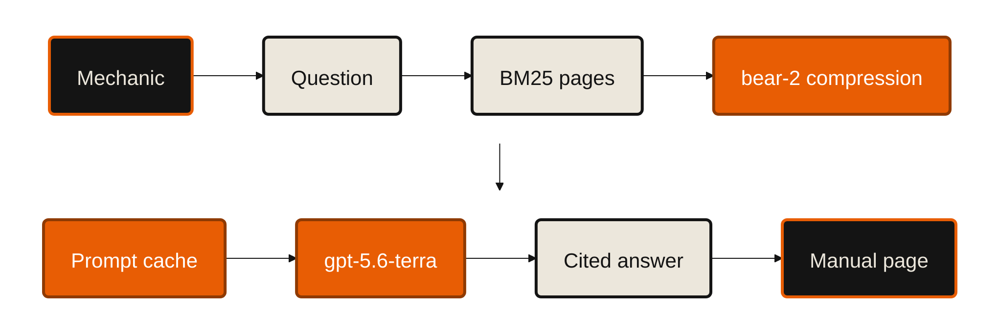

# The Token Company — Mechanica

**5 minutes.** The one claim: *the AI was never not-good-enough for this mechanic. It was too expensive to use.*

Every number below is measured. Sources: `api/data/costs.jsonl` (41,612 billed calls as of 2026-09-20 09:55), `api/eval/report.md`,
`api/eval/report-baseline.md`, `api/eval/chat-report.md`, `api/docs/CHAT-RESEARCH.md`, and the live
`GET /api/cost` + `GET /api/cost/ttc`. Regenerate the whole table with:

```
api/.venv/Scripts/python tools/cost_report.py --live --md ../docs/pitches/token-company/cost-report.md
```

Full output: [`token-company/cost-report.md`](token-company/cost-report.md) · raw numbers in `cost-report.json`.

---

## The headline

| | |
|---|---|
| naive, OUR measured worst case — the largest **deployed** manual (775 p) in the flagship | **$12.40 / question** |
| naive, the **median** deployed manual (171 p) | **$1.37 / question** |
| naive, modelled on **his** 500-page workshop manual | **$8.005 / question** |
| **his own lived bill** when he tried it — his number, not ours, on his manual | **~$4 / question** |
| ours — the default path (question → the manual's pages) | **$0.00038 / ask** |
| ours — worst case (a written answer with citations) | **$0.0041–0.0049 / answer** |
| x-factor, our $12.40 worst case against our $0.00038 ask | **32,632x** — and **3,600x** against the $1.37 median |
| tokens removed before the prompt was ever billed (bear-2 + stripping) | **31.2%** eval · **29.1% over 10 calls** on the live replica now |
| his month at 40 questions/day | **$4,800 → $5.04**, and $5.04 is the worst case |

$1 buys the naive stack **one twelfth of a question** at our measured $12.40 worst case. It buys us **2,632**.

---

## 0:45 — The $4 problem

> *"He doesn't use AI. Not because it's wrong — because one question cost him about four dollars, and he
> hit the limit before lunch."*

A friend in Germany runs a motorcycle workshop. ~20% of his working time goes to searching manuals.
He tried an LLM. The only way to make it answer was to paste the manual in. A 500-page workshop manual is
**400,000 tokens**. At the flagship's $10/M that is **exactly $4.00 of input before the model writes a
word** — his number is not an anecdote, it is the arithmetic. Past OpenAI's 272k long-context line it bills
at **2x**, so today the same question is **$8.01**.

At 40 questions a day that is **$160/day, $4,800/month**. That is not an accuracy problem. That is a
**unit-economics problem**, and it is why the limit screen shows up at 11 a.m.

**What the judge should feel:** this is a real person with a real bill, not a benchmark.

**On screen**

| manual | pages | prompt tokens | naive `gpt-6-astra` | whole manual in `gpt-5.6-luna` |
|---|---|---|---|---|
| KTM 390 Duke 2024 (our demo bike) | 143 | 114,400 | $1.144 | $0.0229 |
| **median deployed manual** | 171 | 136,800 | **$1.37** | $0.0274 |
| BMW R 12 G/S 2026 | 270 | 216,000 | $2.165 | $0.0433 |
| his 500-page workshop manual | 500 | 400,000 **(2x)** | **$8.005** | $0.1601 |
| **largest in the deployed catalog** (live `/api/cost` reports this as `naivePerAsk`) | 775 | 620,000 **(2x)** | **$12.40** | — |

800 tokens/page and the >272,000-token 2x rule are `api/app/llm.py`. Output is 100 tokens at each model's
output price. **Assumption to disclose if asked:** we apply the 2x surcharge to the `luna` column too. If it
does not apply there, the 500-page luna figure is **$0.0801**, not $0.1601 — still 19x our worst case.

The `gpt-5.6-luna` column is there on purpose: *"maybe he just picked the wrong model"* is the honest
objection. On his 500-page manual the **cheapest** model reading the whole thing is $0.08–0.16 a question —
**19–38x** our worst case, **211–421x** our default path. Cheap models don't fix this.
**Not reading the manual** fixes this.

---

## 2:00 — The savings ladder

Each rung re-prices the **same measured token counts** under the previous rung's rules. Nothing is modelled.
Baseline: the median 170-page manual. One slide per rung, numbers on screen.

| rung | $/ask | $/chat answer | step | how it is computed |
|---|---|---|---|---|
| **0** naive: whole manual, flagship, every question | $1.3650 | $1.3650 | — | 170 p × 800 tok in `gpt-6-astra` |
| **1** + prompt-cache the whole manual (best case for *that* design) | $0.1410 | $0.1410 | 10x | cached-input price |
| **2** page retrieval instead of whole manual (still flagship) | $0.04839 | $0.02821 | **48x** | our logged tokens, re-priced at `gpt-6-astra` |
| **3** + model tiering (luna router / terra picker + chat) | $0.001882 | $0.005845 | 4.8x | same tokens, our models, cache ignored |
| **4** + prompt caching + spec path + picker gate + compression | **$0.000865** | **$0.004200** | 1.4x | what the log actually billed |
| **5** + answer cache on a repeat | **$0** | **$0** | — | `ask._cache`, `usd` forced to 0 |

*(Rung 4's $0.000865 is the whole-log mix, development traffic included. On the controlled 150-query rider
eval the mix is cheaper: **$0.00038**. Both are in the report; quote whichever, name which.)*

### Slide A — retrieval is the big one (48x)

> "The first 48x isn't a model trick. It's not reading 500 pages to answer one question."

BM25 over the manual's own sections, **in process, zero LLM, zero embeddings, zero vector DB**
(`api/app/search/local.py`). The prompt carries **2,314 tokens** instead of 136,000–400,000.
The mechanic doesn't want prose anyway — he wants **page 77**.

### Slide B — the cheapest call is the one not made

The only controlled A/B in the repo: the **same 150 rider queries**, before and after the router rewrite,
the deterministic spec path and the picker gate.

| | before | after | change |
|---|---|---|---|
| $ per ask | $0.00207 | **$0.00038** | **5.4x cheaper** |
| LLM calls per ask | 1.73 | **1.15** | −34% |
| p95 latency | 4.99 s | **3.33 s** | −33% |
| out-of-scope answered correctly | 55% | **100%** | **+45 pts** |
| in-scope top-1 | 100% | 100% | unchanged |

- **85.3% of asks make zero picker calls** (172 LLM calls for 150 asks). 66.9% over the whole log.
- **Spec questions cost nothing past the router.** "How much oil does it take" is answered from parsed spec
  rows + BM25, with the quote verified verbatim against the printed page. **Zero LLM calls.**
- **Picker gating:** if the second BM25 hit is below `PICK_MARGIN`, BM25 already won. Skip the picker.
- Cheaper **and** more accurate, on the same queries.

### Slide C — model tiering, measured on the same job

Two routes ran on a flagship first and a cheap model after, on identical work:

| route | flagship | what we ship | factor |
|---|---|---|---|
| `identify.photo` | `gpt-6-astra` $0.024661 | `gpt-5.6-luna` $0.000532 | **46x** |
| `identify.part` | `gpt-6-astra` $0.014047 | `gpt-5.6-luna` $0.000239 | **59x** |

Five routes, two price tiers: vision-id, router and structurer on `luna` ($0.20/M), picker and chat on
`terra` ($2/M), **nothing on the flagship**. Tiering is per route, not per product.

### Slide D — prompt caching, from `cached_tokens`, not from hope

| route | cache hit rate | $ paid | $ without the cache |
|---|---|---|---|
| `ask.router` (1,113 calls) | **99.5%** | $0.1471 | $0.7656 |
| `chat.answer` (248 calls) | 42.7% | $1.0079 | $1.4494 |
| `ask.picker` (286 calls) | 34.6% | $0.6349 | $0.8627 |
| `ingest.struct` (27,364 calls) | 47.0% | $64.91 | $70.87 |

The router's system prompt is a 3,000-token vocabulary translator — rider slang, typos, five languages —
pinned with `prompt_cache_key` per route+model (`api/app/llm.py::stream`). **99.5% of it is served cached at
1/10th price.** A big prompt is cheap when it never changes; the expensive tokens are the ones that do.

### Slide E — compression, where nothing else could reach

Everything above shrinks *which* text reaches the model. **bear-2 shrinks the text itself**, in the one
place the other levers cannot touch: the printed page that must go into the prompt.

- `chat._strip_referrals` first deletes the "have this done by an authorised workshop" boilerplate —
  **2.8% of the KTM page text, 5.7% of the BMW** — which a mechanic on the lift must not be told anyway.
  368/368 KTM and 256/256 BMW printed figures survive it.
- Then **one** bear-2 call for the whole prompt: **46,501 → 31,977 tokens over 25 answers = 31.2% saved**,
  **581 tokens per answer**.
- At `gpt-5.6-terra` fresh input that is **$0.00116/answer — 21.7% of the chat bill**
  ($0.00536 → $0.00420), on top of everything else.
- Live `/api/cost/ttc`, read 2026-09-20 09:42 UTC: 8,811 → 6,247, **29.1% saved over 10 calls**. That
  counter is **in-memory per replica** and resets on deploy, so a low number means a fresh replica, not a
  worse compressor. Read it fresh before the pitch and quote the 31.2% eval figure on stage.

**Why one call and not one per page:** the API allows **60 requests/minute** (undocumented — we found it by
getting 429'd). Per-page compression would have capped the whole product at ten chats a minute. So the
prompt is fenced `PAGE 62 … PAGE 63 …`, compressed in one call, and split back apart.

### Slide F — pay once, not per question

On-demand ingest: **$0.0951 per manual**, mean over **648 real ingests** (mean 177 pages, 114,565 pages
total, **$0.538 per 1,000 pages**). Readable in **1.3 s**, fully searchable in **40.4 s** on the timed live run.
That is **7% of ONE naive question**, and it
then answers every question about that bike forever. The 535 manuals in the deployed catalog cost about
**$51 total, once**.

---

## The token path



**The one line to say over this diagram:** *compression sits between the PDF text layer and every model
call — and it is a cost lever, never a correctness lever. No key, a 5xx, a timeout, a lost page fence: all
four return the original text. The worst case is that we pay full price for a correct answer.*

---

## 1:00 — Live

Two tabs. Phone mirrored.

| # | do | expect | say |
|---|---|---|---|
| 1 | Tab 2: `https://mechanica.emilvinu.ch/api/cost/ttc` — read `tokensIn` / `tokensOut` / `savedPct` aloud | e.g. `8,811 → 6,247, 29.1%` over 10 calls; **may be all zeroes on a fresh replica — that is fine, it just means step 5 starts from 0** | "That counter is bear-2's, live in production." |
| 2 | Tab 1: KTM 390 Duke 2024 → **Chat** → type exactly `chain is loose, what do I do` | numbered steps, every sentence ending `[p. 77]` / `[p. 78]` | "Up to six pages of KTM's own text went in. They got compressed on the way." |
| 3 | point at the chat footer | **`N tokens saved`** (~600–950 for this question) | "Those tokens were never billed." |
| 4 | tap the `[p. 78]` chip | Book jumps to p.78, orange markers on the printed lines | "The model only ever wrote a page number. The server sliced that quote out of the **original** page, not out of the compressed text. Verbatim by construction." |
| 5 | Tab 2: reload `/api/cost/ttc` | `tokensIn`, `tokensOut`, `tokensSaved`, `calls` all moved | "Same request, counters moved, citation still exact." |
| 6 | Tab 1: `#cost` | `total · per ask · naive per ask · calls` | "Four hundredths of a cent an ask. Pasting the manual in is $12.40." |

**Traps.**
- `/cost/ttc` counters are **in-memory per replica** (1–3 replicas on Azure Container Apps). If the number
  goes *backwards* on reload you hit the other replica — ask the question once more, don't explain it.
- The BMW R 12 G/S is **shaft drive**; "chain is loose" returns *BATTERY GUARD* p.150. Chain questions go to
  the KTM.
- Run every scripted question once beforehand — a repeat is served from the answer cache in 0.2–0.4 s at $0,
  which is a great line but a terrible way to demonstrate the counters moving. **Warm a different question.**

---

## 0:45 — The trade-off curve

This is the part we did not take for free. Measured on the six real retrieved chat contexts, one batched
call each (`api/docs/CHAT-RESEARCH.md`):

| aggressiveness | tokens saved | `PAGE N` fences intact | printed figures kept |
|---|---|---|---|
| **0.3** | 19.4% | **6/6** | **86%** |
| 0.5 | **32.2%** | 4/6 | 80% |
| (0.8) | — | page stops being readable | — |

bear-2 is extractive: it strips stopwords and punctuation. At 0.5 it also eats **printed values** and
sometimes a **page fence**. A lost fence silently reattributes one page's text to another page's number. A
lost torque figure is exactly the thing this product exists not to get wrong — **a wrong torque breaks a
motorcycle, and the mechanic is liable for it.**

So we did not take the 32.2%. We shipped **0.3**, accepted ~19%, and then **got the rest from the other
end**: delete the dealer-referral boilerplate first (2.8% / 5.7%), which carries no information a mechanic
needs. End to end that lands at **30.8–31.2% with every printed figure intact** — 368/368 KTM, 256/256 BMW.

> **Cutting text that carries no information beats compressing text that does.**

Three guards make the aggressive setting safe to use at all:
1. **Adaptive** — 0.3 normally; 0.5 only when the raw prompt exceeds 8,000 tokens, where the alternative is
   dropping a whole page.
2. **`chat._split` re-checks every `PAGE N` fence** after compression and throws the entire compression away
   if one is missing.
3. **No quote is ever copied out of compressed text.** The model emits page numbers; the server slices the
   quote from the original page.

The receipt, with compression on: **100% valid citations · 43/43 verbatim · 0 invented numbers · 0 dealer
referrals · 100% of 48 claim sentences carry a `[p. N]`** (`api/eval/chat-report.md`).

---

## 0:30 — Close

| his month, 40 questions/day × 30 days = 1,200 questions | |
|---|---|
| before — whole manual in the flagship (500 p) | **$9,606** |
| before — his own lived $4/question | **$4,800** |
| after — if he chats *every single question* (worst case) | **$5.04** |
| after — the default path, the manual is the answer | **$0.46** |

At 1,000 mechanics: **$1.64M/month → $5,040/month** worst case, **$456/month** on the default path. Ingest
does not scale with mechanics — it scales with distinct manuals, and there are only so many motorcycles.

> *"He stopped using AI because one question cost four dollars. His whole month now costs five — and the
> answer he gets is page 77 of KTM's own manual, not our paraphrase of it. The compression is why the one
> place we do write a sentence is still affordable, and the page fences are why that sentence can still
> point at the exact line of ink."*

---

## Q&A

**Does compression hurt accuracy?**
No, and it is measured, not asserted. With bear-2 on: **100% valid citations (43/43 verbatim on the page
they name), 100% of 48 claim sentences carry a `[p. N]`, 0 invented numbers, 0 dealer referrals**, over 25
questions on two manufacturers. The structural reason is that **the model never quotes**. It emits page
numbers; `chat._quote` slices the quote out of the ORIGINAL page text and rejects anything that is not a
substring of it. A mangled compressed passage cannot become a citation — the worst it can do is make the
model pick the wrong page, and the page-fence check plus the eval is how we know it doesn't. We also
refused the 32.2% setting precisely because it dropped figures. And `_unverified_numbers` is a second net:
every digit in an answer is checked against the printed pages, and the ones that aren't there are reported.

**Why not just use a smaller model everywhere?**
Two of five routes already are, and two more went that way after measurement — `identify.photo` moved off
the flagship for a **46x** saving, `identify.part` for **59x**. The router runs on `gpt-5.6-luna` at
$0.000132 a call. The picker and chat stay on `gpt-5.6-terra` because those two touch the manual's own
printed text, and the failure modes are *a wrong page id* and *a dropped torque figure* — the 5% the
mechanic is liable for. Our cost problem was never the model tier; it was **400,000 tokens**. Note the
honest column in the opening table: the whole manual in the *cheapest* model is still $0.08–0.16 a question,
19–38x our worst case. Tiering is worth 4.8x here. Not reading the manual is worth 48x.

**What about latency?**
bear-2 costs **~0.4–0.5 s** per call, measured live (`ttc.chat` 0.463 s; 90,000 tokens compress in 0.69 s,
so we are nowhere near its ceiling). Time to first token is **p50 2.64 s / p95 5.87 s**, inside our 4 s p50
gate. Three things keep it honest: it runs **once per prompt, not once per page**; identical text is served
from a 2,000-entry LRU with no round trip at all; and it only ever runs on the ~15% of asks that reach the
picker, plus chat. On the default path — the one the mechanic actually uses — there is **no compression
call and no picker call**, and p95 is 3.33 s. If compression times out, we ship the uncompressed prompt: it
degrades to *more expensive*, never to *slower than the timeout* and never to *wrong*.

**What is the cost at 1,000 mechanics?**
1.2M questions/month. **$5,040/month** if every one of them is a full chat answer; **$456/month** on the
default ask path. The naive stack at the same volume is **$1.64M/month, $19.7M/year**. The part that
doesn't scale linearly is ingest: 535 manuals cost about **$51, once**, shared by every shop — there are
**14,770** distinct free English PDFs we can reach, so the whole reachable corpus is roughly **$1,400, once**.

**bear-2's pricing is "you only pay for the tokens compression removes" — so what does it cost you?**
There is no public $/M, so we log it as `usd = 0` and count the saving in **tokens** instead, in a separate
endpoint (`GET /cost/ttc`) kept deliberately out of `/cost` — `/cost` reports dollars spent at an OpenAI
price, and compression spends nothing there. Whatever the rate turns out to be, it is charged against
**14,524 tokens removed per 25 answers**, and the tokens it removes would have been billed at
`gpt-5.6-terra` input. Tell us the number and we'll put it in the table; the ladder does not depend on it.

**Isn't $0.0004 just a small-manual artifact?**
The opposite. The naive column moves with page count — $1.03 at 128 pages, $12.40 at 775. **Our column does
not move at all**, because the prompt never holds the manual: it holds the ≤6 pages BM25 returned. Our
`$/question` is flat in manual size. That is the whole design.

**Why is `ingest.struct` $64.91 — bigger than everything else combined?**
Because it is the *only* thing we deliberately spend on: 27,364 calls to turn 114,565 PDF pages into
sections, specs and grounded quotes across 648 manuals. It is a **one-time, per-manual, shared** cost of
$0.0951 a manual, and it is exactly what buys the $0.0004 questions afterwards. Prompt caching already
takes $5.96 off it (47.0% hit rate). The same token counts on the flagship would have been **$3,070**.

**What happens if The Token Company's API is down during the demo?**
Nothing visible. `ttc.compress` returns `(text, 0, 0)` on a missing key, a 5xx, a timeout, three failed
retries, an empty body, or a "compression" that grew the text — and `_split` throws the result away if a
single `PAGE N` fence is missing. The counter stops moving, the bill goes up ~22% on chat, the answer is
identical. It is wired as a **cost** lever, in a product whose whole premise is that the correctness lever
must never be touched.
