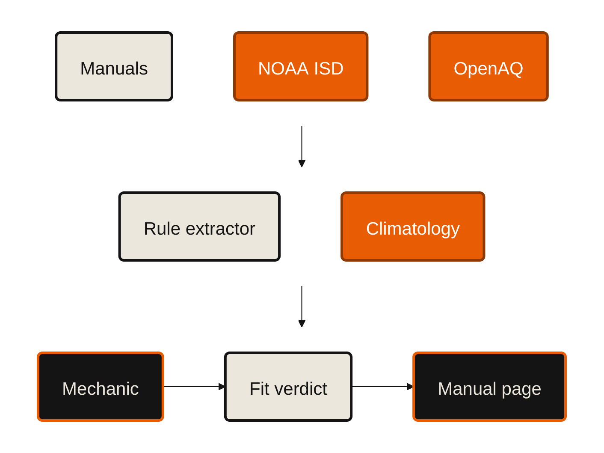

# Voloridge — "Signal in the Noise" · 5-minute pitch

**Mechanica** · <https://mechanica.emilvinu.ch> · repo `C:\Users\me\trustthemanual`
Feature for this sponsor: **Climate Fit** — the manual's own rules, resolved against 600 GB of NOAA
hourly weather and global air quality. Spec: `docs/pitches/voloridge/spec.md`. Scored alternatives:
`docs/pitches/voloridge/ideas.md`. Working code behind the two findings:
`docs/pitches/voloridge/isd_probe.py` (NOAA reducer) and `docs/pitches/voloridge/antifreeze_scan.py`.

Every number below is measured on 2026-09-20 and traceable to a file or an endpoint. Numbers marked
† are only claimable **after** the build; everything else is already true.

**Status, say it before a judge asks:** Climate Fit is **built, deploying**. `api/app/climate/` is in the
repo and wired into `main.py`, and `/api/climate/*` answers on the live host — but the deployed replica
carries no climatology yet, so `POST /api/climate/fit` returns `no climatology` today. Demo it locally, and
say that sentence rather than let a judge find it.

---

## 0:00 – 1:30 · The product

> **Feel:** this is a real tool for a real person, not a hackathon demo.

A friend of mine opened a motorcycle workshop in Germany. He spends about **20% of his working time
looking for the right page in a manual** — roughly 400 hours a year, EUR 36–48k of billable time.
He does not use AI. Two reasons, both fair: at 95% right he is still liable for the 5%, and when he
tried it, one question cost about **$4** because the model had to read a 500-page manual.

Mechanica makes the manual the answer. Pick the bike — search, photo, or VIN. The official PDF opens
**on the exact page** with the exact lines marked, a 3D model explodes to the part, and exact-fit
parts come up with live prices. Chat and voice are grounded: the model may emit a page number, and
the **server** slices the quote out of the original page. It cannot invent a torque figure, because
it is never allowed to type one.

Measured: **$0.00038 per ask** and **$0.0041** for a written chat answer, against a **$12.40** naive
baseline — the largest deployed manual read to the flagship once per question, so **32,632× cheaper**
(3,600× against the $1.37 median manual). First token in ~2.6 s, 100% valid citations, 0 invented numbers.

*(Live: type "KTM 1390 Super Adventure R 2026", one tap, the page is on screen.)*

---

## 1:30 – 5:00 · The data

### 1:30 – 2:15 · The noise is the problem, and it is upstream of us

> **Feel:** these people actually did the ugly part.

Nobody publishes a dataset of manuals. There are dozens of OEM portals, each with its own idea of the
truth. We built one adapter per portal — **34 adapter modules plus 26 crawl fragments, covering 84
publisher hosts** — and the registry that came out is a dataset-quality problem in miniature:

| | |
|---|---|
| registry rows | **53,557** across **84 hosts, 80 makes, 59 markets, 43 languages** |
| distinct URLs behind them | **28,200** — 47% of rows point at a file another row already points at |
| vehicles derived | **27,751** (23,140 motorcycles, 4,611 cars); **13,537** with a free manual |
| makes documented as **unreachable** | **17** — CFMOTO, LiveWire, Beta, Norton, Ural, Energica, Sur-Ron… |

The hardest parts, in order of how much time they cost:

- **The row lies about what it is.** Honda files the Gold Wing *brochure* in the same listing as the
  owner's manual. Ford files owner guides under `/catalog/`. Piaggio calls the owner's manual a "use
  and maintenance booklet", so any classifier that greps `maintenance` drags every Piaggio handbook
  into the service bucket. `api/app/registry/doctype.py` classifies **8 document kinds from the URL
  and title alone** — never by downloading — and it is ordered, with the reasons written in the file.
  Result: 49,408 owner, 2,793 infotainment, 578 supplement, 479 quickstart, 159 spec, 70 service,
  64 warranty, 6 brochure.
- **The file lies about being a manual.** Of 773 ingest attempts, **38 URLs were 3-page flyers** and
  **23 were not PDFs at all**. The pipeline rejects them on page count and on magic bytes, and writes
  the reason down: 648 done, 80 error, 24 duplicate, 21 suspicious (`api/data/mass_report.jsonl`).
- **The same PDF arrives under many names.** One file covers eight model years on four portals.
  Dedupe is by **SHA-256 of the fetched bytes** — 498 hashes, 24 duplicate ingests caught.
- **Retraction.** A portal that drops a model must be able to un-say it. `registry merge-fragments
  --replace` gives a fragment ownership of its site scope: rows it no longer lists are **deleted**,
  and `manualUrl` is a pure function of the registry, so a retracted row stops being advertised
  instead of lingering as a dead link.
- **Some hosts simply say no.** Ducati's Contentful PDFs are public but the page naming them is
  Akamai-fingerprinted: 403 to httpx *and* to headless Chrome, 200 to a headful browser — so that
  adapter drives a real browser over CDP. Kawasaki 401s if you send `Accept: application/json`.
  Honda needs a Googlebot UA and a CSRF token, and four of its 41 distributor codes were found only
  by trying 479 candidates. **All of it is written down in `docs/MANUALS.md`, including the 17 makes
  we could not reach**, so nobody re-walks them.

We copy no manuals at crawl time. `RegistryEntry` has no field that could hold one.

### 2:15 – 3:00 · The dataset we made out of PDFs

> **Feel:** they turned unstructured documents into something you could actually query.

From **535 live manuals · 95,914 pages** we extracted, grounded, and stored:

- **91,388 sections** with per-block page coordinates,
- **431,292 highlights** — normalised rectangles over the real page,
- **137,379 typed specs** — `torque | capacity | clearance | pressure | grade | size | electrical`,
  each with a page number and a **character-for-character quote**.

Cost for the whole corpus: **$61.61**, $0.095 per manual, **40.4 s** to searchable on the timed live run. The grounding gate is
the load-bearing part: a quote that cannot be found in the PDF text layer is dropped, and the log
says how many. On this corpus, **290 of 110,094 sections dropped (0.3%) and 0 of 431,292 highlights
discarded.**

Then we asked one question of that corpus, and it turned into this whole feature:

> **How many of these manuals print a rule that depends on where the vehicle actually is?**

**522 of 529. 98.7%.**

| clause family | manuals | occurrences |
|---|---|---|
| road salt / coastal / corrosion | 518 | 3,817 |
| dusty / sandy | 487 | 1,168 |
| antifreeze | 394 | 2,349 |
| wet / muddy | 371 | 1,060 |
| ambient temperature | 340 | 1,123 |

The manual knows the rule. It has no idea whether it applies to you. **NOAA does.**

### 3:00 – 3:45 · The pipeline

> **Feel:** this is a real data system, not a notebook.

Three things worth a sentence each:

- **600 GB in, 4.34 MB out — built, not projected.** We never store the archive. Each station-year
  `.gz` is reduced **in the stream** to one row: the share of readings below
  5/0/−5/−10/−15/−20/−25/−30/−35/−40 °C and above 30/35/40/45 °C, freeze–thaw days, min, max,
  mean, p01, p99. The 2024 sweep is **done**: 12,585 stations attempted, **12,225 station-years
  reduced**, **4,260 MB streamed**, **121,751,290 observations parsed**, in **537 s** at 48 threads
  from Switzerland — 7.9 MB/s. Out the other end: `climatology.json`, **4.34 MB over 10,715
  stations** (1,701 dropped for fewer than 2,000 quality-passed readings). One year, not six, and we
  say so. (`api/data/climate/isd-2024.jsonl`, `docs/CLIMATE.md`.)
- **The cleaning is small and decisive.** ISD puts a quality code at character 93. Re-running the
  reduction with that filter switched off, over **400 station-years**: only **0.12%** of readings
  are flagged suspect or erroneous and only **6 of 400** annual minima move at all — but at Russian
  station `263240-99999` the 2024 minimum is **−21.5 °C with the filter and −25.1 °C without it**,
  so the filter is the only thing between a mechanic and a false "action needed" against the
  −25 °C floor. A 0.12% cleaning step decides the answer. That is the whole challenge in one line,
  and it ships as a report: `api/data/climate/quality_ablation.json`.
- **The join is where we actually got burned.** Our first pass matched stations **by name**:
  "Boston" landed on a **buoy**, "Moscow" on Moscow **Idaho**, and "Chicago" on a Canadian station
  reporting **−46.9 °C**. The shipped join is geodesic, filters the 16,885 stations that stopped
  reporting (29,661 → 12,776), and **prints the distance** — anything past 50 km renders `unknown`,
  never `ok`. Model-family clustering writes its clusters **with their members** to `families.json`
  so a human can audit a bad merge. No silent fuzzy matching anywhere.

### 3:45 – 4:30 · What we found

> **Feel:** oh. That is genuinely surprising, and it matters.

**One number, nine markets.** The shipped extractor, run over all **529 stored page files**:
**227 manuals print an antifreeze floor, and all 227 print −25 °C**, on 1,028 distinct pages.
EU 108, US 77, worldwide 30, plus Argentina, Japan, China, Brazil, the Philippines and RW. Four
makes, model years 2006–2026, **spread 0.0000 — zero variance**. (The earlier 206 came from the 508
*spec* files; same finding, smaller denominator — both scripts are in the repo.) Somebody in Austria
typed −25 °C once, and it shipped to every market on earth.

It is the outlier in the other direction too: of the eight rule types we extract, `antifreeze_floor`
is the **only** one with a spread of 0.0. Cold-start, dusty, wet, salt and heat clauses spread
0.74–0.85 across makes. The one rule the whole industry agrees on is the one that is wrong for a
fifth of the planet's weather stations. (`api/data/climate/anomalies.json`.)

**How often is that wrong?** We no longer have to sample — the whole 2024 population is built.
**2,215 of 10,715 usable station-years (20.7%) recorded a temperature below −25 °C in 2024.**
Below −20 °C: 27.4%. Below −30 °C: 14.0%. Below −35 °C: 9.1%.

The seeded 260-station draw we quoted before (seed 11) reproduces **exactly** off the rebuilt data —
210 usable, **48 breaching, 22.9%** — so the estimator was unbiased and the population number is the
one to use now. (`docs/pitches/voloridge/findings.md`, regenerated by `findings.py`.)

And the unexpected part: **113 of the breaching stations sit above 1,500 m** — Tibetan-plateau
stations at 4,613 m and 4,535 m, a US station at 4,113 m, Tajikistan at 3,940 m. Those are *altitude*
stations, not latitude ones. The manual's single number fails on the vertical axis too, which is why
`altitude` became its own rule type. (Careful with NOAA's `CTRY` column while reading that table: it
is the archive's own code and it collides — `CH` covers both ZUERICH-FLUNTERN and WUDAOLIANG.)

**The rule that is already personalised, and nobody notices.** KTM does print a temperature-banded
oil grade — *"Engine oil grade at ambient temperature ≥ 0 °C: SAE 10W/50; < 0 °C: SAE 5W/40"*,
**KTM 1390 Super Adventure R 2026 US, p. 215.** Nearest-station join, 2024, measured:

| city | station | km | share of 2024 readings below 0 °C | what p. 215 means for you |
|---|---|---|---|---|
| Phoenix | PHOENIX SKY HARBOR INTL | 6.6 | **0.0%** | 10W/50, all year |
| Zurich | ZUERICH-FLUNTERN | 2.1 | 6.1% | 5W/40 for about three weeks |
| Minneapolis | MINNEAPOLIS–ST PAUL INTL | 10.8 | **20.7%** | 5W/40 for a fifth of the year |
| International Falls, MN | FALLS INTERNATIONAL | 4.6 | **34.6%** | 5W/40 for a third of the year |
| Bangkok | BANGKOK METROPOLIS | 7.5 | 0.0% | the rule never fires |

**And "more often" finally gets a number.** 487 of 529 manuals say service the air filter more often
in dusty conditions — *"Service more frequently when operating in severe conditions: dusty, wet…"*,
Kawasaki Versys 1100 2026 US, p. 174. Not one says how much more often. OpenAQ's PM10 distribution
does: your location's percentile decides whether the manual's own severe-conditions column applies.

**How we know it is not made up.** The extractor never generates a threshold — Pass C drops any rule
whose quote is not a character-for-character substring of the PDF text layer, the same gate that
discarded 0 of 431,292 highlights. Twenty randomly chosen manuals get hand-labelled and we publish
precision and recall as measured†. Bangkok, Dubai, Miami and Delhi are **negative controls in CI**:
if a cold rule ever fires there, the join is broken. And the whole thing is one seeded script in the
repo — `docs/pitches/voloridge/isd_probe.py`, run it yourself.

### 4:30 – 5:00 · Live demo, and the close

> **Feel:** I could hand this to a mechanic today.

1. **KTM 1390 Super Adventure R 2026** → the manual opens.
2. Tap **Conditions**, type **Minneapolis** →
   `MINNEAPOLIS–ST PAUL INTERNATIONAL · 10.8 km · 13,760 observations in 2024`
   - `ENGINE OIL GRADE — action needed · 20.7% of readings below 0 °C (~1,816 h/yr) · p. 215`
   - `ANTIFREEZE PROTECTION — watch · coldest 2024 reading −22.2 °C · floor −25 °C · p. 215`
     (measured: 2.8 °C of margin renders `borderline`, not `ok` — the built system is stricter than
     the script we wrote for this slide)
   - `ROAD SALT / SEA AIR — action needed · 20.7% below 0 °C, 68 freeze–thaw days/yr · p. 207`
3. Change one field to **International Falls, MN** →
   `COOLANT — breached · 108 readings below −25 °C in 2024, low −30.6 °C · p. 215`
4. **Tap the coolant row.** The PDF opens on p. 215 with *"Antifreeze protection to at least −25 °C"*
   highlighted. **KTM said it. We only worked out that it applies to you.**
5. Change to **Bangkok** — every cold rule goes grey and the dust rule lights up. The negative
   control is part of the demo on purpose.
6. Last screen: *227 manuals. 9 markets. One number.* And next to it: **20.7%**.
   Screenshots of every step above: `docs/pitches/voloridge/shots/`.

The close: the manual is still the only thing we show you. What the manufacturer could never print is
**whether the rule is about you** — and that took 600 GB of somebody else's data to answer, reduced
to 4.34 MB, for zero tokens and **3–6 ms** a look (measured warm; the first call in a process also
loads the table, ~120 ms).

---

## Q&A — the hard ones

**Is your station sample biased?**
Yes, and in a knowable direction. It is no longer a sample — it is all 10,715 usable 2024
station-years — but ISD station density is heavy in the US, Russia and Canada and thin across Africa
and South Asia, so a station-weighted 20.7% is **not** "20.7% of riders". It is
"20.7% of the world's actively reporting weather stations". To make a rider-weighted claim we would
need to weight by registrations — we do not have that data, so we do not make that claim. What the
per-user product does is not statistical at all: it is one station, named, with its distance printed.

**Your nearest-station join — how wrong does it get?**
The failure mode is real and we hit it. Our first pass matched stations by *name*: "Boston" landed on
a **buoy** 1 km offshore, "Moscow" on Moscow, **Idaho**, and "Chicago" on a Canadian station with a
−46.9 °C minimum. That is why the shipped join is geodesic and prints the distance, why stations with
`END < 20250101` are filtered out (29,661 → 12,776), and why anything past 50 km renders `unknown`
rather than `ok`. A station 10 km away in flat terrain is fine; 40 km across a mountain range is not,
and elevation delta is on the list to gate on.

**How do you know the extracted rules are right and not hallucinated?**
The model is never allowed to produce the number as free text. Pass A finds candidates with regex at
zero cost; Pass B structures the window; Pass C drops any rule whose quote is not a
character-for-character substring of the PDF text layer. That is the same gate already running in
production, where it discarded 0 of 431,292 highlights and 290 of 110,094 sections. Plus a
hand-labelled 20-manual held-out set with published precision and recall†. If a rule cannot be
grounded, it does not exist.

**600 GB — did you actually process it, or a toy slice?**
One full year, all of it, and we will not imply more. Measured on this laptop over public HTTPS:
**12,225 station-years, 4,260 MB streamed, 121,751,290 observations parsed, 537 s at 48 threads**,
reduced in-stream to a **4.34 MB** table that is committed. Nothing raw was written to disk. Six
years (2019–2024) is the same command with `--years 2019:2024` — about 26 GB and an hour here,
minutes in us-east-1 on the instances you offered at the booth. The shipped slice is 2024.

**Why not just call a weather API?**
Because the question is not "what is the temperature". It is "how many hours per year is this
location below the threshold this manufacturer printed, and how bad was the worst year" — a
multi-year distribution, not a reading. That needs the archive. It also needs to be free and offline
at request time: the verdict costs 0 tokens and **3–6 ms measured** because the whole climatology is
4.34 MB in memory.

**Is this reproducible?**
`docs/pitches/voloridge/isd_probe.py`, seed 11, anonymous HTTPS, no AWS account, no key. Both figures
in the pitch come out of it. Data artefacts are committed; the LLM pass is cached by
`sha256(window)`; every threshold is a named constant.

**What is the actual failure rate from running the wrong coolant?**
We do not know, and we will not guess. We have no failure data — only exposure. Every number we show
is "the manufacturer printed X; your location measured Y". Joining NHTSA complaints and recalls to
this would give the outcome side, and it is the obvious next dataset — it is just not on your curated
list, and we would rather ship one honest join than two hand-wavy ones.

**Scale: what happens at 27,751 vehicles instead of 662?**
The climatology does not grow — it is per station, not per vehicle. The rulebook is per *manual*, and
one manual covers many model years, so it grows with ingests, not with the catalog: 535 manuals
already cover 662 vehicles, and the registry has 28,200 distinct PDFs behind 53,557 rows. At
$0.095/manual and ~$0.0017 of rule extraction per manual, the full free-and-fetchable set is a
three-figure spend, not an architectural problem.

**What did you get wrong?**
Three things, all still in the repo's history. **One:** the name-based station join — "Chicago" on a
Canadian station at −46.9 °C, "Boston" on a buoy, "Moscow" in Idaho. Fixed with geodesics and a
printed distance. **Two:** we shipped the first reduction without the ISD quality filter. It only
moves 0.12% of readings, which is exactly why it is easy to skip — and it still flips
`263240-99999` from breached to fine. **Two and a half:** the first regex for the antifreeze floor
read `−45 … −25 °C` as a promise of −45 °C. It is a mixing *range*, and the guaranteed floor is the
weakest end. 188 manuals were briefly wrong in the safe-looking direction, which is the worse
direction: it would have told a mechanic in Fargo that he was fine. **Three:** one spec file is corrupt on disk right now,
`yamaha-tracer-9-gt-2025-eu-om-90739a.json`, trailing bytes after the JSON document. We found it
because the analysis crashed on it, which is the argument for running the analysis over the whole
corpus instead of a sample.

---

## Sources for every number

| claim | source |
|---|---|
| 53,557 rows · 28,200 URLs · 84 hosts · 27,751 vehicles · 13,537 with a manual | `api/data/registry.json`, `api/data/bikes.json` |
| 535 manuals · 95,914 pages · 91,388 sections · 662 vehicles | `GET https://mechanica.emilvinu.ch/api/manuals` |
| 137,379 specs · 431,292 highlights · 648 done / 80 error / 24 duplicate / 21 suspicious · $61.61 | `api/data/mass_report.jsonl` |
| 107,452 specs locally · 206 manuals × −25 °C × 9 markets (spec corpus) | `docs/pitches/voloridge/antifreeze_scan.py` over `api/data/specs/*.json` |
| 227 manuals × −25 °C × 9 markets · 1,028 pages · spread 0.0000 (page corpus) | `docs/pitches/voloridge/findings.py` → `findings.md`; `api/data/climate/anomalies.json` |
| 3,056 rules · 519/529 manuals · 93,932 pages · 29 dropped by grounding · $0.67 | `api/data/climate/rules_report.json` (route `climate.extract`, `gpt-5.6-luna`, cap $15) |
| 12,225 station-years · 4,260 MB streamed · 121,751,290 obs · 537 s · 4.34 MB out | `api/tools/climate_build.py --isd --years 2024 --threads 48`, `api/data/climate/isd-2024.jsonl` |
| 2,215/10,715 (20.7%) below −25 °C in 2024; 27.4/14.0/9.1% at −20/−30/−35 | `docs/pitches/voloridge/findings.md` |
| 0.12% readings flagged · 6/400 minima moved · `263240-99999` −21.5 vs −25.1 °C | `api/data/climate/quality_ablation.json` (`--ablation --limit 400`) |
| verdicts 3–6 ms warm · 0 tokens · every row carries a page | `api/tests/test_climate.py`, `docs/pitches/voloridge/shots/` |
| 522/529 manuals with an environment clause; the clause-family table | full scan of `api/data/pages/*.json`, 93,932 pages |
| 29,661 stations · 12,776 active · 22.9% below −25 °C in the seeded 260-draw | `docs/pitches/voloridge/isd_probe.py` (seed 11); reproduced off the full build in `findings.md` |
| per-city share of readings below 0 °C | `isd_probe.py cities` |
| 8 docKinds and why | `api/app/registry/doctype.py` |
| 17 unreachable makes, per-portal war stories | `docs/MANUALS.md` |
| $0.00038 per ask · $0.0041 per chat answer · $12.40 naive (775 p) · 100% valid citations | `docs/ARCHITECTURE.md`, `api/eval/report.md`, `GET /api/cost` |
