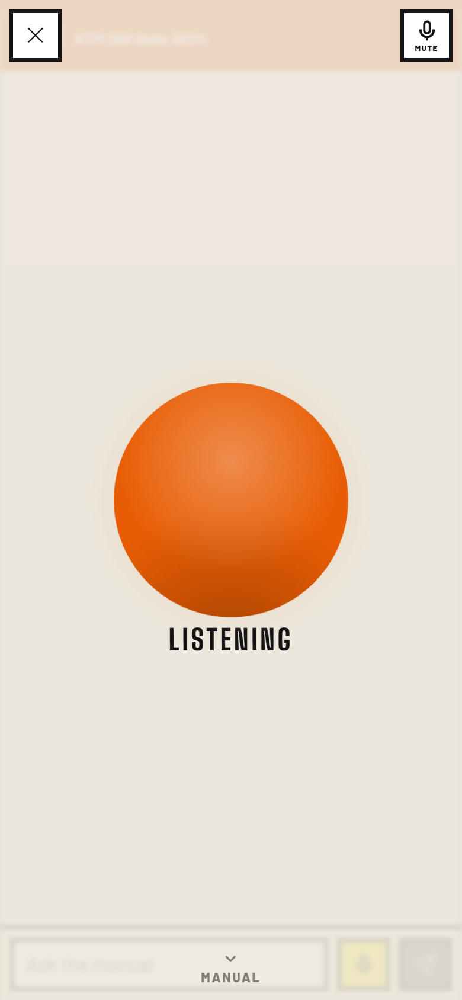
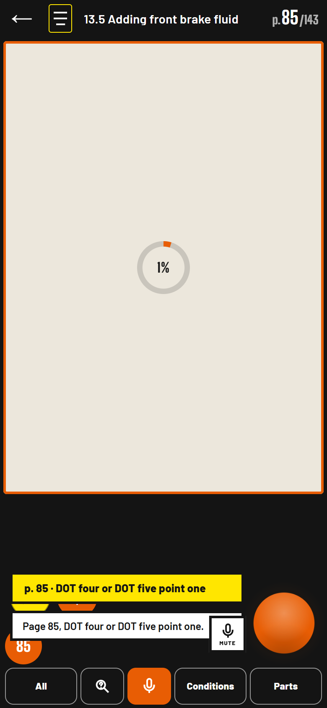
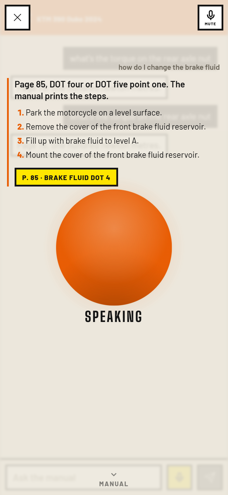
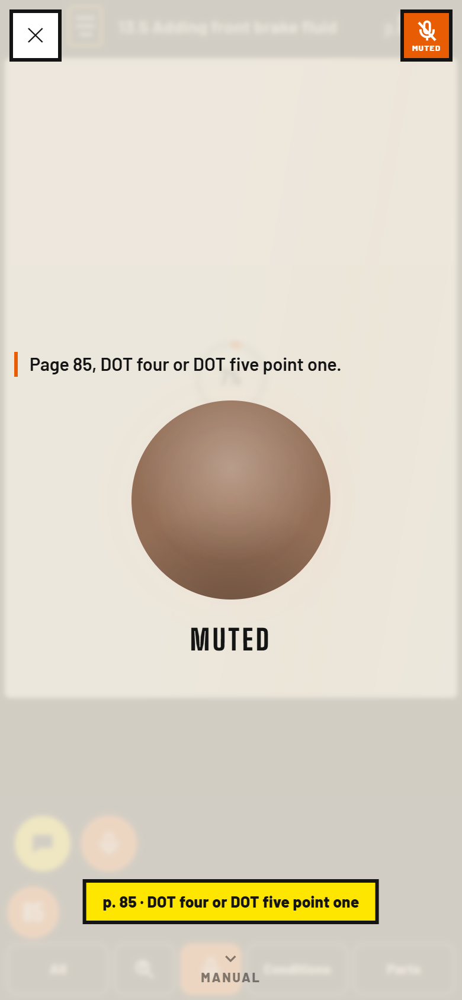

# Voice mode

VOICE in the chat input row opens a Deepgram Voice Agent session over the manual on screen, and it
stays open for the whole repair. While it is live the chat is not a chat: it is **the orb** — one
round thing that is listening to you, breathing on the mic, rippling on a lookup, pulsing on the
answer, with every turn written above it.

**The session belongs to nobody's screen.** `js/voice-session.js` is a singleton that owns the
socket, the microphone, the playback, the transcript, the state and the orb, and it is not inside
the chat, the reader or any overlay. It used to be: `voice` was a local in `chat-ui.js` and the
orb was mounted into the conversation, so closing the chat called `stop()` — and the first thing a
spoken question does is open the manual, which closes the chat. **The assistant hung up on the way
to the page it had just named.** Now the orb's home is one `position: fixed` host on `<body>`, and
Pick → Book → the Parts sheet → back is invisible to it.

---

## "Mechanica."

> "When you say 'mechanica' it should activate the voice integration, like anytime basically."

His hands are on the bike and the phone on the bench has brake fluid between it and him. Tapping
is the one thing he cannot do — so the app starts with a word, and the word carries the sentence
with it: **"Mechanica, I'm working on a YZF R1"** opens the session *and* asks the first question,
in one breath.

`js/voice-wake.js`, mounted by `js/app.js`. Off by default; the toggle is the ear beside the theme
disc in the orange bar, and the choice is remembered in `localStorage["mechanica.wake"]`. A tap is
also the user gesture a microphone legally needs, which is why this is a toggle and not a setting:
a remembered "yes" still waits for the first touch of the visit before it opens anything.

**Why the Web Speech API and not Deepgram.** An always-on Deepgram socket is $0.075 a *minute* and
a microphone permanently on the wire. `webkitSpeechRecognition` is free and stays in the room. It
is a much worse transcriber — which is exactly why it is only ever asked one question, *did this
contain the word*, and the sentence it heard is handed to Deepgram to hear properly.

**Two stages, because the two things he wants pull against each other.** The socket should open
the instant the word lands — connecting, settings and greeting are about a second, and a second he
spends finishing his sentence is a second he does not spend waiting. But the *sentence* is only
whole when the recogniser settles it: firing once on the first interim hands Deepgram "I'm" out of
"I'm working on a YZF R1". So the wake fires twice — `final:false` opens the session and nothing
else, `final:true` carries the question — and `app.js` joins them up. Measured, our side of it:
**1–2 ms** from the first transcript carrying the word to the socket opening, and **1 ms** from the
settled sentence to `InjectUserMessage` on the wire.

**What counts as the word.** `mechanica`, `mechanika`, `mecanica`, and **`mechanic a`** — which is
what Chrome most often returns for it. Deliberately **not** the bare word *mechanic*: this is a
workshop, somebody says it every ten minutes, and a false start that opens a paid socket and talks
over the room is worse than a missed one he can repeat. The judgement is made on the *matched
word*, not the sentence, so "mechanica, ask the mechanic about it" still fires.

| `node web/tools/wake-test.mjs` | |
|---|---|
| summons taken | **10 / 10** (every spelling, plus "mechanic a" and "hey mechanica") |
| the sentence after it, extracted whole | **10 / 10** |
| shop lines that fired it | **0 / 60** — twenty sentences × three spellings, including *"the mechanic said"*, *"it's a mechanical fault"*, *"three mechanics in today"*, *"that's a mechanic's job"*, *"the mechanics of it are simple"* |
| word heard → socket opening | **1–2 ms** |
| settled sentence → on the wire | **1 ms** |

**Two bugs the harness found**, both of which would only ever have shown up in a shop:

- The cooldown was written as `now - opened < COOLDOWN_MS` with `opened` starting at 0. A page
  younger than 2.5 s has a `performance.now()` smaller than the cooldown, so **the very first
  summons was swallowed** — the one most likely to be shouted at a phone that has just been picked
  up. It is `opened && now - opened < …` now.
- Pausing the wake listener the moment the session started threw away the half of the utterance
  that is the actual question, because the final result had not arrived yet. The pause now waits
  out the utterance in flight (`SETTLE_MS` 1800), during which the agent is still connecting and
  has not made a sound, so the two microphones never overlap on anything audible.

**What could NOT be measured, and why it is said here rather than buried.** The plan was ten
minutes of shop audio through `--use-file-for-fake-audio-capture` into a live recogniser.
**Chrome's `SpeechRecognition` does not use the WebRTC capture path**, so the fake-device flags do
not apply to it: it opened this machine's *real* microphone and transcribed the room. The first run
came back with a colleague's conversation. That section was deleted rather than left in with a
caveat, and **Chrome's own recognition latency is not measured anywhere in this document**. What it
contributes is the delay before an interim carrying the word arrives, which Google does not
document and which varies with its speech service.

**Browser support.**

| | continuous `webkitSpeechRecognition` | the wake word |
|---|---|---|
| Chrome, desktop | yes (Google's speech service, network) | works |
| Chrome, Android | yes | works |
| Edge | yes | works |
| Safari, iOS 14.5+ | `webkitSpeechRecognition` exists, but **`continuous` is effectively ignored**: it stops after one utterance and re-`start()` needs a fresh user gesture | the toggle is **not shown** — `supported` is false-by-behaviour there and an affordance that cannot work must not be on screen. Voice still starts from the VOICE button and the corner mic. |
| Firefox | no constructor | toggle not shown |

The listener stops itself when the tab is hidden and while the Deepgram session has the
microphone — two recognisers on one microphone is a fight nobody wins, and the agent's own voice
coming back would trigger it.

## Usable before there is a vehicle

The wake word is pointless if the first thing it can do is nothing, so the agent now runs the app.
A session can open with **no manual at all** (`GET /voice/agent-settings` with no `manualId`), and
five client-side functions do the rest:

| function | what it does | where it runs |
|---|---|---|
| `find_vehicle(make, model, year?)` | the catalogue, fuzzy, grouped by make+model with every year and whether a manual exists | **the browser** |
| `select_vehicle(id)` | `bus.set({bikeId})`, Confirm, `ensureManual` with progress, then Pick | the browser |
| `open_manual(page?)` | the reader, at a page | the browser |
| `open_parts(query?)` | the Parts sheet | the browser |
| `go_back()` | one step back | the browser |

**Client-side on purpose.** The roster of 27k vehicles is already in the tab and already indexed
by the same fuzzy search the Identify field uses; the navigation is the bus's. An API round trip
for either would be slower, would need a second copy of a search that already exists, and would
not work offline.

**The problem this had to solve: Deepgram fixes the function list when `Settings` is applied.**
There is no way to add a tool endpoint later without dropping the socket, and dropping the socket
loses the conversation. So every tool is registered from the first second, and the grounded ones
carry **`?session=<id>`** where the manual id would be. They answer

```json
{"error": "no_manual_yet", "say": "Which bike are you on?", "hint": "…call find_vehicle…"}
```

— a 200, not a 404, because an HTTP error closes the turn and makes the agent apologise for a
fault, where this is simply the truth and something it can act on. When `select_vehicle` lands the
browser `POST`s `/voice/session/{id}/manual?manualId=…`, which binds the id server-side (so every
tool URL is instantly right) and hands back that book's grounding rules, which go down the **same
socket** as an `UpdatePrompt`. **No reconnect, no second greeting, no lost conversation.**

**The prompt's vehicle rules**, each attached to a turn that broke without it: call `find_vehicle`
immediately on his own words and do not ask for the year first; one candidate means get on with
it; make and model matching with the year missing or ambiguous earns **one** short question —
*"Which year?"* — and never a list; take the year however he says it; if the exact year has no
manual take the nearest that does **and say so**; never invent a vehicle; never read an id out
loud; confirm the machine by its full name once.

**Measured end to end** (`node web/tools/orb-shots.mjs`, stubbed socket, both viewports):

```
a session opens with no vehicle chosen at all
his first sentence goes in as a user turn ("I'm working on a YZF R1")
find_vehicle answers from the catalogue in this tab (6 candidates, first Yamaha YZF-R1 2026, 27 years)
select_vehicle puts the app on it ({"ok":true,"name":"Yamaha YZF-R1 2026","manual":"ready",…})
the bus is on that bike (yamaha-yzf-r1-2026)
open_manual put page 77 on his screen
and the orb docked itself the moment the manual was up
```

---

## It was hearing itself

> "it is like detecting itself making sound in a loop"

The phone's speaker is 20 cm from its microphone. While the agent talked, the mic heard the agent,
and **every one of those frames was forwarded to Deepgram**. Deepgram's VAD cannot tell our voice
from his: it answered its own greeting with `UserStartedSpeaking`, the client flushed the answer it
had just scheduled, the orb flashed *interrupted* — and the first syllable of the replacement
answer started the same loop again.

**Reproduced** in headless Chrome with `--use-fake-device-for-media-stream` and
`--use-file-for-fake-audio-capture=<aura-2 speaking the agent's own lines>`, so the microphone
hears nothing but the agent. The socket is stubbed in the page and runs the same kind of VAD
Deepgram runs. `node web/tools/voice-echo.mjs`; `--legacy` is `tuning.guard = false`, which is the
code exactly as it shipped, against the same wav, the same stub and the same VAD.

| run | mic frames up | over the agent | self-raised `UserStartedSpeaking` | agent turns in 9 s | answers cut mid-word |
|---|---|---|---|---|---|
| **as it shipped** | 206 | **206 (421,888 B)** | **3–5** | **4–6** | **3–5** |
| **fixed** | 18 | **0 (0 B)** | **0** | **1** | **0** |

Four layers, because no one of them is enough:

1. **Constraints.** `echoCancellation: true, noiseSuppression: true, autoGainControl: false`,
   read back from `track.getSettings()` and reported by the harness. AGC is the subtle half: it
   normalises the mic towards a target level, so in a quiet workshop it winds the gain **up** until
   the only thing in the room — the phone's own speaker — is at speaking level, and every threshold
   downstream is measuring an amplified echo. It was `true`.
2. **The playback route.** The voice now leaves through a `MediaStreamAudioDestinationNode` into an
   `<audio>` element instead of `ctx.destination`. `ctx.destination` is a WebAudio render stream at
   *this context's* sample rate (24 kHz here, never the device's) and the platform echo canceller's
   reference is the **device** render stream. The element goes out the media pipeline, which is the
   one Chrome references — and the only one **iOS Safari cancels at all**: on iOS, AEC works for
   audio played through an `<audio>`/`<video>` element and not for WebAudio rendered to the default
   destination, so on a phone this is not an optimisation, it is the whole canceller. If the element
   refuses to play, it falls back to `ctx.destination` rather than losing the voice; `handle.audio()`
   reports which route is live (`element` in every measured run).
3. **Half duplex.** While the agent is audible — first frame → the last scheduled sample →
   `TAIL_MS` 250 — the mic is **not forwarded**. The withheld frames are kept, not dropped:
   `PRIME_MS` 320 of them, sent first on a real barge-in so Deepgram hears the word he started
   with and not the second half of it.
4. **One measured threshold.** The first `ECHO_MS` 300 of a spoken turn is our own voice *by
   definition* — he has not started talking yet — so whatever the mic hears there **is** the echo,
   at this room's volume, past this device's canceller. A voice has to beat it by `BARGE_RATIO`
   2.5× for `BARGE_MS` 120 ms. Live in the harness: echo **0.0207–0.0231 RMS**, threshold
   **0.0517–0.0578**. The local duck obeys the same number, so the agent can no longer duck itself.

Two bugs found on the way, both in the old numbers:

- The duck counted **three FRAMES**, and a comment called that 130 ms. An AudioWorklet render
  quantum is 128 samples: three of them is **16 ms**. The agent ducked itself on its own first
  syllable and reported an interruption to the UI every time it opened its mouth. Everything is
  counted in milliseconds now.
- Thresholds were compared against the raw RMS of one 5 ms quantum. Speech is mostly gaps at that
  resolution — "wait wait hold on" spends half its quanta under any threshold you pick — so a
  counter that resets on the first quiet frame never reaches 120 ms and **the rider is never
  heard**. The comparison is now against an envelope (attack 0.5, release 0.08) and the hold
  drains at half speed instead of resetting.

**And a real voice still cuts in.** Same harness, second wav: quiet agent echo, then a *different*
aura-2 voice at speaking level over the top. From the loud onset at the microphone to the first mic
frame leaving for Deepgram: **+120 ms / +140 ms**, with the playback flushed on the same frame.

*Honest limit:* a fake capture device is not an acoustic loop — Chrome's canceller has nothing to
subtract from a file that was never in the room. This harness measures the guard and the
thresholds, which is what the fix is. It does not measure AEC, and the constraints above are
reported, not credited.

**Flow.** `GET /voice/agent-settings?manualId=&bikeId=` builds the whole `Settings` message
server-side: prompt, models, greeting, a ≤1,500-char digest of the manual's chapters, this bike's
keyterms (below), and the four grounded tools as **server-side** functions (`endpoint.url` =
`PUBLIC_BASE/voice/tools/<name>?manualId=…`) — Deepgram calls the API itself, so the manual's text
never passes through the tab and the agent cannot name the wrong book. It also returns `pages` (the
printed page count) and `keyterms` (how many were sent).

`js/voice-deepgram.js` opens `wss://mechanica.emilvinu.ch/ws/deepgram/agent` — the Worker's proxy,
**no credential in the tab** (see *Socket auth* below) — forwards `settings` unread, streams the mic
as 24 kHz linear16 from an AudioWorklet, and plays the returned linear16 through an 80 ms jitter
buffer. `show_page(page, highlight, steps)` is the one client-side function: it jumps the reader
and writes the manual's own steps under the answer, the same path a `[p. N]`
citation chip takes.

**Saying a page is showing it.** The prompt makes the agent name the page every figure came off, and
`show_page` exists to open it — but measured against the live socket the model mostly does not call
it: **7 spoken turns, 6 pages named out loud, 0 `show_page` calls**, including on "show me the brake
fluid procedure". So the reader is not left to the model: the page number in the assistant's own
`ConversationText` (`/\bpages?\s+(\d{1,4})\b/`) moves it, bounds-checked against `pages` and never
re-sent for the page already on screen. That transcript arrives on the same millisecond as the first
byte of audio, so the mechanic hears "page 85" and page 85 is already there. `show_page` still wins
when the agent does call it.

> **This is why the prompt asks for the page in DIGITS.** "Page 78, one hundred newton metres" reads
> aloud as "page seventy-eight" — aura-2 says the number, the regex reads the digits. A prompt that
> asked for *"page seventy eight"* in words would sound identical and silently stop the reader
> turning, which is the entire product. `test_voice_conversation.py` guards it.

---

## The conversation, measured before and after

Driven through the live Worker proxy with Deepgram TTS speaking each question into the socket at
real speed, KTM 390 Duke 2024, 2026-09-20. The founder's six-turn script: greeting, a torque, a
follow-up about the other end, an **interruption mid-answer**, "which page was that", "thanks".
Traces saved. Milliseconds are from the last sample of the question.

### Before (the deployed prompt, `I see you're looking at …`)

| turn | first audio | what it said |
|---|---|---|
| greeting | 229 ms | "I see you're looking at the KTM 390 Duke 2024." |
| "what's the torque on the rear axle nut" | 1,957 ms | "Page 78 says the rear axle nut torque is one hundred newton metres." |
| "and the front one?" | 1,681 ms | "Page 130 says the front axle nut torque is forty-five newton metres." |
| **interrupt mid-sentence** — "wait, the brake fluid" | 1,983 ms | "The manual does not print the weight of the brake fluid. **Want the type or quantity instead?**" |
| "which page was that" | 1,886 ms (7,246 ms in the other run) | "No page in this manual gives the brake fluid's weight**;** the brake fluid info starts on **page 84**." |
| "thanks" | 1,079 ms | "You're all set." |

Judged as a shop foreman: it gets the two torques right and it is fast. Everything else is wrong.
It **ends a turn with a question** a man holding a wheel cannot answer. It reads a **semicolon**
out loud. It turns a one-word interruption into `get_spec("brake fluid **weight**")`, answers "the
manual does not print it" off a result that came back about brake *linings*, and **page 85 prints
DOT 4 and DOT 5.1 the whole time**. It names **page 84**, which no result gave it. And the felt
interruption is bad: `UserStartedSpeaking` took **2,242 ms** to cross the network while **102,720
bytes** — two seconds — of the abandoned answer kept arriving.

### After

Five runs of the six turns, medians in bold.

| turn | first audio | what it said |
|---|---|---|
| greeting | **213 ms** (211–251) | "KTM 390 Duke 2024. Go ahead." |
| "what's the torque on the rear axle nut" | **1,775 ms** (1,441–1,850) | "Page 78, one hundred newton metres." |
| "and the front one?" | **1,588 ms** (1,538–1,668) | "Page 130, forty five newton metres." |
| **interrupt mid-sentence** — "wait, the brake fluid" | **ack heard at 2,643 ms** (sent 2,502), answer 5.2 s | "One sec, checking the manual." → "Page 85, brake fluid DOT four or DOT five point one." |
| "which page was that" | **833 ms** (689–962; **no function call at all**) | "Page 85, brake fluid DOT four or DOT five point one." |
| "thanks" | **1,222 ms** (871–1,262) | "You're welcome." |

One sentence a turn, the page first so his eye moves before the number lands, no trailing question,
no punctuation a mouth cannot say, and the brake-fluid answer is **right** — because the prompt now
makes it look twice before it says the manual is silent. `UserStartedSpeaking` came back in
**1,191 ms** and only **8,640 bytes** of the old answer arrived after the interruption started.

### The three turns that got worse before they got better

All three are recorded, because they are the reason the rules are worded the way they are, and
because a prompt rewrite that only reports its wins is a prompt rewrite nobody should trust.

- A draft said *"a result you received earlier in this conversation still counts"* — meant for
  "which page was that?". gpt-4.1 read it as a licence and answered **"and the front one?"** out of
  context with **"Thirty front axle nut"**. The manual prints forty-five. That is the exact failure
  this product exists to prevent, from a *conversational* shortcut. The rule is now **EVERY QUESTION
  IS A NEW QUESTION**, with the repeat-what-you-already-said exception narrowed to the words.
- With the general-steps licence written as "steps and order only", the same draft said **"The usual
  way is DOT four for KTM but this manual does not say"** and then **"Check page 82 or 83."** A fluid
  grade is a specification, and a page is a figure. Both are now named in the licence's exclusions.
- And the one that only showed up once the look-twice rule was in: the brake-fluid turn answered
  correctly at 2.6 s and then **kept going for thirty-five lookups**, twenty-five of them re-reading
  *the same offset of the same page*, and the turn did not finish for **38 seconds**. A model with a
  licence to look again will look again forever. **STOP WHEN YOU HAVE IT** — say it the moment a
  result printed it, and never call a function twice with the same arguments — took the same
  question to **9 lookups and 13 s**. Improvement #4 below is the other half of that fix.

Every rule in `_prompt` is now attached to a turn that broke it, and every one has a test in
`api/tests/test_voice_conversation.py` carrying the reason in its docstring.

---

## One sec, checking the manual

A spec question answers in 1.4–2.1 s. A procedure question walks `find_procedure` and then reads
printed pages, and takes five to ten — in silence. Measured, **no single round trip is slow**: every
one is 250–650 ms. It is the *chain* that is slow, so there is nothing to hang a per-call spinner on.

So the acknowledgement is a **turn-level** timer in `voice-deepgram.js`. If a lookup is running and
the turn has made no sound 2,500 ms after the rider stopped talking, the client sends
`InjectAgentMessage` with `behavior: "queue"` — Deepgram's documented filler-during-a-long-function-
call path. Live: **sent at 2,503 ms, heard at 2,636 ms**, against a real answer at 5,191 ms. Four
seconds of dead air became one sentence and a wait. 2,500 ms sits above the slowest measured spec
turn (2,107 ms), so a two-second answer never earns one, and the prompt knows the app may have
spoken for it so the model neither repeats it nor apologises for the wait.

## Barge-in, before Deepgram says so

`UserStartedSpeaking` is the truth and it is **0.4–2.2 s** away (five sessions; median ~0.7 s, worst
2.2 s). Being talked over for two seconds is the least human thing this agent does. So the mic's own
envelope **ducks** playback the moment it crosses the measured barge threshold, and holds for
`BARGE_MS` 120 ms before it becomes a real `flush()` and the withheld frames go up. If no server
event arrives within 900 ms nobody was talking — a dropped spanner, a compressor — and the answer
comes back up where it left off. **A duck is reversible; a flush is not.** Tapping the orb while it
is talking is the same path, taken deliberately.

## The events Deepgram does not send

Measured over five live sessions on this exact configuration (flux listen v2 + `open_ai` think +
aura-2 speak), the socket sends `Welcome`, `SettingsApplied`, `ConversationText`, `History`,
`LatencyReport`, `UserStartedSpeaking`, `EndOfTurn`, `FunctionCallRequest`, `FunctionCallResponse`
and `AgentAudioDone` — and **never once `AgentThinking` or `AgentStartedSpeaking`**. Those two were
the whole basis of the old "Thinking" and "Speaking" statuses, so **the drawer sat on "Listening"
through every lookup and every answer** and nobody had noticed. The status is now derived from what
actually arrives:

| status | what causes it |
|---|---|
| thinking | `EndOfTurn`, or any `FunctionCallRequest` |
| speaking | the first audio frame of a turn (outside the barge-mute window) |
| listening | the player drained with no lookup in flight, or `SettingsApplied`, or a barge-in |

`AgentThinking` / `AgentStartedSpeaking` are still honoured if they ever turn up.

**One turn is one bubble.** The model emits one `ConversationText` per *sentence*, so a two-sentence
answer used to land as two bubbles from one breath. Sentences after the first of a turn carry
`part: true` and are appended to the message already there.

## The voice: auditioned, not chosen off the adjectives

"Most natural for a workshop" is not a taste question when the room has an impact wrench in it — it
is whether the sentence survives the noise. Each candidate spoke the six lines this agent actually
says (a page and a torque, a tyre pressure, an oil grade, the acknowledgement, a general
procedure); the same synthetic shop noise went in at 3 dB and 0 dB SNR; nova-3 transcribed it back.

| voice | Deepgram's label | pace | WER clean | 3 dB | 0 dB |
|---|---|---|---|---|---|
| **aura-2-asteria-en** | clear, confident, knowledgeable · *advertising* | 2.50 w/s | **8.5%** | **8.5%** | **13.6%** |
| aura-2-orpheus-en | professional, clear, confident, trustworthy · *customer service* | 2.94 w/s | 11.9% | 16.9% | 18.6% |
| aura-2-arcas-en | natural, smooth, clear, comfortable | 2.78 w/s | 11.9% | 22.0% | 23.7% |
| aura-2-harmonia-en | empathetic, clear, calm, confident | 3.17 w/s | 25.4% | 18.6% | 22.0% |

orpheus was the favourite going in, on the labels. It lost on the only thing that matters here: at
3 dB it read **"forty five newton metres"** back as **"forty five millimeters"**, and arcas did the
same at both levels. A torque that arrives as a length is the one mistake this product cannot make.
asteria stays, and it is also the slowest of the four, which is the right direction for a workshop.
`speed` is left at its default: aura-2 would not go below it (0.9 shaved 0.08 s off a 5.12 s line)
and 1.15 only made it quicker, which nobody here wants.

*Honest limit:* this is a round trip through Deepgram's own STT, not a mechanic in a shop. It ranks
intelligibility under noise, which is the thing we can measure; it does not rank warmth.

## One call instead of six (improvement #4)

Live, "wait, the brake fluid" was `get_spec` → `find_procedure` → **four** `read_page` calls, 6.3 s
to the first word. `find_procedure` now returns the best section's **printed text** with it —
`sections[0].text` + `textPages`, sliced out of the same page text `read_page` serves, marked
`[page N]` so the agent can still say which page a step is printed on, capped at
`SECTION_PAGES` 3 / `SECTION_CHARS` 3,600 so the result does not grow into the context budget.
Only the best section carries text; the rest stay places to go.

Measured locally (KTM 390 Duke): the pages travel back in **21–103 ms** of extra work inside
`find_procedure`, and they replace **2–4 model round trips**, each of which cost **~550–800 ms of
model deliberation** in the live trace (`FunctionCallResponse` → next `FunctionCallRequest`) on top
of its API time. **This is an API-side change and is not deployed yet, so the end-to-end number is
arithmetic on measured hops, not a measured end-to-end turn.** Say it that way.

## The orb



`js/voice-orb.js` + `css/voice-orb.css`, mounted by `js/voice-session.js` into one `position:
fixed` host on `<body>` — not into a screen and not into the chat, because both of those are
hidden, replaced or re-rendered by their owners and an orb that lives in one of them stops
existing when its landlord changes screens.

### It docks

Full screen when it is opened from the chat, because there is nothing else to look at yet.
**Docked** the moment the manual is up, because now there is: a compact orb in the corner, above
the reader's thumb row, with one line of transcript beside it, still listening.



The dock is **one `transform` on one element over 180 ms** — `translate(…) scale(--dock-scale)` —
so no width, no height and no position changes and the page underneath cannot feel it. Measured
at 390×844: the docked disc is **71 px** (44 px minimum, cleared on every viewport), **16 px** from
the right edge and **16 px above `.book-acts`**, which `voice-session.js` measures rather than
guesses. Asserted in `orb-shots.mjs`: `transition-property: transform`, `0.18s`, and the
conversation's box identical before and after.

Which size it is, is `bus.on("screen")` and nothing more — Book docks it, anything else does not —
until he taps, and his own choice wins until the next screen change. **Tap** the orb while it is
talking: stop the answer. **Tap** while it is not: the other size. **Long-press** (600 ms) or the
✕: leave. A tap has to mean "be quiet" while it is talking, because that is the only thing anyone
ever wants from a talking machine, and it cannot mean two things at once.

| state | the disc | under it |
|---|---|---|
| listening | breathes (one 3.4 s cycle, ±3.5%) and rides the **mic's RMS** on top of the breath | LISTENING |
| thinking | dead still; three rings leave the edge on a 1.9 s stagger | THINKING |
| speaking | pulses on the **agent's own output level**, taken from an `AnalyserNode` on the playback gain node | SPEAKING |
| muted | still, desaturated | MUTED |

The output meter is on the gain node rather than on the incoming chunks because a chunk is
scheduled up to 80 ms before it is audible, and an orb 80 ms ahead of the sound looks broken.

### It is also written



Voice is not audio-only. A torque you heard once and a torque you can read are not the same fact,
and a procedure spoken aloud is gone the moment it is said. So every turn is **written into a
column above the orb** — his own words quiet and right-aligned, the agent's on the accent rule,
newest at the bottom nearest his eye, scrollable, and it stops following the bottom the moment he
scrolls up, because a column that yanks itself down while a man is reading a torque is a column he
will stop trusting.

- **A lookup** is one quiet line — *checking the manual…* — that the answer **replaces** rather
  than sits under.
- **One breath is one turn.** The model emits one `ConversationText` per sentence; sentences after
  the first carry `part: true` and are appended to the paragraph already there.
- **A procedure is a numbered list**, one step per line, in the manual's order, with **the page as
  a chip** underneath that opens the sheet. Those lines come from `show_page`'s new `steps`
  argument: the browser never sees a tool result — Deepgram fetches the manual's text, not the tab
  — so the *only* way the printed steps can reach his screen is if the agent hands them over in
  the call that turns the page. The prompt tells it to copy them word for word and never to write
  a step no result printed.
- **The same messages are in the chat.** `voice-session.js` emits them on `mechanica:voice` and
  `chat-ui.js` puts every one into the same `sessions` history a typed turn lands in, so leaving
  voice mode leaves **one** conversation.

Docked, the column folds to the last answer beside the orb; tapping that line opens it again.

### Mute



A 44 px toggle beside the orb **in both sizes** — top right full screen, to the left of the disc
when docked — and the **M** key while a session is live (never while he is typing into something).

Muted means the **track is disabled** (`track.enabled = false`), not a flag this client checks: the
microphone produces silence at the source, so Deepgram receives silence, the agent cannot hear the
shop, and there is no code path left by which a frame could reach it. It deliberately does **not**
stop the answer in flight and does not close anything — muting yourself is not hanging up, and a
mute that cut the sentence you were listening to would be the opposite of what it is for. Three
signals say it at once, because a mechanic who thinks he is being heard and is not will say a whole
sentence to nobody: the icon grows a drawn slash, the word under the orb becomes MUTED, and the
disc stops moving. Nothing is persisted; mute is per session.

**Sixty frames, no layout.** One `requestAnimationFrame` loop writes two custom properties, `--s`
(scale) and `--g` (glow), and the stylesheet turns those into a `transform` and an `opacity`. No
width, height, margin or offset is ever touched. `web/tools/orb-shots.mjs` asserts that — it records
every inline property the loop set across a second of frames and fails if any of them is not a
custom property — and measures **57–59 frames per second** in both states that move, against **one
scale value** for thinking, which is supposed to be still.

**No layout shift.** The conversation's box is measured before, during and after voice mode, and
before and after the dock; any difference fails. It is identical at 390×844 and on desktop — which
is now true by construction, since the orb's host is the viewport and not the view.

**The disc is centred on the VIEWPORT**, not on "the disc plus whatever is written under it": the
state word and the column are absolutely placed so the only in-flow child of `.vo` is the orb. A
word in the flow under it pushed the disc 25 px up and put the docked orb 25 px off the corner it
was aiming at, because the dock translate is measured from the viewport's middle.

**Reduced motion.** No breath, no ripple, no pulse. The level becomes a ring that fills (`--lvl`
into a conic gradient), which moves nothing, and the state word still changes — that is the part
that carries the meaning. Asserted too: nothing scales, and the ring still takes 30+ distinct values
in 600 ms.

**Themes.** Every colour is a token from `css/counter.css`, so the orb follows the theme switch with
the rest of the app. `css/voice-orb.css` is injected by `voice-orb.js` itself — it is the only
module that needs it and the only one that knows where it lives — so neither `index.html` nor
another agent's screen CSS carries a line for it.

Screenshots: `docs/voice/orb/<state>-{phone,desktop}.png`, plus `docked-`, `book-docked-`,
`column-`, `folded-`, `muted-`, `muted-docked-`, `reduced-motion-` and `theme-`.
Regenerate and re-verify with `node web/tools/orb-shots.mjs`.

## Living with the rest of the app

`mechanica:voice` on the window carries everything out — `status`, `text`, `steps`, `page`, `step`,
`spec`, `mute`, `vehicle`, `manual`, `manual-progress`, `interrupted`, `started`, `ended`, `dock`,
`error` — and a screen asks for the assistant either with `mechanica:voice-toggle` or with
`mechanica:voice` carrying `{action: "start" | "stop"}` (the corner mic on Pick, Book and Parts).
The events this module *sends* carry `kind` and never `action`, so listening on its own name
cannot loop. **No screen imports voice code and voice imports no screen.** `screens/book.js` is 12
lines of it: a listener that turns and pulses the page an answer named, one that steps on
"next" / "previous", and the reader's own mic button.

Two things a screen can put in the orb's way, and both are honoured without either side importing
the other: `<body data-voice="live">` while a session is up, so a screen can hide its own
microphone button rather than show two of the same control; and `data-voice-anchor` on anything
the docked orb must sit above — the reader's thumb row and the corner icon pair are both measured,
and the highest wins.

The answers act on the page:

| the agent | the app |
|---|---|
| names a page, or calls `show_page` | the reader turns to it and the sheet pulses; out of the relevant-pages filter, the strip quietly becomes the whole manual so it can |
| hands over `steps` | the manual's own lines are written under the answer with the page as a chip |
| he says "next" / "previous" / "go back" | the reader steps, with **no round trip at all** — it is parsed out of his own `ConversationText` |
| a figure with a page in it | a chip beside the orb for five seconds, then gone |

Where the page turn is routed depends on where he is standing, and the session decides because it
is the only thing that knows: on Book it is the reader's own `jump()`, anywhere else it is
`chat-ui.js`'s `jump()`, which closes the overlay first and then navigates.

**Ending cleanly.** `pagehide` and `offline` end the session; a different manual ends it, because
an agent grounded in one book must not answer about another. A socket nobody is listening to still
bills $0.075 a minute, and a phone whose microphone is open after the app is gone is worse than the
money.

---

**Config.** listen `flux-general-en` v2, eager/standard EOT 0.4/0.7, `eot_timeout_ms` 2000; think
`open_ai` `gpt-4.1` (`MODEL_VOICE` overrides; reasoning models like gpt-5.6-* are impossible —
Deepgram sends `reasoning_effort`, which OpenAI rejects with tools attached); speak
`aura-2-asteria-en`; greeting `"<bike>. Go ahead."`.

**Keyterms.** `agent.listen.provider.keyterms` is [keyterm prompting](https://developers.deepgram.com/docs/keyterm)
in the Voice Agent's own spelling — an array of plain phrases, up to 100 / 500 tokens, supported by
flux and nova-3. `voice.py::_keyterms` builds it per manual, best first, because the cap truncates:
the bike's own name, then the parts this manual names, the specs it prints, its headings and the
rider phrasings each section was indexed under (to 900 chars) — then the `parts-taxonomy.json`
entries for this kind of vehicle, spread one group at a time so the suspension and the wheels are
reached, and skipping anything whose words are already primed. KTM 390 Duke: **100 terms, 1,413
chars**. Headings are reduced to the noun phrase ("Checking the engine oil level" → "engine oil
level"), index order is un-inverted ("Nut, rear wheel spindle" → "rear wheel spindle Nut"), and
anything longer than five words is dropped rather than cut.

*Honest measurement:* accepted by the live socket at the full 100 terms, zero errors. A/B'd on
`wss://…/ws/deepgram/listen` against Deepgram TTS speech mixed with synthetic shop noise — **3 dB
SNR: 11.4% WER without, 13.6% with (n=88 words); 0 dB SNR: 14.1% without, 13.3% with (n=135)**. That
is noise, not a win. Individual terms flipped both ways ("rear brake kit" → "rear brake disc" with;
"oil screen" → "oil stream" with). It ships because it is the documented lever, costs nothing and
protects the proper nouns — but a real claim needs real mechanics in a real shop, not a TTS voice.

**Limits.** `PUBLIC_BASE` must be https or the endpoints are refused (503 here, not a dead socket).
English only. No mic, no toggle.

**Phones.** iOS Safari's echo canceller only works on audio played through an `<audio>` or
`<video>` element — WebAudio rendered to `ctx.destination` is not in its reference — which is why
the playback route above is an element and not a convenience. It also needs the element to be
playing from a user gesture, which the VOICE tap provides; if `play()` is still refused the client
falls back to `ctx.destination` and the half-duplex guard is then the *only* thing between the
agent and its own voice, which is exactly why the guard does not depend on AEC working. Android
Chrome cancels both paths. `handle.audio().route` says which one is live.

**Probing it from node.** Since 2026-09-20 the Worker refuses a WebSocket handshake that carries no
`Origin` (BUG-10: everything that is not a browser also sends none, so the old "no Origin means one
of our own scripts" exemption was an open door to `DEEPGRAM_API_KEY`). That is the right call and it
locks out every node probe, because the WHATWG `WebSocket` in node cannot set a header. Use the `ws`
package, which can: `new WebSocket(url, { origin: "https://mechanica.emilvinu.ch" })`. Headless-Chrome
harnesses (`web/tools/voice-shots.mjs`, `web/tools/orb-shots.mjs`) are unaffected.

**Where the milliseconds go** (live, through the Worker proxy; KTM 390 Duke; the settings above):

| hop | measured |
|---|---|
| socket open → `Welcome` | 2–10 ms |
| → `SettingsApplied` | 127–166 ms |
| → greeting audio | **184–251 ms** |
| `get_spec` round trip | 250–650 ms |
| `read_page` round trip | 110–330 ms |
| one extra tool hop, model time only | ~550–800 ms |
| spec turn, end of question → first audio | **1,441–1,850 ms** |
| `UserStartedSpeaking` after the rider starts talking | 384–2,242 ms |
| local duck (mic envelope over the measured echo) | the frame it crosses on, no network |
| measured echo, past the canceller | **0.0207–0.0231 RMS**; threshold **0.0517–0.0578** |
| mic frames forwarded while the agent is audible | **0**, was 206 (421,888 B) in 9 s |
| a real voice → its first frame on the socket | **120–140 ms** |
| barge-in local stop | **<3 ms** (next render quantum) + a 500 ms window that drops the abandoned answer's chunks |
| cost | **$0.075 per connected minute** — the hosted tier bundles STT + LLM + TTS and bills socket time, and the socket exists only between the two taps on VOICE |

Screenshots: `web/docs-shots/voice-*.png`. Regenerate with `node web/tools/voice-shots.mjs`.

## Socket auth — the Worker holds the key

A browser WebSocket cannot send headers, so the first design minted a short-lived Deepgram key at
`POST /voice/deepgram-token` and shipped it to the tab in the `Sec-WebSocket-Protocol` pair
`[scheme, key]`. Minting one needs `keys:write` on the project; this account's key has neither that
nor `/v1/auth/grant`, so the endpoint honestly 502s — **in production neither socket could ever
open**.

So the key never goes to the browser at all. `worker/index.js` proxies both sockets and adds the
real `Authorization: Token` header on the way out:

| browser opens | Worker opens |
| --- | --- |
| `wss://<origin>/ws/deepgram/agent` | `wss://agent.deepgram.com/v1/agent/converse` |
| `wss://<origin>/ws/deepgram/listen?<query>` | `wss://api.deepgram.com/v2/listen?<same query>` |

The Worker accepts the browser's upgrade with a `WebSocketPair`, opens the upstream socket with
`fetch(…, {headers:{Upgrade:"websocket"}})` **before** answering the handshake — so the `Settings`
message the client sends on `open` can never beat the upstream into existence — and pipes frames
verbatim in both directions, closing one when the other closes or errors. Nothing about a frame is
logged. Origins are restricted to the page's own host plus `mechanica.emilvinu.ch`, the workers.dev
host and localhost; a handshake with no `Origin` (our own probe scripts) is allowed, since only
browsers are bound by that check anyway.

Both clients pick the route from `location.hostname`: anything but localhost uses the proxy and
sends **no subprotocol**; a page served from localhost has no Worker in front of it and falls back
to the `/voice/deepgram-token` path, which is what `web/tools/voice-shots.mjs` fulfils locally with
the account key.

**`binaryType`.** Workers defaults a `WebSocket` to `binaryType = "blob"`, and a `Blob` handed back
to `send()` leaves as the *text* `[object Blob]`. A transparent audio proxy that forgets this turns
every PCM frame into `UNPARSABLE_CLIENT_MESSAGE` upstream and drops every audio frame downstream
while the JSON still flows perfectly — the failure looks like "the agent has no voice", not like a
bug in the proxy. `raw()` sets `"arraybuffer"` on both ends.

**Worker limits.** One WebSocket message is capped at **1 MiB** (frames here are ~2 KB). Duration is
not capped and only CPU time is billed, not the minutes the socket is open, so a proxied session
costs Deepgram's $0.075/min and essentially nothing on Cloudflare; the client's 8 s `KeepAlive` also
keeps the hop warm. The socket lives in a plain Worker invocation, not a Durable Object: a redeploy
does not kill open sessions, but nothing resumes one either — the view just reconnects on the next
tap.

**Secret.** `DEEPGRAM_API_KEY`, a Worker secret (not in `wrangler.jsonc`, not in the repo):

```sh
printf '%s' "$(tr -d '\r\n' < /c/Users/me/agent-secrets/deepgram.txt)" | npx wrangler secret put DEEPGRAM_API_KEY
```

**Verified** on the live app, headless Chrome, no mic: the agent socket is
`wss://mechanica.emilvinu.ch/ws/deepgram/agent` with no subprotocol, `Welcome → SettingsApplied →
ConversationText → AgentAudioDone`, **210 binary frames / 201,600 bytes** of greeting audio, first
audio 724 ms after the socket opened, **zero console errors**; the dictation socket is
`/ws/deepgram/listen?…` and returns `Connected` + `TurnInfo`.
